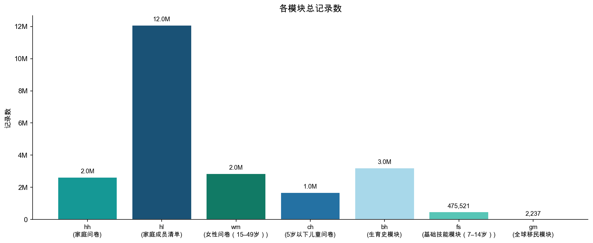
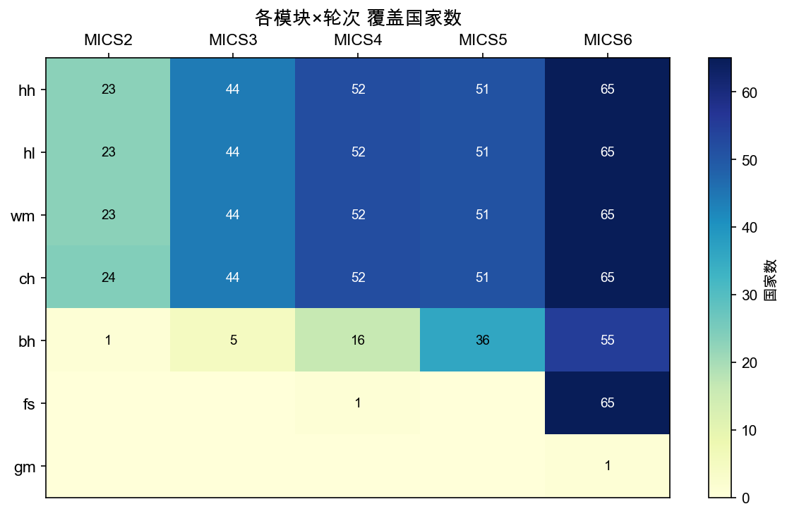

# MICS 数据集汇总报告

> 生成脚本：`MICS/etc/generate_summary.py`

---

## 1. 数据来源

本数据集来自 [UNICEF MICS（多指标集群调查）](https://mics.unicef.org/surveys)，
涵盖 MICS2 至 MICS6 五个轮次，覆盖全球 155 个国家/地区。
原始数据为 SPSS（.sav）格式，已按标准变量映射字典统一处理后合并为 7 个 Parquet 文件。

---

## 2. 数据集结构

MICS 调查包含 7 个相互关联的问卷模块，通过共同的链接键可横向关联：

| 模块 | 名称 | 分析单元 | 总行数 | 总列数 | 覆盖国家数 | 覆盖轮次 | 链接键 |
|------|------|----------|--------|--------|------------|----------|--------|
| [hh](hh_CN.md) | 家庭问卷 | 每行一个家庭 | 2,631,840 | 3,541 | 155 | MICS2 MICS3 MICS4 MICS5 MICS6 | `HH1 + HH2` |
| [hl](hl_CN.md) | 家庭成员清单 | 每行一名家庭成员 | 12,068,280 | 1,821 | 155 | MICS2 MICS3 MICS4 MICS5 MICS6 | `HH1 + HH2 + HL1` |
| [wm](wm_CN.md) | 女性问卷（15–49岁） | 每行一名女性 | 2,842,815 | 7,678 | 155 | MICS2 MICS3 MICS4 MICS5 MICS6 | `HH1 + HH2 + LN` |
| [ch](ch_CN.md) | 5岁以下儿童问卷 | 每行一名5岁以下儿童 | 1,665,101 | 6,074 | 155 | MICS2 MICS3 MICS4 MICS5 MICS6 | `HH1 + HH2 + LN` |
| [bh](bh_CN.md) | 生育史模块 | 每行一次出生记录（一名女性可有多行） | 3,196,805 | 835 | 93 | MICS2 MICS3 MICS4 MICS5 MICS6 | `HH1 + HH2 + LN + BHLN` |
| [fs](fs_CN.md) | 基础技能模块（7–14岁） | 每行一名7–14岁儿童 | 475,521 | 1,848 | 66 | MICS4 MICS6 | `HH1 + HH2 + LN` |
| [gm](gm_CN.md) | 全球移民模块 | 每行一名受访者 | 2,237 | 29 | 1 | MICS6 | `HH1 + HH2` |

---

## 3. 各模块记录数



---

## 4. 各模块×轮次 覆盖国家数

数字为各格子覆盖的国家/地区数，0 表示该轮次不包含此模块。


---

## 5. 各模块说明

### hh — 家庭问卷

每行一个家庭。涵盖家庭基本信息、饮水卫生（WS*）、居住条件（HC*）。

- **记录数**: 2,631,840
- **列数**: 3,541
- **覆盖国家**: 155
- **覆盖轮次**: MICS2 MICS3 MICS4 MICS5 MICS6
- **链接键**: `HH1 + HH2`
- **详细报告**: [hh_CN.md](hh_CN.md)

### hl — 家庭成员清单

每行一名家庭成员。涵盖年龄、性别、教育（ED*）及成员间关联。

- **记录数**: 12,068,280
- **列数**: 1,821
- **覆盖国家**: 155
- **覆盖轮次**: MICS2 MICS3 MICS4 MICS5 MICS6
- **链接键**: `HH1 + HH2 + HL1`
- **详细报告**: [hl_CN.md](hl_CN.md)

### wm — 女性问卷（15–49岁）

每行一名女性。涵盖教育、生育史摘要（CM*）、避孕（CP*）、孕产保健（MN*）。

- **记录数**: 2,842,815
- **列数**: 7,678
- **覆盖国家**: 155
- **覆盖轮次**: MICS2 MICS3 MICS4 MICS5 MICS6
- **链接键**: `HH1 + HH2 + LN`
- **详细报告**: [wm_CN.md](wm_CN.md)

### ch — 5岁以下儿童问卷

每行一名5岁以下儿童。涵盖出生登记（BR*）、疫苗接种（VA*）、营养（AN*）、腹泻（CA*）。

- **记录数**: 1,665,101
- **列数**: 6,074
- **覆盖国家**: 155
- **覆盖轮次**: MICS2 MICS3 MICS4 MICS5 MICS6
- **链接键**: `HH1 + HH2 + LN`
- **详细报告**: [ch_CN.md](ch_CN.md)

### bh — 生育史模块

每行一次出生记录（一名女性可有多行）。涵盖出生日期、存活状态（BH5）、死亡年龄，用于计算儿童死亡率。

- **记录数**: 3,196,805
- **列数**: 835
- **覆盖国家**: 93
- **覆盖轮次**: MICS2 MICS3 MICS4 MICS5 MICS6
- **链接键**: `HH1 + HH2 + LN + BHLN`
- **详细报告**: [bh_CN.md](bh_CN.md)

### fs — 基础技能模块（7–14岁）

每行一名7–14岁儿童。涵盖读写、计算能力及认知发展（CB*）。仅MICS5/6。

- **记录数**: 475,521
- **列数**: 1,848
- **覆盖国家**: 66
- **覆盖轮次**: MICS4 MICS6
- **链接键**: `HH1 + HH2 + LN`
- **详细报告**: [fs_CN.md](fs_CN.md)

### gm — 全球移民模块

每行一名受访者。涵盖移民经历（MG*）及财富指数（windex*）。仅MICS6，样本量较小。

- **记录数**: 2,237
- **列数**: 29
- **覆盖国家**: 1
- **覆盖轮次**: MICS6
- **链接键**: `HH1 + HH2`
- **详细报告**: [gm_CN.md](gm_CN.md)

---

## 6. 模块间关联关系

```
hh (家庭) ──┬── hl (成员)  ←→  wm (女性) ──→ bh (生育史)
            │                ↓
            │               ch (5岁以下儿童)
            │
            ├── fs (7-14岁儿童基础技能)
            └── gm (移民)

关联键: hh ↔ hl ↔ wm/ch 均通过 HH1 + HH2 连接
        wm ↔ bh 通过 HH1 + HH2 + LN 连接
```
