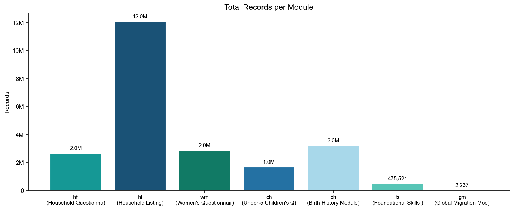
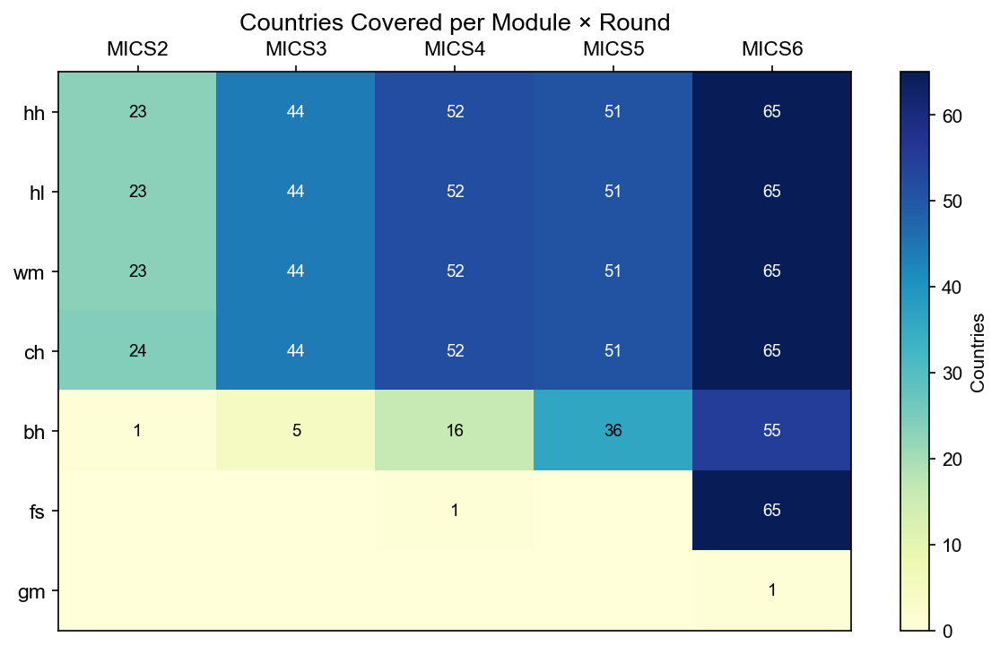

# MICS Dataset Summary Report

> Generation script: `MICS/etc/generate_summary.py`

---

## 1. Data Source

This dataset is derived from [UNICEF MICS (Multiple Indicator Cluster Surveys)](https://mics.unicef.org/surveys),
covering MICS rounds 2–6 across 155 countries and areas.
Raw data were in SPSS (.sav) format and have been standardised using a variable mapping dictionary
and merged into 7 Parquet files.

---

## 2. Dataset Structure

MICS surveys comprise 7 interrelated questionnaire modules linked by common keys:

| Module | Name | Unit of Analysis | Total Rows | Total Cols | Countries | Rounds | Link Key |
|--------|------|-----------------|------------|------------|-----------|--------|----------|
| [hh](hh_EN.md) | Household Questionnaire | One row per household | 2,631,840 | 3,541 | 155 | MICS2 MICS3 MICS4 MICS5 MICS6 | `HH1 + HH2` |
| [hl](hl_EN.md) | Household Listing | One row per household member | 12,068,280 | 1,821 | 155 | MICS2 MICS3 MICS4 MICS5 MICS6 | `HH1 + HH2 + HL1` |
| [wm](wm_EN.md) | Women's Questionnaire (15–49) | One row per woman | 2,842,815 | 7,678 | 155 | MICS2 MICS3 MICS4 MICS5 MICS6 | `HH1 + HH2 + LN` |
| [ch](ch_EN.md) | Under-5 Children's Questionnaire | One row per child under 5 | 1,665,101 | 6,074 | 155 | MICS2 MICS3 MICS4 MICS5 MICS6 | `HH1 + HH2 + LN` |
| [bh](bh_EN.md) | Birth History Module | One row per birth (multiple per woman) | 3,196,805 | 835 | 93 | MICS2 MICS3 MICS4 MICS5 MICS6 | `HH1 + HH2 + LN + BHLN` |
| [fs](fs_EN.md) | Foundational Skills Module (7–14) | One row per child 7–14 | 475,521 | 1,848 | 66 | MICS4 MICS6 | `HH1 + HH2 + LN` |
| [gm](gm_EN.md) | Global Migration Module | One row per respondent | 2,237 | 29 | 1 | MICS6 | `HH1 + HH2` |

---

## 3. Records per Module



---

## 4. Country Coverage per Module × Round

Each cell shows the number of countries covered. 0 means the module was not fielded in that round.


---

## 5. Module Descriptions

### hh — Household Questionnaire

One row per household. Covers household info, water & sanitation (WS*), housing characteristics (HC*).

- **Records**: 2,631,840
- **Columns**: 3,541
- **Countries**: 155
- **Rounds**: MICS2 MICS3 MICS4 MICS5 MICS6
- **Link key**: `HH1 + HH2`
- **Full report**: [hh_EN.md](hh_EN.md)

### hl — Household Listing

One row per household member. Covers age, sex, education (ED*), intra-household links.

- **Records**: 12,068,280
- **Columns**: 1,821
- **Countries**: 155
- **Rounds**: MICS2 MICS3 MICS4 MICS5 MICS6
- **Link key**: `HH1 + HH2 + HL1`
- **Full report**: [hl_EN.md](hl_EN.md)

### wm — Women's Questionnaire (15–49)

One row per woman. Covers education, birth history summary (CM*), contraception (CP*), maternal health (MN*).

- **Records**: 2,842,815
- **Columns**: 7,678
- **Countries**: 155
- **Rounds**: MICS2 MICS3 MICS4 MICS5 MICS6
- **Link key**: `HH1 + HH2 + LN`
- **Full report**: [wm_EN.md](wm_EN.md)

### ch — Under-5 Children's Questionnaire

One row per child under 5. Covers birth registration (BR*), vaccination (VA*), nutrition (AN*), diarrhoea (CA*).

- **Records**: 1,665,101
- **Columns**: 6,074
- **Countries**: 155
- **Rounds**: MICS2 MICS3 MICS4 MICS5 MICS6
- **Link key**: `HH1 + HH2 + LN`
- **Full report**: [ch_EN.md](ch_EN.md)

### bh — Birth History Module

One row per birth (multiple per woman). Covers birth date, survival status (BH5), age at death. Used for child mortality estimates.

- **Records**: 3,196,805
- **Columns**: 835
- **Countries**: 93
- **Rounds**: MICS2 MICS3 MICS4 MICS5 MICS6
- **Link key**: `HH1 + HH2 + LN + BHLN`
- **Full report**: [bh_EN.md](bh_EN.md)

### fs — Foundational Skills Module (7–14)

One row per child 7–14. Covers literacy, numeracy, cognitive development (CB*). MICS5/6 only.

- **Records**: 475,521
- **Columns**: 1,848
- **Countries**: 66
- **Rounds**: MICS4 MICS6
- **Link key**: `HH1 + HH2 + LN`
- **Full report**: [fs_EN.md](fs_EN.md)

### gm — Global Migration Module

One row per respondent. Covers migration experience (MG*) and wealth index (windex*). MICS6 only, small sample.

- **Records**: 2,237
- **Columns**: 29
- **Countries**: 1
- **Rounds**: MICS6
- **Link key**: `HH1 + HH2`
- **Full report**: [gm_EN.md](gm_EN.md)

---

## 6. Module Relationships

```
hh (Household) ──┬── hl (Members)  ←→  wm (Women) ──→ bh (Birth History)
                 │                   ↓
                 │                  ch (Under-5 Children)
                 │
                 ├── fs (Children 7-14, Foundational Skills)
                 └── gm (Migration)

Join keys: hh ↔ hl ↔ wm/ch via HH1 + HH2
           wm ↔ bh via HH1 + HH2 + LN
```
