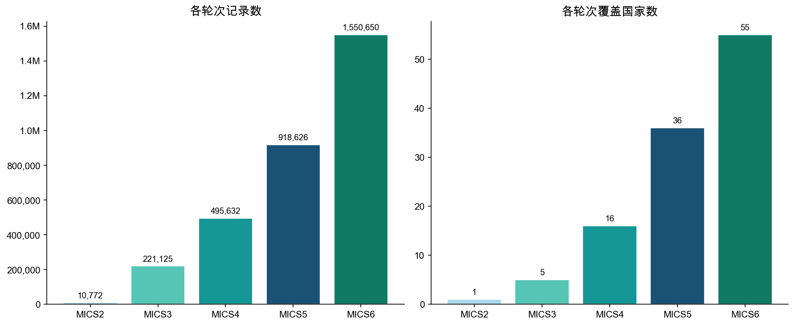
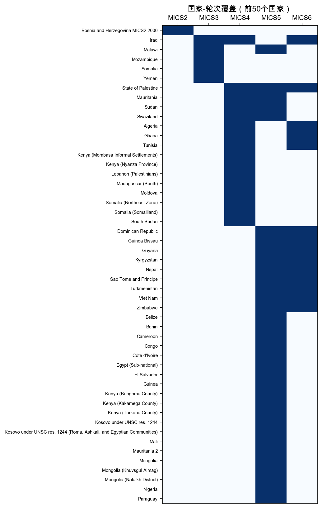
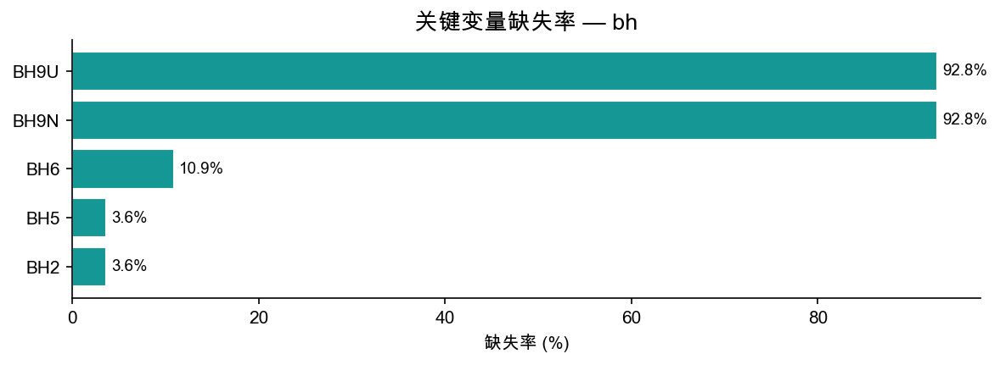

# bh 模块数据报告

> 生成脚本：`MICS/etc/generate_remaining.py`

---

## 1. 概览

| 指标 | 数值 |
|--------|-------|
| 总行数 | 3,196,805 |
| 总列数 | 835 |
| 覆盖国家/地区数 | 93 |
| 覆盖轮次 | MICS2 ~ MICS6 |

**bh 模块**（生育史模块）每行代表一次出生记录（一名女性可有多行）。主要包含：出生日期（BH4*）、存活状态（BH5）、死亡年龄（BH9*）等。用于计算儿童死亡率指标。

---

## 2. 各轮次分布

| 轮次 | 国家/地区数 | 记录数 | 平均每国记录数 |
|------|------------|--------|--------------|
| MICS2 | 1 | 10,772 | 10,772 |
| MICS3 | 5 | 221,125 | 44,225 |
| MICS4 | 16 | 495,632 | 30,977 |
| MICS5 | 36 | 918,626 | 25,517 |
| MICS6 | 55 | 1,550,650 | 28,194 |

---

## 3. 国家-轮次覆盖

蓝色=有数据，白色=无数据。

---

## 4. 关键变量缺失率

缺失主要来自早期轮次问卷未包含该题。

| 变量 | 含义 | 缺失率 |
|------|------|--------|
| BH2 | 出生性别 | 3.6% |
| BH5 | 当前存活状态 | 3.6% |
| BH6 | 年龄（存活儿） | 10.9% |
| BH9U | 死亡年龄单位 | 92.8% |
| BH9N | 死亡年龄数值 | 92.8% |

---

## 5. 标准核心变量列表

共 **175** 个标准变量（出现在 ≥50% 的轮次中）

| 变量名 | 含义 | MICS3 | MICS4 | MICS5 | MICS6 |
|--------|------|:-----:|:-----:|:-----:|:-----:|
| `BH1` |  | ✓ | — | ✓ | — |
| `BH10` |  | ✓ | ✓ | ✓ | ✓ |
| `BH11` |  | ✓ | ✓ | — | — |
| `BH13` |  | ✓ | ✓ | — | — |
| `BH14` |  | ✓ | ✓ | — | — |
| `BH15` |  | ✓ | — | ✓ | — |
| `BH2` |  | ✓ | ✓ | ✓ | ✓ |
| `BH3` |  | ✓ | ✓ | ✓ | ✓ |
| `BH4C` |  | — | ✓ | ✓ | ✓ |
| `BH4F` |  | — | ✓ | ✓ | ✓ |
| `BH4M` |  | ✓ | ✓ | ✓ | ✓ |
| `BH4Y` |  | ✓ | ✓ | ✓ | ✓ |
| `BH5` |  | ✓ | ✓ | ✓ | ✓ |
| `BH6` |  | ✓ | ✓ | ✓ | ✓ |
| `BH7` |  | ✓ | ✓ | ✓ | ✓ |
| `BH8` |  | ✓ | ✓ | ✓ | ✓ |
| `BH9A` |  | ✓ | — | ✓ | — |
| `BH9C` |  | — | ✓ | ✓ | ✓ |
| `BH9F` |  | — | ✓ | ✓ | ✓ |
| `BH9N` |  | — | ✓ | ✓ | ✓ |
| `BH9U` |  | — | ✓ | ✓ | ✓ |
| `BHLN` |  | — | ✓ | ✓ | ✓ |
| `CDEAD` |  | — | ✓ | — | ✓ |
| `CEB` |  | — | ✓ | — | ✓ |
| `CM1` |  | ✓ | ✓ | — | — |
| `CM3` |  | ✓ | ✓ | — | — |
| `CM4A` |  | ✓ | ✓ | — | — |
| `CM4B` |  | ✓ | ✓ | — | — |
| `CM5` |  | ✓ | ✓ | — | — |
| `CM6A` |  | ✓ | ✓ | — | — |
| `CM6B` |  | ✓ | ✓ | — | — |
| `CM7` |  | ✓ | ✓ | — | — |
| `CM8A` |  | ✓ | ✓ | — | — |
| `CM8B` |  | ✓ | ✓ | — | — |
| `CM9` |  | ✓ | ✓ | — | — |
| `CSURV` |  | — | ✓ | — | ✓ |
| `HC10A` |  | ✓ | ✓ | — | — |
| `HC10B` |  | ✓ | ✓ | — | — |
| `HC10D` |  | ✓ | ✓ | — | — |
| `HC10E` |  | ✓ | ✓ | — | — |
| `HC11` |  | ✓ | ✓ | — | — |
| `HC12` |  | ✓ | ✓ | — | — |
| `HC13` |  | ✓ | ✓ | — | — |
| `HC14A` |  | ✓ | ✓ | — | — |
| `HC14B` |  | ✓ | ✓ | — | — |
| `HC14C` |  | ✓ | ✓ | — | — |
| `HC14D` |  | ✓ | ✓ | — | — |
| `HC14E` |  | ✓ | ✓ | — | — |
| `HC14F` |  | ✓ | ✓ | — | — |
| `HC2` |  | ✓ | ✓ | — | — |
| `HC3` |  | ✓ | ✓ | — | — |
| `HC4` |  | ✓ | ✓ | — | — |
| `HC5` |  | ✓ | ✓ | — | — |
| `HC6` |  | ✓ | ✓ | — | — |
| `HC8` |  | ✓ | ✓ | — | — |
| `HC9A` |  | ✓ | ✓ | — | — |
| `HC9B` |  | ✓ | ✓ | — | — |
| `HC9C` |  | ✓ | ✓ | — | — |
| `HC9D` |  | ✓ | ✓ | — | — |
| `HC9E` |  | ✓ | ✓ | — | — |
| `HC9F` |  | ✓ | ✓ | — | — |
| `HC9G` |  | ✓ | ✓ | — | — |
| `HC9H` |  | ✓ | ✓ | — | — |
| `HC9I` |  | ✓ | ✓ | — | — |
| `HC9J` |  | ✓ | ✓ | — | — |
| `HH1` |  | ✓ | ✓ | ✓ | ✓ |
| `HH10` |  | ✓ | ✓ | — | — |
| `HH11` |  | ✓ | ✓ | — | — |
| `HH12` |  | ✓ | ✓ | — | — |
| `HH13` |  | ✓ | ✓ | — | — |
| `HH14` |  | ✓ | ✓ | — | — |
| `HH15` |  | ✓ | ✓ | — | — |
| `HH16` |  | ✓ | ✓ | — | — |
| `HH2` |  | ✓ | ✓ | ✓ | ✓ |
| `HH3` |  | ✓ | ✓ | ✓ | ✓ |
| `HH4` |  | ✓ | ✓ | ✓ | ✓ |
| `HH5D` |  | ✓ | ✓ | — | — |
| `HH5M` |  | ✓ | ✓ | — | — |
| `HH5Y` |  | ✓ | ✓ | — | — |
| `HH6` |  | ✓ | ✓ | ✓ | ✓ |
| `HH6A` |  | ✓ | — | ✓ | ✓ |
| `HH7` |  | ✓ | ✓ | ✓ | ✓ |
| `HH7A` |  | ✓ | ✓ | ✓ | ✓ |
| `HH7B` |  | — | — | ✓ | ✓ |
| `HH7C` |  | — | — | ✓ | ✓ |
| `HH9` |  | ✓ | ✓ | — | — |
| `LN` |  | ✓ | ✓ | ✓ | ✓ |
| `MA1` |  | ✓ | ✓ | — | — |
| `MA2` |  | ✓ | ✓ | — | — |
| `MA2A` |  | ✓ | ✓ | — | — |
| `MA2B` |  | ✓ | ✓ | — | — |
| `MA3` |  | ✓ | ✓ | — | — |
| `MA4` |  | ✓ | ✓ | — | — |
| `MA5` |  | ✓ | ✓ | — | — |
| `MA6M` |  | ✓ | ✓ | — | — |
| `MA6Y` |  | ✓ | ✓ | — | — |
| `MA8` |  | ✓ | ✓ | — | — |
| `MSTATUS` |  | — | ✓ | ✓ | ✓ |
| `PSU` |  | — | ✓ | — | ✓ |
| `WAGE` |  | — | ✓ | ✓ | — |
| `WAGEM` |  | — | ✓ | — | ✓ |
| `WDOB` |  | — | ✓ | ✓ | ✓ |
| `WDOBFC` |  | — | ✓ | ✓ | ✓ |
| `WDOBLC` |  | — | ✓ | ✓ | ✓ |
| `WDOI` |  | — | ✓ | ✓ | ✓ |
| `WDOM` |  | — | ✓ | — | ✓ |
| `WM1` |  | ✓ | ✓ | ✓ | ✓ |
| `WM10` |  | ✓ | ✓ | — | — |
| `WM11` |  | ✓ | ✓ | — | — |
| `WM12` |  | ✓ | ✓ | — | — |
| `WM14` |  | ✓ | ✓ | — | — |
| `WM2` |  | ✓ | ✓ | ✓ | ✓ |
| `WM4` |  | ✓ | ✓ | ✓ | ✓ |
| `WM5` |  | ✓ | ✓ | — | — |
| `WM6D` |  | ✓ | ✓ | ✓ | ✓ |
| `WM6M` |  | ✓ | ✓ | ✓ | ✓ |
| `WM6Y` |  | ✓ | ✓ | ✓ | ✓ |
| `WM7` |  | ✓ | ✓ | — | — |
| `WM8M` |  | ✓ | ✓ | — | — |
| `WM8Y` |  | ✓ | ✓ | — | — |
| `WM9` |  | ✓ | ✓ | — | — |
| `WMWEIGHT` |  | — | ✓ | ✓ | — |
| `WS1` |  | ✓ | ✓ | — | — |
| `WS2` |  | ✓ | ✓ | — | — |
| `WS3` |  | ✓ | ✓ | — | — |
| `WS4` |  | ✓ | ✓ | — | — |
| `WS5` |  | ✓ | ✓ | — | — |
| `WS6A` |  | ✓ | ✓ | — | — |
| `WS6B` |  | ✓ | ✓ | — | — |
| `WS6C` |  | ✓ | ✓ | — | — |
| `WS6D` |  | ✓ | ✓ | — | — |
| `WS6E` |  | ✓ | ✓ | — | — |
| `WS6F` |  | ✓ | ✓ | — | — |
| `WS6X` |  | ✓ | ✓ | — | — |
| `WS6Z` |  | ✓ | ✓ | — | — |
| `WS7` |  | ✓ | ✓ | — | — |
| `WS8` |  | ✓ | ✓ | — | — |
| `WS9` |  | ✓ | ✓ | — | — |
| `agem` |  | ✓ | ✓ | — | — |
| `area` |  | ✓ | ✓ | — | — |
| `birthint` |  | — | ✓ | ✓ | ✓ |
| `brthint` |  | — | ✓ | ✓ | — |
| `brthord` |  | — | ✓ | ✓ | ✓ |
| `ccdob` |  | ✓ | ✓ | — | — |
| `ceb` |  | ✓ | ✓ | — | — |
| `cmcdoiw` |  | ✓ | ✓ | — | — |
| `deadkids` |  | ✓ | ✓ | — | — |
| `ethnicity` |  | — | ✓ | ✓ | ✓ |
| `hh7` |  | ✓ | — | ✓ | ✓ |
| `language` |  | — | — | ✓ | ✓ |
| `langue` |  | — | ✓ | ✓ | — |
| `magebrt` |  | — | ✓ | ✓ | ✓ |
| `melevel` |  | ✓ | ✓ | — | — |
| `mstatus` |  | ✓ | ✓ | — | — |
| `region` |  | ✓ | ✓ | ✓ | ✓ |
| `religion` |  | — | ✓ | ✓ | ✓ |
| `strata` |  | — | ✓ | — | ✓ |
| `stratum` |  | — | ✓ | — | ✓ |
| `surviv` |  | ✓ | ✓ | — | — |
| `wage` |  | ✓ | ✓ | ✓ | — |
| `wdob` |  | ✓ | ✓ | — | — |
| `welevel` |  | — | ✓ | ✓ | ✓ |
| `welevel1` |  | — | — | ✓ | ✓ |
| `windex2` |  | — | — | ✓ | ✓ |
| `windex5` |  | — | ✓ | ✓ | ✓ |
| `windex5c` |  | — | — | ✓ | ✓ |
| `windex5r` |  | — | — | ✓ | ✓ |
| `windex5u` |  | — | — | ✓ | ✓ |
| `wlthind5` |  | ✓ | ✓ | — | — |
| `wlthscor` |  | ✓ | ✓ | — | — |
| `wmweight` |  | ✓ | ✓ | ✓ | ✓ |
| `wscore` |  | — | ✓ | ✓ | ✓ |
| `wscorec` |  | — | — | ✓ | ✓ |
| `wscorer` |  | — | — | ✓ | ✓ |
| `wscoreu` |  | — | — | ✓ | ✓ |

---

## 6. 使用说明

- **链接键**: `country` + `mics_round` + HH1 + HH2 + LN（母亲行号）+ BHLN（出生序号）
- **注意**: MICS2 变量已按映射字典标准化，早期轮次缺失字段显示为 NaN
