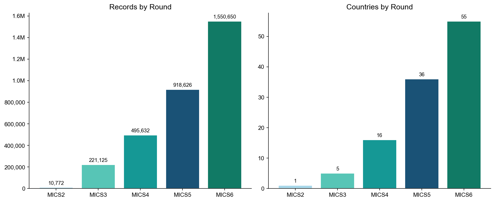
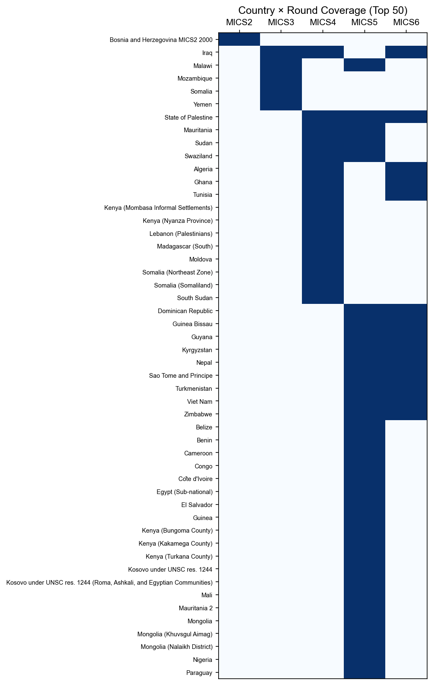
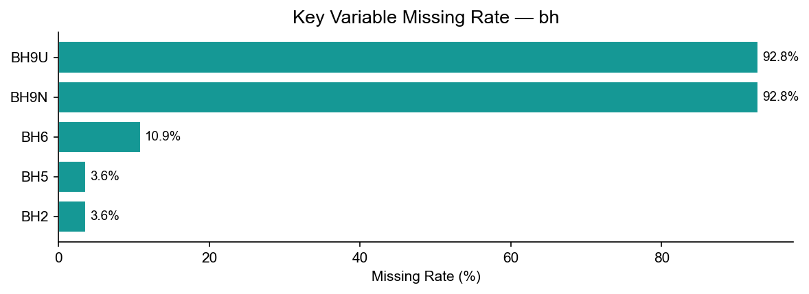

# bh Module Data Report

> Generation script: `MICS/etc/generate_remaining.py`

---

## 1. Overview

| Metric | Value |
|--------|-------|
| Total rows | 3,196,805 |
| Total columns | 835 |
| Countries/areas covered | 93 |
| Rounds covered | MICS2 – MICS6 |

The **bh module** (Birth History Module) — One row per birth (a woman may have multiple rows). Key topics: birth date (BH4*), survival status (BH5), age at death (BH9*). Used to compute child mortality indicators.

---

## 2. Distribution by Round

| Round | Countries/Areas | Records | Avg. Records/Country |
|-------|----------------|---------|----------------------|
| MICS2 | 1 | 10,772 | 10,772 |
| MICS3 | 5 | 221,125 | 44,225 |
| MICS4 | 16 | 495,632 | 30,977 |
| MICS5 | 36 | 918,626 | 25,517 |
| MICS6 | 55 | 1,550,650 | 28,194 |

---

## 3. Country × Round Coverage

Blue = data available, White = no data.

---

## 4. Missing Rate of Key Variables

Missingness mainly reflects questions absent in earlier rounds.

| Variable | Description | Missing Rate |
|----------|-------------|-------------|
| BH2 | Sex of birth | 3.6% |
| BH5 | Survival status | 3.6% |
| BH6 | Current age (alive) | 10.9% |
| BH9U | Age at death unit | 92.8% |
| BH9N | Age at death value | 92.8% |

---

## 5. Standard Core Variables

共 **175** 个标准变量（出现在 ≥50% 的轮次中）

| 变量名 | 含义 | MICS3 | MICS4 | MICS5 | MICS6 |
|--------|------|:-----:|:-----:|:-----:|:-----:|
| `BH1` |  | ✓ | — | ✓ | — |
| `BH10` |  | ✓ | ✓ | ✓ | ✓ |
| `BH11` |  | ✓ | ✓ | — | — |
| `BH13` |  | ✓ | ✓ | — | — |
| `BH14` |  | ✓ | ✓ | — | — |
| `BH15` |  | ✓ | — | ✓ | — |
| `BH2` |  | ✓ | ✓ | ✓ | ✓ |
| `BH3` |  | ✓ | ✓ | ✓ | ✓ |
| `BH4C` |  | — | ✓ | ✓ | ✓ |
| `BH4F` |  | — | ✓ | ✓ | ✓ |
| `BH4M` |  | ✓ | ✓ | ✓ | ✓ |
| `BH4Y` |  | ✓ | ✓ | ✓ | ✓ |
| `BH5` |  | ✓ | ✓ | ✓ | ✓ |
| `BH6` |  | ✓ | ✓ | ✓ | ✓ |
| `BH7` |  | ✓ | ✓ | ✓ | ✓ |
| `BH8` |  | ✓ | ✓ | ✓ | ✓ |
| `BH9A` |  | ✓ | — | ✓ | — |
| `BH9C` |  | — | ✓ | ✓ | ✓ |
| `BH9F` |  | — | ✓ | ✓ | ✓ |
| `BH9N` |  | — | ✓ | ✓ | ✓ |
| `BH9U` |  | — | ✓ | ✓ | ✓ |
| `BHLN` |  | — | ✓ | ✓ | ✓ |
| `CDEAD` |  | — | ✓ | — | ✓ |
| `CEB` |  | — | ✓ | — | ✓ |
| `CM1` |  | ✓ | ✓ | — | — |
| `CM3` |  | ✓ | ✓ | — | — |
| `CM4A` |  | ✓ | ✓ | — | — |
| `CM4B` |  | ✓ | ✓ | — | — |
| `CM5` |  | ✓ | ✓ | — | — |
| `CM6A` |  | ✓ | ✓ | — | — |
| `CM6B` |  | ✓ | ✓ | — | — |
| `CM7` |  | ✓ | ✓ | — | — |
| `CM8A` |  | ✓ | ✓ | — | — |
| `CM8B` |  | ✓ | ✓ | — | — |
| `CM9` |  | ✓ | ✓ | — | — |
| `CSURV` |  | — | ✓ | — | ✓ |
| `HC10A` |  | ✓ | ✓ | — | — |
| `HC10B` |  | ✓ | ✓ | — | — |
| `HC10D` |  | ✓ | ✓ | — | — |
| `HC10E` |  | ✓ | ✓ | — | — |
| `HC11` |  | ✓ | ✓ | — | — |
| `HC12` |  | ✓ | ✓ | — | — |
| `HC13` |  | ✓ | ✓ | — | — |
| `HC14A` |  | ✓ | ✓ | — | — |
| `HC14B` |  | ✓ | ✓ | — | — |
| `HC14C` |  | ✓ | ✓ | — | — |
| `HC14D` |  | ✓ | ✓ | — | — |
| `HC14E` |  | ✓ | ✓ | — | — |
| `HC14F` |  | ✓ | ✓ | — | — |
| `HC2` |  | ✓ | ✓ | — | — |
| `HC3` |  | ✓ | ✓ | — | — |
| `HC4` |  | ✓ | ✓ | — | — |
| `HC5` |  | ✓ | ✓ | — | — |
| `HC6` |  | ✓ | ✓ | — | — |
| `HC8` |  | ✓ | ✓ | — | — |
| `HC9A` |  | ✓ | ✓ | — | — |
| `HC9B` |  | ✓ | ✓ | — | — |
| `HC9C` |  | ✓ | ✓ | — | — |
| `HC9D` |  | ✓ | ✓ | — | — |
| `HC9E` |  | ✓ | ✓ | — | — |
| `HC9F` |  | ✓ | ✓ | — | — |
| `HC9G` |  | ✓ | ✓ | — | — |
| `HC9H` |  | ✓ | ✓ | — | — |
| `HC9I` |  | ✓ | ✓ | — | — |
| `HC9J` |  | ✓ | ✓ | — | — |
| `HH1` |  | ✓ | ✓ | ✓ | ✓ |
| `HH10` |  | ✓ | ✓ | — | — |
| `HH11` |  | ✓ | ✓ | — | — |
| `HH12` |  | ✓ | ✓ | — | — |
| `HH13` |  | ✓ | ✓ | — | — |
| `HH14` |  | ✓ | ✓ | — | — |
| `HH15` |  | ✓ | ✓ | — | — |
| `HH16` |  | ✓ | ✓ | — | — |
| `HH2` |  | ✓ | ✓ | ✓ | ✓ |
| `HH3` |  | ✓ | ✓ | ✓ | ✓ |
| `HH4` |  | ✓ | ✓ | ✓ | ✓ |
| `HH5D` |  | ✓ | ✓ | — | — |
| `HH5M` |  | ✓ | ✓ | — | — |
| `HH5Y` |  | ✓ | ✓ | — | — |
| `HH6` |  | ✓ | ✓ | ✓ | ✓ |
| `HH6A` |  | ✓ | — | ✓ | ✓ |
| `HH7` |  | ✓ | ✓ | ✓ | ✓ |
| `HH7A` |  | ✓ | ✓ | ✓ | ✓ |
| `HH7B` |  | — | — | ✓ | ✓ |
| `HH7C` |  | — | — | ✓ | ✓ |
| `HH9` |  | ✓ | ✓ | — | — |
| `LN` |  | ✓ | ✓ | ✓ | ✓ |
| `MA1` |  | ✓ | ✓ | — | — |
| `MA2` |  | ✓ | ✓ | — | — |
| `MA2A` |  | ✓ | ✓ | — | — |
| `MA2B` |  | ✓ | ✓ | — | — |
| `MA3` |  | ✓ | ✓ | — | — |
| `MA4` |  | ✓ | ✓ | — | — |
| `MA5` |  | ✓ | ✓ | — | — |
| `MA6M` |  | ✓ | ✓ | — | — |
| `MA6Y` |  | ✓ | ✓ | — | — |
| `MA8` |  | ✓ | ✓ | — | — |
| `MSTATUS` |  | — | ✓ | ✓ | ✓ |
| `PSU` |  | — | ✓ | — | ✓ |
| `WAGE` |  | — | ✓ | ✓ | — |
| `WAGEM` |  | — | ✓ | — | ✓ |
| `WDOB` |  | — | ✓ | ✓ | ✓ |
| `WDOBFC` |  | — | ✓ | ✓ | ✓ |
| `WDOBLC` |  | — | ✓ | ✓ | ✓ |
| `WDOI` |  | — | ✓ | ✓ | ✓ |
| `WDOM` |  | — | ✓ | — | ✓ |
| `WM1` |  | ✓ | ✓ | ✓ | ✓ |
| `WM10` |  | ✓ | ✓ | — | — |
| `WM11` |  | ✓ | ✓ | — | — |
| `WM12` |  | ✓ | ✓ | — | — |
| `WM14` |  | ✓ | ✓ | — | — |
| `WM2` |  | ✓ | ✓ | ✓ | ✓ |
| `WM4` |  | ✓ | ✓ | ✓ | ✓ |
| `WM5` |  | ✓ | ✓ | — | — |
| `WM6D` |  | ✓ | ✓ | ✓ | ✓ |
| `WM6M` |  | ✓ | ✓ | ✓ | ✓ |
| `WM6Y` |  | ✓ | ✓ | ✓ | ✓ |
| `WM7` |  | ✓ | ✓ | — | — |
| `WM8M` |  | ✓ | ✓ | — | — |
| `WM8Y` |  | ✓ | ✓ | — | — |
| `WM9` |  | ✓ | ✓ | — | — |
| `WMWEIGHT` |  | — | ✓ | ✓ | — |
| `WS1` |  | ✓ | ✓ | — | — |
| `WS2` |  | ✓ | ✓ | — | — |
| `WS3` |  | ✓ | ✓ | — | — |
| `WS4` |  | ✓ | ✓ | — | — |
| `WS5` |  | ✓ | ✓ | — | — |
| `WS6A` |  | ✓ | ✓ | — | — |
| `WS6B` |  | ✓ | ✓ | — | — |
| `WS6C` |  | ✓ | ✓ | — | — |
| `WS6D` |  | ✓ | ✓ | — | — |
| `WS6E` |  | ✓ | ✓ | — | — |
| `WS6F` |  | ✓ | ✓ | — | — |
| `WS6X` |  | ✓ | ✓ | — | — |
| `WS6Z` |  | ✓ | ✓ | — | — |
| `WS7` |  | ✓ | ✓ | — | — |
| `WS8` |  | ✓ | ✓ | — | — |
| `WS9` |  | ✓ | ✓ | — | — |
| `agem` |  | ✓ | ✓ | — | — |
| `area` |  | ✓ | ✓ | — | — |
| `birthint` |  | — | ✓ | ✓ | ✓ |
| `brthint` |  | — | ✓ | ✓ | — |
| `brthord` |  | — | ✓ | ✓ | ✓ |
| `ccdob` |  | ✓ | ✓ | — | — |
| `ceb` |  | ✓ | ✓ | — | — |
| `cmcdoiw` |  | ✓ | ✓ | — | — |
| `deadkids` |  | ✓ | ✓ | — | — |
| `ethnicity` |  | — | ✓ | ✓ | ✓ |
| `hh7` |  | ✓ | — | ✓ | ✓ |
| `language` |  | — | — | ✓ | ✓ |
| `langue` |  | — | ✓ | ✓ | — |
| `magebrt` |  | — | ✓ | ✓ | ✓ |
| `melevel` |  | ✓ | ✓ | — | — |
| `mstatus` |  | ✓ | ✓ | — | — |
| `region` |  | ✓ | ✓ | ✓ | ✓ |
| `religion` |  | — | ✓ | ✓ | ✓ |
| `strata` |  | — | ✓ | — | ✓ |
| `stratum` |  | — | ✓ | — | ✓ |
| `surviv` |  | ✓ | ✓ | — | — |
| `wage` |  | ✓ | ✓ | ✓ | — |
| `wdob` |  | ✓ | ✓ | — | — |
| `welevel` |  | — | ✓ | ✓ | ✓ |
| `welevel1` |  | — | — | ✓ | ✓ |
| `windex2` |  | — | — | ✓ | ✓ |
| `windex5` |  | — | ✓ | ✓ | ✓ |
| `windex5c` |  | — | — | ✓ | ✓ |
| `windex5r` |  | — | — | ✓ | ✓ |
| `windex5u` |  | — | — | ✓ | ✓ |
| `wlthind5` |  | ✓ | ✓ | — | — |
| `wlthscor` |  | ✓ | ✓ | — | — |
| `wmweight` |  | ✓ | ✓ | ✓ | ✓ |
| `wscore` |  | — | ✓ | ✓ | ✓ |
| `wscorec` |  | — | — | ✓ | ✓ |
| `wscorer` |  | — | — | ✓ | ✓ |
| `wscoreu` |  | — | — | ✓ | ✓ |

---

## 6. Usage Notes

- **Link keys**: `country` + `mics_round` + HH1 + HH2 + LN (mother's line number) + BHLN (birth order)
- **Note**: MICS2 variables have been standardised; fields absent in early rounds appear as NaN
