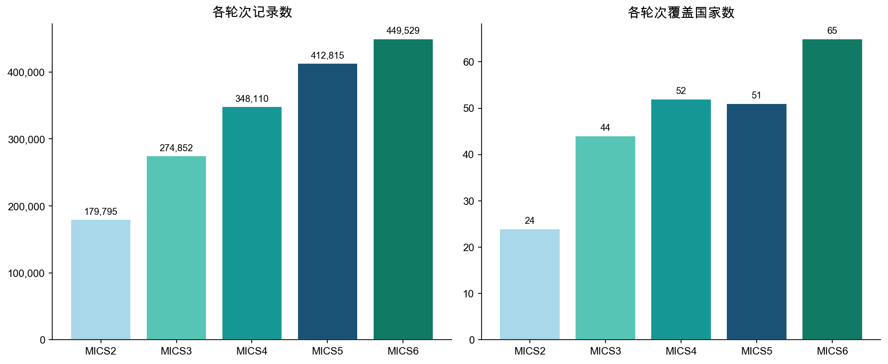
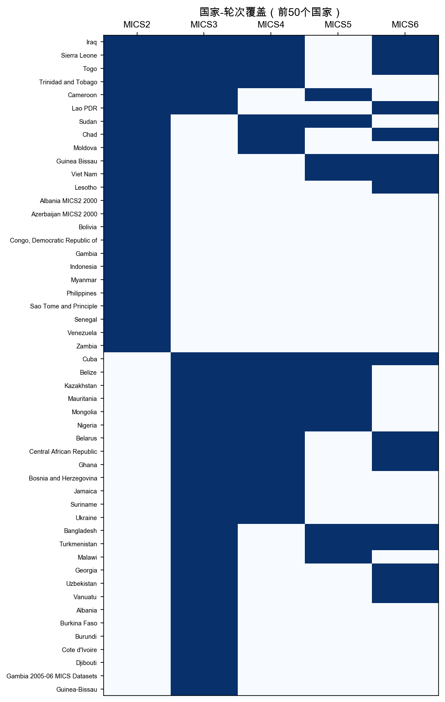
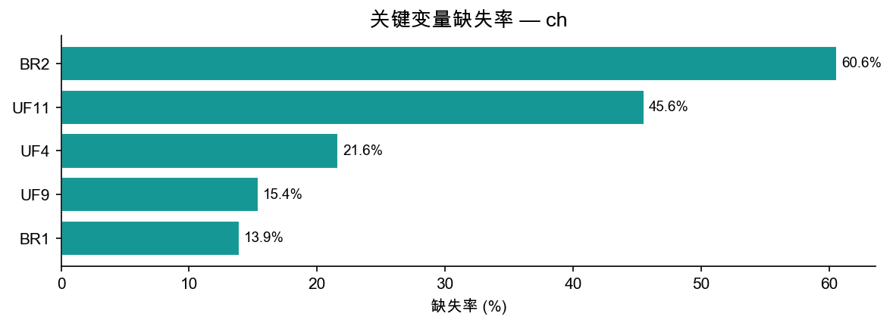

# ch 模块数据报告

> 生成脚本：`MICS/etc/generate_remaining.py`

---

## 1. 概览

| 指标 | 数值 |
|--------|-------|
| 总行数 | 1,665,101 |
| 总列数 | 6,074 |
| 覆盖国家/地区数 | 155 |
| 覆盖轮次 | MICS2 ~ MICS6 |

**ch 模块**（5岁以下儿童问卷）每行代表一名5岁以下儿童。主要包含：访谈信息、出生日期与年龄、出生登记（BR*）、疫苗接种（VA*）、急性呼吸道感染（ARI*）、腹泻（CA*）、营养（AN*）等。

---

## 2. 各轮次分布

| 轮次 | 国家/地区数 | 记录数 | 平均每国记录数 |
|------|------------|--------|--------------|
| MICS2 | 24 | 179,795 | 7,491 |
| MICS3 | 44 | 274,852 | 6,247 |
| MICS4 | 52 | 348,110 | 6,694 |
| MICS5 | 51 | 412,815 | 8,094 |
| MICS6 | 65 | 449,529 | 6,916 |

---

## 3. 国家-轮次覆盖

蓝色=有数据，白色=无数据。

---

## 4. 关键变量缺失率

缺失主要来自早期轮次问卷未包含该题。

| 变量 | 含义 | 缺失率 |
|------|------|--------|
| UF9 | 访谈结果 | 15.4% |
| UF4 | 性别 | 21.6% |
| UF11 | 年龄 | 45.6% |
| BR1 | 有出生证明 | 13.9% |
| BR2 | 已登记 | 60.6% |

---

## 5. 标准核心变量列表

共 **958** 个标准变量（出现在 ≥50% 的轮次中）

| 变量名 | 含义 | MICS3 | MICS4 | MICS5 | MICS6 |
|--------|------|:-----:|:-----:|:-----:|:-----:|
| `AG1D` | Day of birth of child | — | ✓ | ✓ | — |
| `AG1M` | Month of birth of child | — | ✓ | ✓ | — |
| `AG1Y` | Year of birth of child | — | ✓ | ✓ | — |
| `AG2` | Age of child | — | ✓ | ✓ | — |
| `AN1` | Measurer's identification code | ✓ | ✓ | ✓ | ✓ |
| `AN1A` |  | — | — | ✓ | ✓ |
| `AN2` | Result of height/length and weight measurement | ✓ | ✓ | ✓ | ✓ |
| `AN2A` |  | ✓ | ✓ | — | ✓ |
| `AN3` | Child's weight (kilograms) | ✓ | ✓ | ✓ | ✓ |
| `AN4` | Child's length or height (centimetres) | ✓ | ✓ | ✓ | ✓ |
| `AN4A` | Child measured lying or standing | — | ✓ | ✓ | — |
| `AN4B` |  | — | ✓ | ✓ | — |
| `AN4C` |  | — | ✓ | ✓ | — |
| `AN5` | Oedema presence | — | ✓ | ✓ | ✓ |
| `AN5A` |  | — | ✓ | ✓ | — |
| `AN5B` |  | — | ✓ | ✓ | — |
| `AN6` |  | — | — | ✓ | ✓ |
| `BD2` |  | — | — | ✓ | ✓ |
| `BD3` |  | — | — | ✓ | ✓ |
| `BD4` |  | — | — | ✓ | ✓ |
| `BD5` |  | — | — | ✓ | ✓ |
| `BD6` |  | — | — | ✓ | ✓ |
| `BD7A` |  | — | — | ✓ | ✓ |
| `BD7B` |  | — | — | ✓ | ✓ |
| `BD7B1` |  | — | — | ✓ | ✓ |
| `BD7B2` |  | — | — | ✓ | ✓ |
| `BD7B3` |  | — | — | ✓ | ✓ |
| `BD7C` |  | — | — | ✓ | ✓ |
| `BD7D` |  | — | — | ✓ | ✓ |
| `BD7E` |  | — | — | ✓ | ✓ |
| `BD7E1` |  | — | — | ✓ | ✓ |
| `BD7E2` |  | — | — | ✓ | ✓ |
| `BD7F` |  | — | — | ✓ | ✓ |
| `BD7G` |  | — | — | ✓ | ✓ |
| `BD7P1` |  | — | — | ✓ | ✓ |
| `BD8A` |  | — | — | ✓ | ✓ |
| `BD8B` |  | — | — | ✓ | ✓ |
| `BD8C` |  | — | — | ✓ | ✓ |
| `BD8D` |  | — | — | ✓ | ✓ |
| `BD8E` |  | — | — | ✓ | ✓ |
| `BD8F` |  | — | — | ✓ | ✓ |
| `BD8G` |  | — | — | ✓ | ✓ |
| `BD8H` |  | — | — | ✓ | ✓ |
| `BD8I` |  | — | — | ✓ | ✓ |
| `BD8J` |  | — | — | ✓ | ✓ |
| `BD8K` |  | — | — | ✓ | ✓ |
| `BD8L` |  | — | — | ✓ | ✓ |
| `BD8M` |  | — | — | ✓ | ✓ |
| `BD8N` |  | — | — | ✓ | ✓ |
| `BD8N1` |  | — | — | ✓ | ✓ |
| `BD8O` |  | — | — | ✓ | ✓ |
| `BD8P` |  | — | — | ✓ | ✓ |
| `BD8Q` |  | — | — | ✓ | ✓ |
| `BF1` | Child ever been breastfed | ✓ | ✓ | ✓ | — |
| `BF10` | Child drank or ate vitamin or mineral supplements yesterday | — | ✓ | ✓ | — |
| `BF11` | Child drank ORS yesterday | — | ✓ | ✓ | — |
| `BF12` | Child drank any other liquid yesterday | — | ✓ | ✓ | — |
| `BF13` | Child drank or ate yogurt yesterday | — | ✓ | ✓ | — |
| `BF14` | Times drank or ate yogurt | — | ✓ | ✓ | — |
| `BF15` | Child ate thin porridge yesterday | — | ✓ | ✓ | — |
| `BF16` | Child ate solid or semi-solid food yesterday | — | ✓ | ✓ | — |
| `BF17` | Times child ate solid or semi-solid food | — | ✓ | ✓ | — |
| `BF18` | Child drank anything else from the bottle with a nipple yesterday | — | ✓ | ✓ | — |
| `BF1A` |  | ✓ | ✓ | — | — |
| `BF2` | Child still being breastfed | ✓ | ✓ | ✓ | — |
| `BF2AU` |  | ✓ | ✓ | — | — |
| `BF2B` |  | ✓ | ✓ | — | — |
| `BF3` | Child drank plain water yesterday | — | ✓ | ✓ | — |
| `BF3A` |  | ✓ | ✓ | — | — |
| `BF3B` |  | ✓ | ✓ | — | — |
| `BF3C` |  | ✓ | ✓ | — | — |
| `BF3D` |  | ✓ | ✓ | — | — |
| `BF3E` |  | ✓ | ✓ | — | — |
| `BF3F` |  | ✓ | ✓ | — | — |
| `BF3G` |  | ✓ | ✓ | — | — |
| `BF3H` |  | ✓ | ✓ | — | — |
| `BF3I` |  | ✓ | ✓ | — | — |
| `BF4` | Child drank infant formula yesterday | — | ✓ | ✓ | — |
| `BF5` | Times child drank infant formula | ✓ | ✓ | ✓ | — |
| `BF6` | Child drank milk yesterday | — | ✓ | ✓ | — |
| `BF7` | Times child drank milk | — | ✓ | ✓ | — |
| `BF8` | Child drank juice or juice drinks yesterday | — | ✓ | ✓ | — |
| `BF9` | Child drank broth/soup yesterday | — | ✓ | ✓ | — |
| `BG1` |  | — | — | ✓ | ✓ |
| `BG2` |  | — | — | ✓ | ✓ |
| `BG3` |  | — | — | ✓ | ✓ |
| `BMI` | Body Mass Index WHO | — | ✓ | ✓ | ✓ |
| `BMIFLAG` | BMI flag WHO | — | ✓ | ✓ | ✓ |
| `BR0` |  | — | ✓ | — | ✓ |
| `BR1` | Birth certificate | ✓ | ✓ | ✓ | ✓ |
| `BR1A` |  | — | — | ✓ | ✓ |
| `BR2` | Birth registered | ✓ | ✓ | ✓ | ✓ |
| `BR2A` |  | ✓ | ✓ | ✓ | ✓ |
| `BR2AD` |  | — | ✓ | ✓ | ✓ |
| `BR2AM` |  | — | ✓ | — | ✓ |
| `BR2AX` |  | — | ✓ | ✓ | — |
| `BR2AY` |  | — | ✓ | — | ✓ |
| `BR2B` |  | — | ✓ | — | ✓ |
| `BR3` | Know how to register birth | ✓ | ✓ | ✓ | ✓ |
| `BR3A` |  | — | ✓ | ✓ | — |
| `BR3AA` |  | — | ✓ | ✓ | — |
| `BR3AB` |  | — | ✓ | ✓ | — |
| `BR3AC` |  | — | ✓ | ✓ | — |
| `BR3AD` |  | — | ✓ | ✓ | — |
| `BR3AE` |  | — | ✓ | ✓ | — |
| `BR3AF` |  | — | ✓ | ✓ | — |
| `BR3AG` |  | — | ✓ | ✓ | — |
| `BR3AH` |  | — | ✓ | ✓ | — |
| `BR3AI` |  | — | ✓ | ✓ | — |
| `BR3AX` |  | — | ✓ | ✓ | — |
| `BR3AZ` |  | — | ✓ | ✓ | — |
| `BR4` | Reason birth not registered | ✓ | ✓ | ✓ | ✓ |
| `BR4A` |  | ✓ | — | — | ✓ |
| `BR5` |  | — | — | ✓ | ✓ |
| `BR5A` |  | — | ✓ | ✓ | — |
| `BR5B` |  | — | ✓ | ✓ | — |
| `BR5C` |  | — | ✓ | ✓ | — |
| `BR5D` |  | — | ✓ | ✓ | — |
| `BR5X` |  | — | ✓ | ✓ | — |
| `BR5Z` |  | — | ✓ | ✓ | — |
| `BR6` |  | ✓ | ✓ | — | — |
| `BR7` |  | ✓ | ✓ | — | — |
| `BR8AF` |  | ✓ | ✓ | — | — |
| `BR8AM` |  | ✓ | ✓ | — | — |
| `BR8AN` |  | ✓ | ✓ | — | — |
| `BR8AO` |  | ✓ | ✓ | — | — |
| `BR8DF` |  | ✓ | ✓ | — | — |
| `BR8DM` |  | ✓ | ✓ | — | — |
| `BR8DN` |  | ✓ | ✓ | — | — |
| `BR8DO` |  | ✓ | ✓ | — | — |
| `BR8EF` |  | ✓ | ✓ | — | — |
| `BR8EM` |  | ✓ | ✓ | — | — |
| `BR8EN` |  | ✓ | ✓ | — | — |
| `BR8EO` |  | ✓ | ✓ | — | — |
| `BR8FF` |  | ✓ | ✓ | — | — |
| `BR8FM` |  | ✓ | ✓ | — | — |
| `BR8FN` |  | ✓ | ✓ | — | — |
| `BR8FO` |  | ✓ | ✓ | — | — |
| `CA1` | Child had diarrhoea in last 2 weeks | ✓ | ✓ | ✓ | ✓ |
| `CA10` | Sought advice or treatment for illness | ✓ | ✓ | ✓ | — |
| `CA11A` | Place sought care: (public sector) Government hospital | ✓ | ✓ | ✓ | ✓ |
| `CA11A1` |  | ✓ | ✓ | — | — |
| `CA11A2` |  | ✓ | ✓ | — | — |
| `CA11A3` |  | ✓ | ✓ | — | — |
| `CA11B` | Place sought care: (public sector) Government health center | ✓ | ✓ | ✓ | ✓ |
| `CA11C` | Place sought care: (public sector) Government health post | ✓ | ✓ | ✓ | ✓ |
| `CA11D` | Place sought care: (public sector) Village health worker | ✓ | ✓ | ✓ | ✓ |
| `CA11E` | Place sought care: (public sector) Mobile / Outreach clinic | ✓ | ✓ | ✓ | ✓ |
| `CA11F` |  | — | ✓ | ✓ | ✓ |
| `CA11G` |  | — | ✓ | ✓ | ✓ |
| `CA11H` | Place sought care: Other public | — | ✓ | ✓ | ✓ |
| `CA11I` | Place sought care: Private hospital / clinic | — | ✓ | ✓ | ✓ |
| `CA11J` | Place sought care: Private physician | — | ✓ | ✓ | ✓ |
| `CA11K` | Place sought care: Private pharmacy | — | ✓ | ✓ | ✓ |
| `CA11L` | Place sought care: Mobile clinic | — | ✓ | ✓ | ✓ |
| `CA11M` |  | — | ✓ | ✓ | ✓ |
| `CA11N` |  | — | ✓ | ✓ | ✓ |
| `CA11NR` |  | — | — | ✓ | ✓ |
| `CA11O` | Place sought care: Other private medical | — | ✓ | ✓ | ✓ |
| `CA11P` | Place sought care: Relative / Friend | ✓ | ✓ | ✓ | ✓ |
| `CA11Q` | Place sought care: Shop | ✓ | ✓ | ✓ | ✓ |
| `CA11R` | Place sought care: Traditional practitioner | ✓ | ✓ | ✓ | ✓ |
| `CA11S` |  | — | ✓ | ✓ | ✓ |
| `CA11T` |  | — | ✓ | ✓ | ✓ |
| `CA11U` |  | — | — | ✓ | ✓ |
| `CA11V` |  | — | — | ✓ | ✓ |
| `CA11W` |  | — | ✓ | — | ✓ |
| `CA11X` | Place sought care: Other | ✓ | ✓ | ✓ | ✓ |
| `CA11Z` |  | ✓ | ✓ | ✓ | ✓ |
| `CA12` | Given medicine to treat this illness | — | ✓ | ✓ | ✓ |
| `CA13` |  | ✓ | ✓ | — | — |
| `CA13A` | Medicine: Antibiotic pill / syrup | — | ✓ | ✓ | ✓ |
| `CA13B` | Medicine: Antibiotic injection | — | ✓ | ✓ | ✓ |
| `CA13C` |  | — | ✓ | ✓ | ✓ |
| `CA13D` |  | — | ✓ | ✓ | ✓ |
| `CA13E` |  | — | ✓ | ✓ | — |
| `CA13F` |  | — | ✓ | ✓ | — |
| `CA13G` |  | — | ✓ | ✓ | ✓ |
| `CA13H` |  | — | ✓ | ✓ | ✓ |
| `CA13L` |  | — | — | ✓ | ✓ |
| `CA13M` | Medicine: Anti-malarials | — | ✓ | ✓ | ✓ |
| `CA13NR` |  | — | — | ✓ | ✓ |
| `CA13P` | Medicine: Paracetamol / Panadol / Acetaminophen | — | ✓ | ✓ | — |
| `CA13Q` | Medicine: Aspirin | — | ✓ | ✓ | ✓ |
| `CA13R` | Medicine: Ibupropfen | — | ✓ | ✓ | — |
| `CA13S` |  | — | ✓ | ✓ | — |
| `CA13T` |  | — | ✓ | ✓ | — |
| `CA13V` |  | — | ✓ | — | ✓ |
| `CA13W` |  | — | ✓ | — | ✓ |
| `CA13X` | Medicine: Other | — | ✓ | ✓ | ✓ |
| `CA13Z` | Medicine: DK | — | ✓ | ✓ | — |
| `CA15` | What was done to dispose of the stools | — | ✓ | ✓ | ✓ |
| `CA15A` |  | ✓ | ✓ | ✓ | ✓ |
| `CA15B` |  | ✓ | — | — | ✓ |
| `CA1A` |  | ✓ | ✓ | — | ✓ |
| `CA2` | Child drank less or more during illness | — | ✓ | ✓ | — |
| `CA2A` |  | ✓ | ✓ | — | — |
| `CA2B` |  | ✓ | ✓ | — | — |
| `CA2C` |  | ✓ | ✓ | — | — |
| `CA2D` |  | ✓ | ✓ | — | — |
| `CA2G` |  | ✓ | ✓ | — | — |
| `CA3` | Child ate less or more during illness | ✓ | ✓ | ✓ | ✓ |
| `CA3A` |  | ✓ | — | ✓ | — |
| `CA4` |  | ✓ | ✓ | ✓ | ✓ |
| `CA4A` | Drank fluid made from special packet (ORS) | — | ✓ | ✓ | — |
| `CA4B` | Rice-based ORS packet for diarrhoea | ✓ | ✓ | ✓ | — |
| `CA4C` | Sugar and salt solution for diarrhoea | ✓ | ✓ | ✓ | — |
| `CA4CA` |  | — | ✓ | ✓ | — |
| `CA4CB` |  | — | ✓ | ✓ | — |
| `CA4CC` |  | — | ✓ | ✓ | — |
| `CA4D` | Green coconut water for diarrhoea | — | ✓ | ✓ | — |
| `CA4E` | Rice water for diarrhoea | — | ✓ | ✓ | — |
| `CA4F` | Boiled rice water for diarrhoea | — | ✓ | ✓ | — |
| `CA4G` |  | — | ✓ | ✓ | — |
| `CA4H` |  | — | ✓ | ✓ | — |
| `CA5` | Anything else given to treat the diarrhoea | ✓ | ✓ | ✓ | ✓ |
| `CA6` |  | ✓ | ✓ | — | — |
| `CA6A` | Other treatment (pill or syrup): Antibiotic | — | ✓ | ✓ | ✓ |
| `CA6A1` |  | — | ✓ | ✓ | — |
| `CA6AA` |  | — | ✓ | ✓ | — |
| `CA6AC` |  | — | ✓ | ✓ | — |
| `CA6AD` |  | — | ✓ | ✓ | — |
| `CA6B` | Other treatment (pill or syrup): Antimotility | — | ✓ | ✓ | ✓ |
| `CA6BB` |  | — | ✓ | ✓ | — |
| `CA6C` | Other treatment (pill or syrup): Zinc | — | ✓ | ✓ | ✓ |
| `CA6CC` |  | — | ✓ | ✓ | — |
| `CA6D` |  | — | ✓ | — | ✓ |
| `CA6G` | Other treatment (pill or syrup): Other (not antibiotic, antimotility or zinc) | — | ✓ | ✓ | ✓ |
| `CA6H` | Other treatment (pill or syrup): Unknown | — | ✓ | ✓ | ✓ |
| `CA6I` |  | — | ✓ | — | ✓ |
| `CA6J` |  | — | ✓ | — | ✓ |
| `CA6K` |  | — | ✓ | — | ✓ |
| `CA6L` | Other treatment (injection): Antibiotic | — | ✓ | ✓ | ✓ |
| `CA6M` | Other treatment (injection): Non-antibiotic | — | ✓ | ✓ | ✓ |
| `CA6N` | Other treatment (injection): Unknown | — | ✓ | ✓ | ✓ |
| `CA6NR` |  | — | — | ✓ | ✓ |
| `CA6O` | Other treatment: Intravenous | — | ✓ | ✓ | ✓ |
| `CA6P` |  | — | ✓ | ✓ | ✓ |
| `CA6Q` | Other treatment: Home remedy/Herbal medicine | — | ✓ | ✓ | ✓ |
| `CA6R` |  | — | ✓ | — | ✓ |
| `CA6W` |  | — | ✓ | — | ✓ |
| `CA6X` | Other treatment: Other | — | ✓ | ✓ | ✓ |
| `CA6Z` |  | — | — | ✓ | ✓ |
| `CA7` | Child ill with cough in last 2 weeks | ✓ | ✓ | ✓ | — |
| `CA8` | Difficulty breathing during illness with cough | ✓ | ✓ | ✓ | — |
| `CA9` | Symptoms due to problem in chest or blocked nose | — | ✓ | ✓ | — |
| `CA9A` |  | ✓ | ✓ | — | ✓ |
| `CA9B` |  | ✓ | — | ✓ | ✓ |
| `CA9C` |  | ✓ | ✓ | ✓ | ✓ |
| `CA9D` |  | ✓ | ✓ | — | ✓ |
| `CA9E` |  | ✓ | ✓ | — | ✓ |
| `CA9F` |  | ✓ | ✓ | — | ✓ |
| `CA9G` |  | — | ✓ | — | ✓ |
| `CA9H` |  | ✓ | ✓ | — | ✓ |
| `CA9I` |  | ✓ | ✓ | — | ✓ |
| `CA9J` |  | ✓ | ✓ | — | ✓ |
| `CA9K` |  | ✓ | ✓ | — | ✓ |
| `CA9L` |  | ✓ | ✓ | — | ✓ |
| `CA9M` |  | — | ✓ | — | ✓ |
| `CA9O` |  | ✓ | ✓ | — | ✓ |
| `CA9P` |  | ✓ | ✓ | — | ✓ |
| `CA9Q` |  | ✓ | ✓ | — | ✓ |
| `CA9R` |  | ✓ | — | — | ✓ |
| `CA9S` |  | ✓ | — | — | ✓ |
| `CA9X` |  | ✓ | ✓ | — | ✓ |
| `CAGE` | Age (months) | — | ✓ | ✓ | ✓ |
| `CAGED` | Age in days | — | ✓ | ✓ | ✓ |
| `CAGED_AN` |  | — | ✓ | ✓ | ✓ |
| `CAGE_11` | Age | — | ✓ | ✓ | ✓ |
| `CAGE_11_AN` |  | — | — | ✓ | ✓ |
| `CAGE_6` | Age | — | ✓ | ✓ | ✓ |
| `CAGE_6_AN` |  | — | — | ✓ | ✓ |
| `CAGE_AN` |  | — | ✓ | ✓ | ✓ |
| `CDOB` | Date of birth of child (CMC) | — | ✓ | ✓ | ✓ |
| `CDOI` | Date of interview child (CMC) | — | ✓ | ✓ | ✓ |
| `CDOI_AN` |  | — | ✓ | ✓ | ✓ |
| `CE2` |  | ✓ | ✓ | — | — |
| `CE3A` |  | ✓ | ✓ | — | — |
| `CE3B` |  | ✓ | ✓ | — | — |
| `CE3C` |  | ✓ | ✓ | — | — |
| `CE4A` |  | ✓ | ✓ | — | — |
| `CHWEIGHT` |  | ✓ | ✓ | ✓ | — |
| `EC1` | Number of children's books or picture books for child | — | ✓ | ✓ | ✓ |
| `EC10` | Child knows name and recognizes symbol of all numbers from 1-10 | — | ✓ | ✓ | ✓ |
| `EC10A` |  | — | ✓ | ✓ | — |
| `EC11` | Child able to pick up small object with 2 fingers | — | ✓ | ✓ | ✓ |
| `EC11A` |  | — | ✓ | ✓ | — |
| `EC12` | Child sometimes too sick to play | — | ✓ | ✓ | ✓ |
| `EC13` | Child follows simple directions | — | ✓ | ✓ | ✓ |
| `EC14` | Child able to do something independently | — | ✓ | ✓ | ✓ |
| `EC15` | Child gets along well with other children | — | ✓ | ✓ | ✓ |
| `EC16` | Child kicks, bites or hits other children or adults | — | ✓ | ✓ | — |
| `EC17` | Child gets distracted easily | — | ✓ | ✓ | — |
| `EC21` |  | — | — | ✓ | ✓ |
| `EC22` |  | — | — | ✓ | ✓ |
| `EC23` |  | — | — | ✓ | ✓ |
| `EC24` |  | — | — | ✓ | ✓ |
| `EC25` |  | — | — | ✓ | ✓ |
| `EC26` |  | — | — | ✓ | ✓ |
| `EC27` |  | — | — | ✓ | ✓ |
| `EC28` |  | — | — | ✓ | ✓ |
| `EC29` |  | — | — | ✓ | ✓ |
| `EC2A` | Homemade toys | — | ✓ | ✓ | ✓ |
| `EC2B` | Toys from shops | — | ✓ | ✓ | ✓ |
| `EC2C` | Household objects or outside objects | — | ✓ | ✓ | ✓ |
| `EC2D` |  | — | ✓ | ✓ | ✓ |
| `EC2E` |  | — | ✓ | — | ✓ |
| `EC30` |  | — | — | ✓ | ✓ |
| `EC31` |  | — | — | ✓ | ✓ |
| `EC32` |  | — | — | ✓ | ✓ |
| `EC33` |  | — | — | ✓ | ✓ |
| `EC34` |  | — | — | ✓ | ✓ |
| `EC35` |  | — | — | ✓ | ✓ |
| `EC36` |  | — | — | ✓ | ✓ |
| `EC37` |  | — | — | ✓ | ✓ |
| `EC38` |  | — | — | ✓ | ✓ |
| `EC3A` | In past week, days left alone for more than 1 hour | — | ✓ | ✓ | ✓ |
| `EC3B` | In past week, days left with other child for more than 1 hour | — | ✓ | ✓ | ✓ |
| `EC5` | Attends early childhood education programme | — | ✓ | ✓ | — |
| `EC5A` | Type of early childhood education programm | — | ✓ | ✓ | ✓ |
| `EC5B` |  | — | ✓ | ✓ | ✓ |
| `EC5C` |  | — | — | ✓ | ✓ |
| `EC6` | Within last 7 days, hours attended education | — | ✓ | ✓ | ✓ |
| `EC6A` |  | — | ✓ | ✓ | — |
| `EC6B_A` |  | — | ✓ | ✓ | — |
| `EC6B_B` |  | — | ✓ | ✓ | — |
| `EC6B_C` |  | — | ✓ | ✓ | — |
| `EC6B_D` |  | — | ✓ | ✓ | — |
| `EC6B_E` |  | — | ✓ | ✓ | — |
| `EC6B_F` |  | — | ✓ | ✓ | — |
| `EC6B_G` |  | — | ✓ | ✓ | — |
| `EC6B_H` |  | — | ✓ | ✓ | — |
| `EC6B_I` |  | — | ✓ | ✓ | — |
| `EC6B_J` |  | — | ✓ | ✓ | — |
| `EC6B_X` |  | — | ✓ | ✓ | — |
| `EC7` |  | — | ✓ | — | ✓ |
| `EC7AA` | Books-Mother | — | ✓ | ✓ | — |
| `EC7AB` | Books-Father | — | ✓ | ✓ | — |
| `EC7AQ` |  | — | ✓ | ✓ | — |
| `EC7AX` | Books-Other | — | ✓ | ✓ | — |
| `EC7AY` | Books-No one | — | ✓ | ✓ | — |
| `EC7BA` | Tell stories-Mother | — | ✓ | ✓ | — |
| `EC7BB` | Tell stories-Father | — | ✓ | ✓ | — |
| `EC7BQ` |  | — | ✓ | ✓ | — |
| `EC7BX` | Tell stories-Other | — | ✓ | ✓ | — |
| `EC7BY` | Tell stories-No one | — | ✓ | ✓ | — |
| `EC7CA` | Sang songs-Mother | — | ✓ | ✓ | — |
| `EC7CB` | Sang songs-Father | — | ✓ | ✓ | — |
| `EC7CQ` |  | — | ✓ | ✓ | — |
| `EC7CX` | Sang songs-Other | — | ✓ | ✓ | — |
| `EC7CY` | Sang songs-No one | — | ✓ | ✓ | — |
| `EC7DA` | Took outside-Mother | — | ✓ | ✓ | — |
| `EC7DB` | Took outside-Father | — | ✓ | ✓ | — |
| `EC7DQ` |  | — | ✓ | ✓ | — |
| `EC7DX` | Took outside-Other | — | ✓ | ✓ | — |
| `EC7DY` | Took outside-No one | — | ✓ | ✓ | — |
| `EC7EA` | Played with-Mother | — | ✓ | ✓ | — |
| `EC7EB` | Played with-Father | — | ✓ | ✓ | — |
| `EC7EQ` |  | — | ✓ | ✓ | — |
| `EC7EX` | Played with-Other | — | ✓ | ✓ | — |
| `EC7EY` | Played with-No one | — | ✓ | ✓ | — |
| `EC7FA` | Named/counted-Mother | — | ✓ | ✓ | — |
| `EC7FB` | Named/counted-Father | — | ✓ | ✓ | — |
| `EC7FQ` |  | — | ✓ | ✓ | — |
| `EC7FX` | Named/counted-Other | — | ✓ | ✓ | — |
| `EC7FY` | Named/counted-No one | — | ✓ | ✓ | — |
| `EC8` | Child identifies at least ten letters of the alphabet | — | ✓ | ✓ | ✓ |
| `EC9` | Child reads at least four simple, popular words | — | ✓ | ✓ | ✓ |
| `EC9A` |  | — | ✓ | ✓ | — |
| `ED3` | Ever attended school or pre-school | — | ✓ | ✓ | — |
| `ED3A` |  | ✓ | ✓ | — | — |
| `ED3B` |  | ✓ | ✓ | — | — |
| `ED4` |  | — | ✓ | — | ✓ |
| `ED4A` | Highest level of education attended | — | ✓ | ✓ | — |
| `ED4B` | Highest grade completed at that level | — | ✓ | ✓ | — |
| `FLAG` | Flag for anthropometric indicators | ✓ | ✓ | ✓ | ✓ |
| `FLINE` |  | — | — | ✓ | ✓ |
| `HAM` | Height for age percent of reference median NCHS | ✓ | ✓ | ✓ | ✓ |
| `HAP` | Height for age percentile NCHS | ✓ | ✓ | ✓ | ✓ |
| `HAZ` | Height for age z-score NCHS | ✓ | ✓ | ✓ | ✓ |
| `HAZ2` | Height for age z-score WHO | — | ✓ | ✓ | ✓ |
| `HAZFLAG` | Height for age flag WHO | — | ✓ | ✓ | ✓ |
| `HC10A` |  | ✓ | ✓ | — | — |
| `HC10B` |  | ✓ | ✓ | — | — |
| `HC10C` |  | ✓ | ✓ | — | — |
| `HC10D` |  | ✓ | ✓ | — | — |
| `HC10E` |  | ✓ | ✓ | — | — |
| `HC10F` |  | ✓ | ✓ | — | — |
| `HC11` |  | ✓ | ✓ | — | — |
| `HC12` |  | ✓ | ✓ | — | — |
| `HC13` |  | ✓ | ✓ | — | — |
| `HC14A` |  | ✓ | ✓ | — | — |
| `HC14B` |  | ✓ | ✓ | — | — |
| `HC14C` |  | ✓ | ✓ | — | — |
| `HC14D` |  | ✓ | ✓ | — | — |
| `HC14E` |  | ✓ | ✓ | — | — |
| `HC14F` |  | ✓ | ✓ | — | — |
| `HC15A` |  | ✓ | ✓ | — | — |
| `HC1A` |  | ✓ | ✓ | — | ✓ |
| `HC1C` |  | ✓ | ✓ | — | — |
| `HC2` |  | ✓ | ✓ | — | — |
| `HC3` |  | ✓ | ✓ | — | — |
| `HC4` |  | ✓ | ✓ | — | — |
| `HC5` |  | ✓ | ✓ | — | — |
| `HC6` |  | ✓ | ✓ | — | — |
| `HC8` |  | ✓ | ✓ | — | — |
| `HC9A` |  | ✓ | ✓ | — | — |
| `HC9B` |  | ✓ | ✓ | — | — |
| `HC9C` |  | ✓ | ✓ | — | — |
| `HC9D` |  | ✓ | ✓ | — | — |
| `HC9E` |  | ✓ | ✓ | — | — |
| `HC9F` |  | ✓ | ✓ | — | — |
| `HC9G` |  | ✓ | ✓ | — | — |
| `HC9H` |  | ✓ | ✓ | — | — |
| `HC9I` |  | ✓ | ✓ | — | — |
| `HC9J` |  | ✓ | ✓ | — | — |
| `HC9K` |  | ✓ | ✓ | — | — |
| `HC9L` |  | ✓ | ✓ | — | — |
| `HC9M` |  | ✓ | ✓ | — | — |
| `HC9N` |  | ✓ | ✓ | — | — |
| `HC9O` |  | ✓ | ✓ | — | — |
| `HF0` |  | — | — | ✓ | ✓ |
| `HF1` |  | — | ✓ | ✓ | ✓ |
| `HF11` |  | — | ✓ | ✓ | — |
| `HF12D` |  | — | ✓ | ✓ | — |
| `HF12M` |  | — | ✓ | ✓ | — |
| `HF12Y` |  | — | ✓ | ✓ | — |
| `HF13BD` |  | — | ✓ | ✓ | — |
| `HF13BM` |  | — | ✓ | ✓ | — |
| `HF13BY` |  | — | ✓ | ✓ | — |
| `HF13D1D` |  | — | ✓ | ✓ | — |
| `HF13D1M` |  | — | ✓ | ✓ | — |
| `HF13D1Y` |  | — | ✓ | ✓ | — |
| `HF13D2D` |  | — | ✓ | ✓ | — |
| `HF13D2M` |  | — | ✓ | ✓ | — |
| `HF13D2Y` |  | — | ✓ | ✓ | — |
| `HF13D3D` |  | — | ✓ | ✓ | — |
| `HF13D3M` |  | — | ✓ | ✓ | — |
| `HF13D3Y` |  | — | ✓ | ✓ | — |
| `HF13D4D` |  | — | ✓ | ✓ | — |
| `HF13D4M` |  | — | ✓ | ✓ | — |
| `HF13D4Y` |  | — | ✓ | ✓ | — |
| `HF13H0D` |  | — | ✓ | ✓ | — |
| `HF13H0M` |  | — | ✓ | ✓ | — |
| `HF13H0Y` |  | — | ✓ | ✓ | — |
| `HF13H1D` |  | — | ✓ | ✓ | — |
| `HF13H1M` |  | — | ✓ | ✓ | — |
| `HF13H1Y` |  | — | ✓ | ✓ | — |
| `HF13H2D` |  | — | ✓ | ✓ | — |
| `HF13H2M` |  | — | ✓ | ✓ | — |
| `HF13H2Y` |  | — | ✓ | ✓ | — |
| `HF13H3D` |  | — | ✓ | ✓ | — |
| `HF13H3M` |  | — | ✓ | ✓ | — |
| `HF13H3Y` |  | — | ✓ | ✓ | — |
| `HF13I1D` |  | — | ✓ | ✓ | — |
| `HF13I1M` |  | — | ✓ | ✓ | — |
| `HF13I1Y` |  | — | ✓ | ✓ | — |
| `HF13I2D` |  | — | ✓ | ✓ | — |
| `HF13I2M` |  | — | ✓ | ✓ | — |
| `HF13I2Y` |  | — | ✓ | ✓ | — |
| `HF13I3D` |  | — | ✓ | ✓ | — |
| `HF13I3M` |  | — | ✓ | ✓ | — |
| `HF13I3Y` |  | — | ✓ | ✓ | — |
| `HF13I4D` |  | — | ✓ | ✓ | — |
| `HF13I4M` |  | — | ✓ | ✓ | — |
| `HF13I4Y` |  | — | ✓ | ✓ | — |
| `HF13MD` |  | — | ✓ | ✓ | — |
| `HF13MM` |  | — | ✓ | ✓ | — |
| `HF13MY` |  | — | ✓ | ✓ | — |
| `HF13P1D` |  | — | ✓ | ✓ | — |
| `HF13P1M` |  | — | ✓ | ✓ | — |
| `HF13P1Y` |  | — | ✓ | ✓ | — |
| `HF13P2D` |  | — | ✓ | ✓ | — |
| `HF13P2M` |  | — | ✓ | ✓ | — |
| `HF13P2Y` |  | — | ✓ | ✓ | — |
| `HF13P3D` |  | — | ✓ | ✓ | — |
| `HF13P3M` |  | — | ✓ | ✓ | — |
| `HF13P3Y` |  | — | ✓ | ✓ | — |
| `HF13P4D` |  | — | ✓ | ✓ | — |
| `HF13P4M` |  | — | ✓ | ✓ | — |
| `HF13P4Y` |  | — | ✓ | ✓ | — |
| `HF2` |  | — | ✓ | ✓ | ✓ |
| `HF4` |  | — | ✓ | ✓ | ✓ |
| `HF6` |  | — | ✓ | ✓ | ✓ |
| `HF7` |  | — | ✓ | ✓ | — |
| `HF8A` |  | — | ✓ | ✓ | — |
| `HF8D` |  | — | ✓ | ✓ | — |
| `HF8M` |  | — | ✓ | ✓ | ✓ |
| `HF8Y` |  | — | ✓ | ✓ | — |
| `HF9D` |  | — | ✓ | ✓ | ✓ |
| `HF9M` |  | — | ✓ | ✓ | ✓ |
| `HF9Y` |  | — | ✓ | ✓ | ✓ |
| `HH1` | Cluster number | ✓ | ✓ | ✓ | ✓ |
| `HH10` |  | ✓ | ✓ | — | — |
| `HH11` |  | ✓ | ✓ | — | — |
| `HH12` |  | ✓ | ✓ | — | — |
| `HH13` |  | ✓ | ✓ | — | — |
| `HH14` |  | ✓ | ✓ | — | — |
| `HH15` |  | ✓ | ✓ | — | — |
| `HH16` |  | ✓ | ✓ | — | — |
| `HH2` | Household number | ✓ | ✓ | ✓ | ✓ |
| `HH3` |  | ✓ | ✓ | ✓ | ✓ |
| `HH4` |  | ✓ | ✓ | ✓ | ✓ |
| `HH5D` |  | ✓ | ✓ | — | — |
| `HH5M` |  | ✓ | ✓ | — | — |
| `HH5Y` |  | ✓ | ✓ | — | — |
| `HH6` | Area | ✓ | ✓ | ✓ | ✓ |
| `HH6A` |  | ✓ | ✓ | ✓ | ✓ |
| `HH6B` |  | ✓ | ✓ | ✓ | — |
| `HH7` | Division | ✓ | ✓ | ✓ | ✓ |
| `HH7A` | District | ✓ | ✓ | ✓ | ✓ |
| `HH7B` |  | ✓ | ✓ | ✓ | ✓ |
| `HH7C` |  | ✓ | ✓ | ✓ | ✓ |
| `HH7D` |  | ✓ | ✓ | ✓ | — |
| `HH9` |  | ✓ | ✓ | — | — |
| `HHNINOS` |  | — | — | ✓ | ✓ |
| `HHSEX` |  | — | ✓ | — | ✓ |
| `HL4` | Sex | ✓ | ✓ | ✓ | ✓ |
| `HL6` |  | — | ✓ | ✓ | — |
| `HL7` |  | — | ✓ | — | ✓ |
| `HM1` |  | — | ✓ | ✓ | ✓ |
| `HM3` |  | — | ✓ | — | ✓ |
| `HM4` |  | — | — | ✓ | ✓ |
| `HM5` |  | — | ✓ | ✓ | ✓ |
| `HM6` |  | — | ✓ | — | ✓ |
| `IM1` | Vaccination card for child | ✓ | ✓ | ✓ | — |
| `IM10` | Times child given Polio vaccination | ✓ | ✓ | ✓ | ✓ |
| `IM10A` |  | — | ✓ | ✓ | ✓ |
| `IM10B` |  | — | ✓ | ✓ | — |
| `IM11` | Child ever given DPT vaccination | ✓ | ✓ | ✓ | ✓ |
| `IM11A` |  | ✓ | ✓ | ✓ | — |
| `IM11B` |  | — | ✓ | ✓ | — |
| `IM12` | Times child given DPT vaccination | ✓ | ✓ | ✓ | ✓ |
| `IM12A` |  | — | ✓ | ✓ | ✓ |
| `IM12B` |  | — | ✓ | ✓ | ✓ |
| `IM12C` |  | — | ✓ | ✓ | ✓ |
| `IM12D` |  | — | ✓ | ✓ | ✓ |
| `IM12E` |  | — | — | ✓ | ✓ |
| `IM13` | Child ever given Hepatitis B vaccination | ✓ | ✓ | ✓ | — |
| `IM13A` |  | — | ✓ | ✓ | — |
| `IM13B` |  | — | ✓ | ✓ | — |
| `IM14` | Hepatitis B first given within 24 h after birth or later | ✓ | ✓ | ✓ | ✓ |
| `IM14A` |  | — | ✓ | ✓ | — |
| `IM14B` |  | — | ✓ | ✓ | — |
| `IM15` | Times child given Hepatitis B vaccination | ✓ | ✓ | ✓ | ✓ |
| `IM15A` |  | — | ✓ | ✓ | ✓ |
| `IM15B` |  | — | ✓ | ✓ | ✓ |
| `IM15C` |  | — | ✓ | ✓ | ✓ |
| `IM16` | Child ever given Measles or MMR vaccination | ✓ | ✓ | ✓ | ✓ |
| `IM16A` |  | ✓ | ✓ | ✓ | ✓ |
| `IM16B` |  | ✓ | ✓ | ✓ | ✓ |
| `IM16C` |  | — | ✓ | ✓ | — |
| `IM17` |  | ✓ | ✓ | ✓ | ✓ |
| `IM17A` |  | — | ✓ | ✓ | ✓ |
| `IM17B` |  | — | — | ✓ | ✓ |
| `IM18` | Child given Vitamin A dose within last 6 months | ✓ | ✓ | ✓ | ✓ |
| `IM18A` |  | ✓ | ✓ | ✓ | — |
| `IM18B` |  | ✓ | ✓ | ✓ | — |
| `IM18C` |  | ✓ | ✓ | ✓ | — |
| `IM18DA` |  | ✓ | — | ✓ | — |
| `IM18DB` |  | ✓ | — | ✓ | — |
| `IM19` |  | — | ✓ | ✓ | ✓ |
| `IM19A` | Child participated in campaign A | ✓ | ✓ | ✓ | ✓ |
| `IM19B` | Child participated in campaign B | ✓ | ✓ | ✓ | ✓ |
| `IM19C` | Child participated in campaign C | ✓ | ✓ | ✓ | — |
| `IM19D` | Child participated in campaign D | ✓ | ✓ | ✓ | — |
| `IM19E` | Child participated in campaign E | ✓ | ✓ | ✓ | — |
| `IM19F` | Child participated in campaign F | — | ✓ | ✓ | — |
| `IM19G` |  | — | ✓ | ✓ | — |
| `IM19H` |  | — | ✓ | ✓ | — |
| `IM2` | Ever had vaccination card | — | ✓ | ✓ | ✓ |
| `IM20` |  | — | ✓ | ✓ | ✓ |
| `IM20A` |  | — | ✓ | — | ✓ |
| `IM20B` |  | — | ✓ | — | ✓ |
| `IM20D` |  | — | ✓ | ✓ | — |
| `IM21` |  | ✓ | ✓ | ✓ | ✓ |
| `IM22` |  | ✓ | ✓ | ✓ | ✓ |
| `IM22A` |  | — | — | ✓ | ✓ |
| `IM22B` |  | — | — | ✓ | ✓ |
| `IM23` |  | — | ✓ | ✓ | ✓ |
| `IM24` |  | — | ✓ | ✓ | ✓ |
| `IM2A` |  | — | ✓ | ✓ | — |
| `IM2AD` |  | ✓ | ✓ | — | — |
| `IM2AY` |  | ✓ | ✓ | — | — |
| `IM2D` |  | ✓ | ✓ | — | — |
| `IM2M` |  | ✓ | ✓ | — | — |
| `IM2Y` |  | ✓ | ✓ | — | — |
| `IM3A1D` |  | — | ✓ | ✓ | — |
| `IM3A1M` |  | — | ✓ | ✓ | — |
| `IM3A1Y` |  | — | ✓ | ✓ | — |
| `IM3A2D` |  | — | ✓ | ✓ | — |
| `IM3A2M` |  | — | ✓ | ✓ | — |
| `IM3A2Y` |  | — | ✓ | ✓ | — |
| `IM3AD` | Day of receiving vitamin A | ✓ | ✓ | — | — |
| `IM3AM` | Month of receiving vitamin A | ✓ | ✓ | — | — |
| `IM3AY` | Year of receiving vitamin A | ✓ | ✓ | — | — |
| `IM3BD` | Day of BCG immunization | ✓ | ✓ | ✓ | ✓ |
| `IM3BM` | Month of BCG immunization | ✓ | ✓ | ✓ | ✓ |
| `IM3BY` | Year of BCG immunization | ✓ | ✓ | ✓ | ✓ |
| `IM3CD` |  | ✓ | ✓ | — | — |
| `IM3CM` |  | ✓ | ✓ | — | — |
| `IM3CY` |  | ✓ | ✓ | — | — |
| `IM3D1D` | Day of DPT1 immunization | — | ✓ | ✓ | ✓ |
| `IM3D1M` | Month of DPT1 immunization | — | ✓ | ✓ | ✓ |
| `IM3D1Y` | Year of DPT1 immunization | — | ✓ | ✓ | ✓ |
| `IM3D2D` | Day of DPT2 immunization | — | ✓ | ✓ | ✓ |
| `IM3D2M` | Month of DPT2 immunization | — | ✓ | ✓ | ✓ |
| `IM3D2Y` | Year of DPT2 immunization | — | ✓ | ✓ | ✓ |
| `IM3D3D` | Day of DPT3 immunization | — | ✓ | ✓ | ✓ |
| `IM3D3M` | Month of DPT3 immunization | — | ✓ | ✓ | ✓ |
| `IM3D3Y` | Year of DPT3 immunization | — | ✓ | ✓ | ✓ |
| `IM3D4D` |  | — | ✓ | ✓ | ✓ |
| `IM3D4M` |  | — | ✓ | ✓ | ✓ |
| `IM3D4Y` |  | — | ✓ | ✓ | ✓ |
| `IM3D5D` |  | — | ✓ | ✓ | — |
| `IM3D5M` |  | — | ✓ | ✓ | — |
| `IM3D5Y` |  | — | ✓ | ✓ | — |
| `IM3DD` |  | ✓ | ✓ | — | — |
| `IM3DM` |  | ✓ | ✓ | — | — |
| `IM3DP1D` |  | — | ✓ | ✓ | — |
| `IM3DP1M` |  | — | ✓ | ✓ | — |
| `IM3DP1Y` |  | — | ✓ | ✓ | — |
| `IM3DP2D` |  | — | ✓ | ✓ | — |
| `IM3DP2M` |  | — | ✓ | ✓ | — |
| `IM3DP2Y` |  | — | ✓ | ✓ | — |
| `IM3DP3D` |  | — | ✓ | ✓ | — |
| `IM3DP3M` |  | — | ✓ | ✓ | — |
| `IM3DP3Y` |  | — | ✓ | ✓ | — |
| `IM3DTD` |  | — | ✓ | ✓ | — |
| `IM3DTM` |  | — | ✓ | ✓ | — |
| `IM3DTY` |  | — | ✓ | ✓ | — |
| `IM3DY` |  | ✓ | ✓ | — | — |
| `IM3ED` |  | ✓ | ✓ | — | — |
| `IM3EM` |  | ✓ | ✓ | — | — |
| `IM3EY` |  | ✓ | ✓ | — | — |
| `IM3H0D` |  | — | ✓ | ✓ | ✓ |
| `IM3H0M` |  | — | ✓ | ✓ | ✓ |
| `IM3H0Y` |  | — | ✓ | ✓ | ✓ |
| `IM3H1D` | Day of HepB1 immunization | — | ✓ | ✓ | ✓ |
| `IM3H1M` | Month of HepB1 immunization | — | ✓ | ✓ | ✓ |
| `IM3H1Y` | Year of HepB1 immunization | — | ✓ | ✓ | ✓ |
| `IM3H2D` | Day of HepB2 immunization | — | ✓ | ✓ | ✓ |
| `IM3H2M` | Month of HepB2 immunization | — | ✓ | ✓ | ✓ |
| `IM3H2Y` | Year of HepB2 immunization | — | ✓ | ✓ | ✓ |
| `IM3H3D` | Day of HepB3 immunization | — | ✓ | ✓ | — |
| `IM3H3M` | Month of HepB3 immunization | — | ✓ | ✓ | — |
| `IM3H3Y` | Year of HepB3 immunization | — | ✓ | ✓ | — |
| `IM3HI1D` |  | — | ✓ | ✓ | — |
| `IM3HI1M` |  | — | ✓ | ✓ | — |
| `IM3HI1Y` |  | — | ✓ | ✓ | — |
| `IM3HI2D` |  | — | ✓ | ✓ | — |
| `IM3HI2M` |  | — | ✓ | ✓ | — |
| `IM3HI2Y` |  | — | ✓ | ✓ | — |
| `IM3HI3D` |  | — | ✓ | ✓ | — |
| `IM3HI3M` |  | — | ✓ | ✓ | — |
| `IM3HI3Y` |  | — | ✓ | ✓ | — |
| `IM3HIB1D` |  | — | ✓ | ✓ | — |
| `IM3HIB1M` |  | — | ✓ | ✓ | — |
| `IM3HIB1Y` |  | — | ✓ | ✓ | — |
| `IM3HIB2D` |  | — | ✓ | ✓ | — |
| `IM3HIB2M` |  | — | ✓ | ✓ | — |
| `IM3HIB2Y` |  | — | ✓ | ✓ | — |
| `IM3HIB3D` |  | — | ✓ | ✓ | — |
| `IM3HIB3M` |  | — | ✓ | ✓ | — |
| `IM3HIB3Y` |  | — | ✓ | ✓ | — |
| `IM3I1D` |  | — | ✓ | ✓ | — |
| `IM3I1M` |  | — | ✓ | ✓ | — |
| `IM3I1Y` |  | — | ✓ | ✓ | — |
| `IM3I2D` |  | — | ✓ | ✓ | — |
| `IM3I2M` |  | — | ✓ | ✓ | — |
| `IM3I2Y` |  | — | ✓ | ✓ | — |
| `IM3I3D` |  | — | ✓ | ✓ | — |
| `IM3I3M` |  | — | ✓ | ✓ | — |
| `IM3I3Y` |  | — | ✓ | ✓ | — |
| `IM3I4D` |  | — | ✓ | ✓ | — |
| `IM3I4M` |  | — | ✓ | ✓ | — |
| `IM3I4Y` |  | — | ✓ | ✓ | — |
| `IM3J1D` |  | — | ✓ | ✓ | — |
| `IM3J1M` |  | — | ✓ | ✓ | — |
| `IM3J1Y` |  | — | ✓ | ✓ | — |
| `IM3J2D` |  | — | ✓ | ✓ | — |
| `IM3J2M` |  | — | ✓ | ✓ | — |
| `IM3J2Y` |  | — | ✓ | ✓ | — |
| `IM3J3D` |  | — | ✓ | ✓ | — |
| `IM3J3M` |  | — | ✓ | ✓ | — |
| `IM3J3Y` |  | — | ✓ | ✓ | — |
| `IM3M1D` |  | — | ✓ | ✓ | — |
| `IM3M1M` |  | — | ✓ | ✓ | — |
| `IM3M1Y` |  | — | ✓ | ✓ | — |
| `IM3M2D` |  | — | ✓ | ✓ | — |
| `IM3M2M` |  | — | ✓ | ✓ | — |
| `IM3M2Y` |  | — | ✓ | ✓ | — |
| `IM3MD` | Day measles or MMR immunization | — | ✓ | ✓ | — |
| `IM3MM` | Month Measles or MMR immunization | — | ✓ | ✓ | — |
| `IM3MY` | Year of Measles or MMR immunization | — | ✓ | ✓ | — |
| `IM3P0D` | Day of Polio at birth immunization | — | ✓ | ✓ | ✓ |
| `IM3P0M` | Month of Polio at birth immunization | — | ✓ | ✓ | ✓ |
| `IM3P0Y` | Year of Polio at birth immunization | — | ✓ | ✓ | ✓ |
| `IM3P1D` | Day of Polio1 immunization | — | ✓ | ✓ | ✓ |
| `IM3P1M` | Month of Polio1 immunization | — | ✓ | ✓ | ✓ |
| `IM3P1Y` | Year of Polio1 immunization | — | ✓ | ✓ | ✓ |
| `IM3P2D` | Day of Polio2 immunization | — | ✓ | ✓ | ✓ |
| `IM3P2M` | Month of Polio2 immunization | — | ✓ | ✓ | ✓ |
| `IM3P2Y` | Year of Polio2 immunization | — | ✓ | ✓ | ✓ |
| `IM3P3D` | Day of Polio3 immunization | — | ✓ | ✓ | ✓ |
| `IM3P3M` | Month of Polio3 immunization | — | ✓ | ✓ | ✓ |
| `IM3P3Y` | Year of Polio3 immunization | — | ✓ | ✓ | ✓ |
| `IM3P4D` |  | — | ✓ | ✓ | ✓ |
| `IM3P4M` |  | — | ✓ | ✓ | ✓ |
| `IM3P4Y` |  | — | ✓ | ✓ | ✓ |
| `IM3P5D` |  | — | ✓ | ✓ | — |
| `IM3P5M` |  | — | ✓ | ✓ | — |
| `IM3P5Y` |  | — | ✓ | ✓ | — |
| `IM3PE1D` |  | — | ✓ | ✓ | — |
| `IM3PE1M` |  | — | ✓ | ✓ | — |
| `IM3PE1Y` |  | — | ✓ | ✓ | — |
| `IM3PE2D` |  | — | ✓ | ✓ | — |
| `IM3PE2M` |  | — | ✓ | ✓ | — |
| `IM3PE2Y` |  | — | ✓ | ✓ | — |
| `IM3PE3D` |  | — | ✓ | ✓ | — |
| `IM3PE3M` |  | — | ✓ | ✓ | — |
| `IM3PE3Y` |  | — | ✓ | ✓ | — |
| `IM3PEN1D` |  | — | ✓ | ✓ | — |
| `IM3PEN1M` |  | — | ✓ | ✓ | — |
| `IM3PEN1Y` |  | — | ✓ | ✓ | — |
| `IM3PEN2D` |  | — | ✓ | ✓ | — |
| `IM3PEN2M` |  | — | ✓ | ✓ | — |
| `IM3PEN2Y` |  | — | ✓ | ✓ | — |
| `IM3PEN3D` |  | — | ✓ | ✓ | — |
| `IM3PEN3M` |  | — | ✓ | ✓ | — |
| `IM3PEN3Y` |  | — | ✓ | ✓ | — |
| `IM3PT1D` |  | — | ✓ | ✓ | — |
| `IM3PT1M` |  | — | ✓ | ✓ | — |
| `IM3PT1Y` |  | — | ✓ | ✓ | — |
| `IM3PT2D` |  | — | ✓ | ✓ | — |
| `IM3PT2M` |  | — | ✓ | ✓ | — |
| `IM3PT2Y` |  | — | ✓ | ✓ | — |
| `IM3PT3D` |  | — | ✓ | ✓ | — |
| `IM3PT3M` |  | — | ✓ | ✓ | — |
| `IM3PT3Y` |  | — | ✓ | ✓ | — |
| `IM3RORD` |  | — | ✓ | — | ✓ |
| `IM3RORM` |  | — | ✓ | — | ✓ |
| `IM3RORY` |  | — | ✓ | — | ✓ |
| `IM3T1D` |  | — | ✓ | ✓ | — |
| `IM3T1M` |  | — | ✓ | ✓ | — |
| `IM3T1Y` |  | — | ✓ | ✓ | — |
| `IM3T2D` |  | — | ✓ | ✓ | — |
| `IM3T2M` |  | — | ✓ | ✓ | — |
| `IM3T2Y` |  | — | ✓ | ✓ | — |
| `IM3T3D` |  | — | ✓ | ✓ | — |
| `IM3T3M` |  | — | ✓ | ✓ | — |
| `IM3T3Y` |  | — | ✓ | ✓ | — |
| `IM3V1D` |  | — | ✓ | ✓ | ✓ |
| `IM3V1M` |  | — | ✓ | ✓ | ✓ |
| `IM3V1Y` |  | — | ✓ | ✓ | ✓ |
| `IM3V2D` |  | — | ✓ | ✓ | ✓ |
| `IM3V2M` |  | — | ✓ | ✓ | ✓ |
| `IM3V2Y` |  | — | ✓ | ✓ | ✓ |
| `IM3VD` |  | — | ✓ | ✓ | — |
| `IM3VM` |  | — | ✓ | ✓ | — |
| `IM3VY` |  | — | ✓ | ✓ | — |
| `IM3YD` |  | — | ✓ | ✓ | — |
| `IM3YM` |  | — | ✓ | ✓ | — |
| `IM3YY` |  | — | ✓ | ✓ | — |
| `IM4AD` |  | ✓ | ✓ | — | — |
| `IM4AM` |  | ✓ | ✓ | — | — |
| `IM4AY` |  | ✓ | ✓ | — | — |
| `IM4BD` |  | ✓ | ✓ | — | — |
| `IM4BM` |  | ✓ | ✓ | — | — |
| `IM4BY` |  | ✓ | ✓ | — | — |
| `IM4CD` |  | ✓ | ✓ | — | — |
| `IM4CM` |  | ✓ | ✓ | — | — |
| `IM4CY` |  | ✓ | ✓ | — | — |
| `IM5` | Child received any other vaccinations | — | ✓ | ✓ | ✓ |
| `IM6` | Child ever received any vaccinations | — | ✓ | ✓ | — |
| `IM6BD` |  | ✓ | — | — | ✓ |
| `IM6BM` |  | ✓ | — | — | ✓ |
| `IM6BY` |  | ✓ | — | — | ✓ |
| `IM6D` |  | ✓ | ✓ | — | — |
| `IM6DD` |  | ✓ | — | — | ✓ |
| `IM6DM` |  | ✓ | — | — | ✓ |
| `IM6DY` |  | ✓ | — | — | ✓ |
| `IM6M` |  | ✓ | ✓ | — | — |
| `IM6Y` |  | ✓ | ✓ | — | — |
| `IM7` | Child ever given BCG vaccination | — | ✓ | ✓ | — |
| `IM7A` |  | — | ✓ | ✓ | — |
| `IM7D` |  | ✓ | ✓ | — | — |
| `IM7M` |  | ✓ | ✓ | — | — |
| `IM7Y` |  | ✓ | ✓ | — | — |
| `IM8` | Child ever given Polio vaccination | — | ✓ | ✓ | ✓ |
| `IM8A` |  | — | ✓ | — | ✓ |
| `IM8AD` |  | ✓ | ✓ | — | — |
| `IM8AM` |  | ✓ | ✓ | — | — |
| `IM8AY` |  | ✓ | ✓ | — | — |
| `IM8BD` |  | ✓ | ✓ | — | — |
| `IM8BM` |  | ✓ | ✓ | — | — |
| `IM8BY` |  | ✓ | ✓ | — | — |
| `IM8D` |  | ✓ | — | — | ✓ |
| `IM8M` |  | ✓ | — | — | ✓ |
| `IM9` | Polio first given just after birth or later | ✓ | ✓ | ✓ | ✓ |
| `IM9A` |  | ✓ | — | ✓ | — |
| `LN` | Line number | ✓ | ✓ | ✓ | ✓ |
| `ML1` |  | ✓ | ✓ | — | — |
| `ML11` |  | ✓ | ✓ | — | — |
| `ML2` |  | ✓ | ✓ | — | — |
| `ML3` |  | ✓ | ✓ | — | — |
| `ML4A` |  | ✓ | ✓ | — | — |
| `ML4B` |  | ✓ | ✓ | — | — |
| `ML4C` |  | ✓ | ✓ | — | — |
| `ML4D` |  | ✓ | ✓ | — | — |
| `ML4E` |  | ✓ | ✓ | — | — |
| `ML4H` |  | ✓ | ✓ | — | — |
| `ML4P` |  | ✓ | ✓ | — | — |
| `ML4Q` |  | ✓ | ✓ | — | — |
| `ML4R` |  | ✓ | ✓ | — | — |
| `ML4X` |  | ✓ | ✓ | — | — |
| `ML4Z` |  | ✓ | ✓ | — | — |
| `ML5` |  | ✓ | ✓ | — | — |
| `ML6` |  | ✓ | ✓ | — | — |
| `ML7A` |  | ✓ | ✓ | — | — |
| `ML7B` |  | ✓ | ✓ | — | — |
| `ML7C` |  | ✓ | ✓ | — | — |
| `ML7D` |  | ✓ | ✓ | — | — |
| `ML7E` |  | ✓ | ✓ | — | — |
| `ML7H` |  | ✓ | ✓ | — | — |
| `ML7P` |  | ✓ | ✓ | — | — |
| `ML7Q` |  | ✓ | ✓ | — | — |
| `ML7R` |  | ✓ | ✓ | — | — |
| `ML7X` |  | ✓ | ✓ | — | — |
| `ML7Z` |  | ✓ | ✓ | — | — |
| `ML9` |  | ✓ | ✓ | — | — |
| `ML9A` |  | ✓ | ✓ | — | — |
| `ML9B` |  | ✓ | ✓ | — | — |
| `PSU` |  | — | ✓ | ✓ | ✓ |
| `TN10` |  | — | ✓ | ✓ | ✓ |
| `TN11` |  | — | ✓ | ✓ | — |
| `TN12_1` |  | — | ✓ | ✓ | — |
| `TN12_2` |  | — | ✓ | ✓ | — |
| `TN12_3` |  | — | ✓ | ✓ | — |
| `TN12_4` |  | — | ✓ | ✓ | — |
| `TN12_5` |  | — | ✓ | ✓ | — |
| `TN12_6` |  | — | ✓ | ✓ | — |
| `TN2` |  | — | ✓ | ✓ | — |
| `TN3` |  | — | ✓ | — | ✓ |
| `TN4` |  | — | ✓ | ✓ | ✓ |
| `TN5` |  | — | ✓ | ✓ | ✓ |
| `TN5A` |  | — | ✓ | ✓ | — |
| `TN5B` |  | — | ✓ | ✓ | — |
| `TN6` |  | — | ✓ | ✓ | — |
| `TN6A` |  | — | ✓ | ✓ | — |
| `TN7` |  | — | ✓ | — | ✓ |
| `TN8` |  | — | ✓ | ✓ | — |
| `TN9` |  | — | ✓ | ✓ | ✓ |
| `TNLN` |  | — | ✓ | ✓ | ✓ |
| `UF1` | Cluster number | ✓ | ✓ | ✓ | ✓ |
| `UF10` | Field editor | — | ✓ | ✓ | ✓ |
| `UF10A` |  | — | ✓ | ✓ | — |
| `UF10D` |  | ✓ | ✓ | — | — |
| `UF10M` |  | ✓ | ✓ | — | — |
| `UF10Y` |  | ✓ | ✓ | — | — |
| `UF11` | Data entry clerk | ✓ | ✓ | ✓ | — |
| `UF11A` |  | ✓ | ✓ | — | — |
| `UF12` |  | — | ✓ | — | ✓ |
| `UF12H` | Start of interview - Hour | — | ✓ | ✓ | — |
| `UF12M` | Start of interview - Minutes | — | ✓ | ✓ | — |
| `UF13` |  | — | ✓ | — | ✓ |
| `UF13H` | End of interview - Hour | — | ✓ | ✓ | — |
| `UF13M` | End of interview - Minutes | — | ✓ | ✓ | — |
| `UF1A` |  | — | ✓ | — | ✓ |
| `UF2` | Household number | ✓ | ✓ | ✓ | ✓ |
| `UF4` | Child's line number | ✓ | ✓ | ✓ | ✓ |
| `UF6` | Mother / Caretaker's line number | ✓ | ✓ | ✓ | ✓ |
| `UF7` | Interviewer number | ✓ | ✓ | ✓ | — |
| `UF7A` |  | — | ✓ | ✓ | — |
| `UF8A` | Selected for nutrition survey | — | ✓ | ✓ | ✓ |
| `UF8AD` |  | — | ✓ | ✓ | — |
| `UF8AM` |  | — | ✓ | ✓ | — |
| `UF8AY` |  | — | ✓ | ✓ | — |
| `UF8D` | Day of interview | ✓ | ✓ | ✓ | — |
| `UF8M` | Month of interview | ✓ | ✓ | ✓ | ✓ |
| `UF8Y` | Year of interview | ✓ | ✓ | ✓ | — |
| `UF9` | Result of interview for children under 5 | ✓ | ✓ | ✓ | ✓ |
| `UF9A` |  | ✓ | ✓ | ✓ | — |
| `UFCONSENT` |  | — | ✓ | ✓ | — |
| `VA1` |  | ✓ | ✓ | — | ✓ |
| `VA2` |  | ✓ | ✓ | — | ✓ |
| `VA3` |  | ✓ | ✓ | — | ✓ |
| `VS1` |  | — | — | ✓ | ✓ |
| `WAM` | Weight for age percent of reference median NCHS | ✓ | ✓ | ✓ | ✓ |
| `WAP` | Weight for age percentile NCHS | ✓ | ✓ | ✓ | ✓ |
| `WAZ` | Weight for age z-score NCHS | ✓ | ✓ | ✓ | ✓ |
| `WAZ2` | Weight for age z-score WHO | — | ✓ | ✓ | ✓ |
| `WAZFLAG` | Weight for age flag WHO | — | ✓ | ✓ | ✓ |
| `WHM` | Weight for height percent of reference median NCHS | ✓ | ✓ | ✓ | ✓ |
| `WHP` | Weight for height percentile NCHS | ✓ | ✓ | ✓ | ✓ |
| `WHZ` | Weight for height z-score NCHS | ✓ | ✓ | ✓ | ✓ |
| `WHZ2` | Weight for height z-score WHO | — | ✓ | ✓ | ✓ |
| `WHZFLAG` | Weight for height flag WHO | — | ✓ | ✓ | ✓ |
| `WHZNOAGE` | Weight for height - Age flag WHO | — | ✓ | ✓ | ✓ |
| `WS1` |  | ✓ | ✓ | — | — |
| `WS2` |  | ✓ | ✓ | — | — |
| `WS3` |  | ✓ | ✓ | — | — |
| `WS4` |  | ✓ | ✓ | — | — |
| `WS5` |  | ✓ | ✓ | — | — |
| `WS6A` |  | ✓ | ✓ | — | — |
| `WS6B` |  | ✓ | ✓ | — | — |
| `WS6C` |  | ✓ | ✓ | — | — |
| `WS6D` |  | ✓ | ✓ | — | — |
| `WS6E` |  | ✓ | ✓ | — | — |
| `WS6F` |  | ✓ | ✓ | — | — |
| `WS6X` |  | ✓ | ✓ | — | — |
| `WS6Z` |  | ✓ | ✓ | — | — |
| `WS7` |  | ✓ | ✓ | — | — |
| `WS8` |  | ✓ | ✓ | — | — |
| `WS9` |  | ✓ | ✓ | — | — |
| `ZBMI` | Body Mass Index z-score WHO | — | ✓ | ✓ | ✓ |
| `area` |  | ✓ | ✓ | — | — |
| `cage` |  | ✓ | ✓ | — | — |
| `cage_11` |  | ✓ | ✓ | — | — |
| `cage_6` |  | ✓ | ✓ | — | — |
| `cdob` |  | ✓ | ✓ | — | — |
| `chweight` | Children's sample weight | ✓ | ✓ | ✓ | ✓ |
| `cmcdoic` |  | ✓ | ✓ | — | — |
| `division` |  | — | — | ✓ | ✓ |
| `ethnicity` | Ethnicity of household head | — | ✓ | ✓ | ✓ |
| `felevel` |  | ✓ | ✓ | ✓ | ✓ |
| `helevel` |  | — | ✓ | — | ✓ |
| `hh6a` |  | — | ✓ | — | ✓ |
| `hh6r` |  | — | — | ✓ | ✓ |
| `hh7` |  | ✓ | — | ✓ | ✓ |
| `hh7a` |  | ✓ | ✓ | — | — |
| `hh7r` |  | — | — | ✓ | ✓ |
| `language` |  | — | ✓ | ✓ | ✓ |
| `langue` |  | — | ✓ | ✓ | — |
| `melevel` | Mother's education | ✓ | ✓ | ✓ | ✓ |
| `melevel1` |  | — | ✓ | — | ✓ |
| `melevel2` |  | ✓ | — | — | ✓ |
| `province` | Province | — | ✓ | ✓ | — |
| `region` |  | ✓ | ✓ | ✓ | ✓ |
| `religion` | Religion of household head | ✓ | ✓ | ✓ | ✓ |
| `strata` |  | — | ✓ | — | ✓ |
| `stratum` |  | ✓ | ✓ | ✓ | ✓ |
| `suburban` |  | — | — | ✓ | ✓ |
| `windex10` |  | — | — | ✓ | ✓ |
| `windex10r` |  | — | — | ✓ | ✓ |
| `windex10u` |  | — | — | ✓ | ✓ |
| `windex2` |  | — | ✓ | ✓ | ✓ |
| `windex5` | Wealth index quintile | — | ✓ | ✓ | ✓ |
| `windex5c` |  | — | — | ✓ | ✓ |
| `windex5r` | Rural wealth index quintile | — | — | ✓ | ✓ |
| `windex5u` | Urban wealth index quintile | — | — | ✓ | ✓ |
| `wlthind5` |  | ✓ | ✓ | — | — |
| `wlthscor` |  | ✓ | ✓ | — | — |
| `wscore` | Combined wealth score | — | ✓ | ✓ | ✓ |
| `wscorec` |  | — | — | ✓ | ✓ |
| `wscorer` | Rural wealth score | — | — | ✓ | ✓ |
| `wscoreu` | Urban wealth score | — | — | ✓ | ✓ |
| `zchweight` |  | — | — | ✓ | ✓ |

---

## 6. 使用说明

- **链接键**: `country` + `mics_round` + HH1 + HH2 + LN（儿童行号）
- **注意**: MICS2 变量已按映射字典标准化，早期轮次缺失字段显示为 NaN
