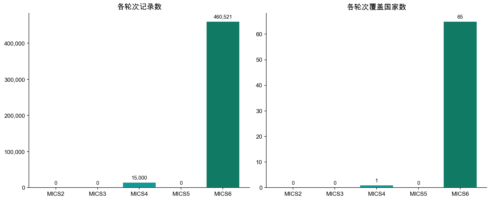
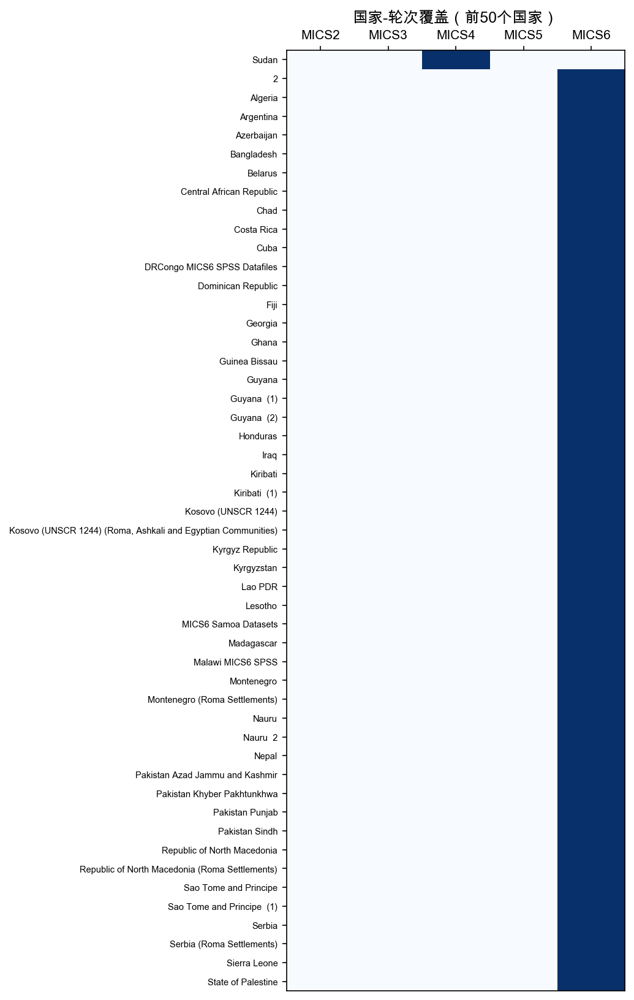
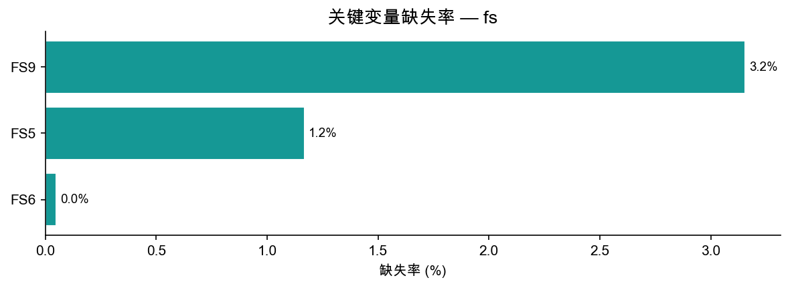
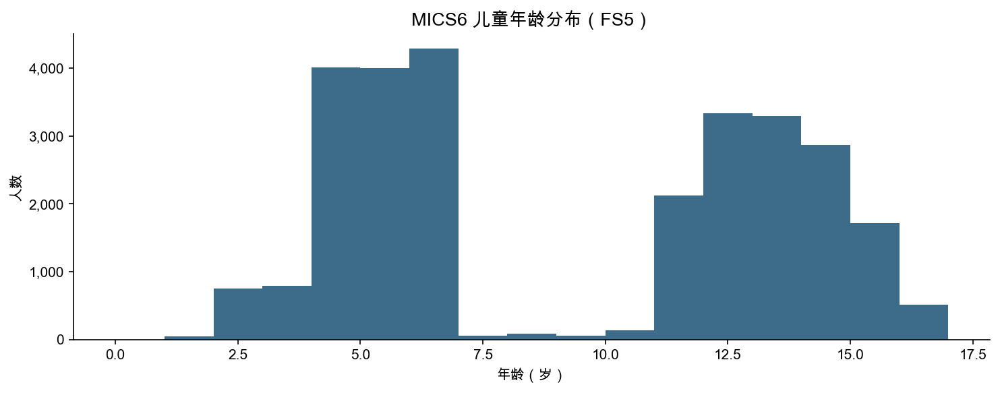

# fs 模块数据报告

> 生成脚本：`MICS/etc/generate_remaining.py`

---

## 1. 概览

| 指标 | 数值 |
|--------|-------|
| 总行数 | 475,521 |
| 总列数 | 1,848 |
| 覆盖国家/地区数 | 66 |
| 覆盖轮次 | MICS2 ~ MICS6 |

**fs 模块**（基础技能模块（7–14岁儿童））每行代表一名7–14岁儿童。主要包含：读写能力、计算能力、学习基础技能评估（FS*）、认知发展（CB*）等。仅存在于MICS5和MICS6。

---

## 2. 各轮次分布

| 轮次 | 国家/地区数 | 记录数 | 平均每国记录数 |
|------|------------|--------|--------------|
| MICS2 | 0 | 0 | 0 |
| MICS3 | 0 | 0 | 0 |
| MICS4 | 1 | 15,000 | 15,000 |
| MICS5 | 0 | 0 | 0 |
| MICS6 | 65 | 460,521 | 7,085 |

---

## 3. 国家-轮次覆盖

蓝色=有数据，白色=无数据。

---

## 4. 关键变量缺失率

缺失主要来自早期轮次问卷未包含该题。

| 变量 | 含义 | 缺失率 |
|------|------|--------|
| FS9 | 访谈结果 | 3.2% |
| FS5 | 年龄 | 1.2% |
| FS6 | 性别 | 0.0% |

---

## 5. 年龄分布（MICS6）

---

## 6. 标准核心变量列表

共 **1846** 个标准变量（出现在 ≥50% 的轮次中）

| 变量名 | 含义 | MICS3 | MICS4 | MICS5 | MICS6 |
|--------|------|:-----:|:-----:|:-----:|:-----:|
| `AC1` |  | — | — | — | ✓ |
| `AC2` |  | — | — | — | ✓ |
| `AC3` |  | — | — | — | ✓ |
| `AC4` |  | — | — | — | ✓ |
| `AC5` |  | — | — | — | ✓ |
| `AC6` |  | — | — | — | ✓ |
| `AC7` |  | — | — | — | ✓ |
| `AE5C` |  | — | — | — | ✓ |
| `AE5D` |  | — | — | — | ✓ |
| `AE5E` |  | — | — | — | ✓ |
| `AE5X` |  | — | — | — | ✓ |
| `BDH1` |  | — | — | — | ✓ |
| `BDH2` |  | — | — | — | ✓ |
| `BDH3` |  | — | — | — | ✓ |
| `BDH4` |  | — | — | — | ✓ |
| `BDH5` |  | — | — | — | ✓ |
| `BDH6` |  | — | — | — | ✓ |
| `BDH7` |  | — | — | — | ✓ |
| `BDH8` |  | — | — | — | ✓ |
| `CAUH1` |  | — | — | — | ✓ |
| `CAUH10` |  | — | — | — | ✓ |
| `CAUH11` |  | — | — | — | ✓ |
| `CAUH12A` |  | — | — | — | ✓ |
| `CAUH12B` |  | — | — | — | ✓ |
| `CAUH12C` |  | — | — | — | ✓ |
| `CAUH12D` |  | — | — | — | ✓ |
| `CAUH12E` |  | — | — | — | ✓ |
| `CAUH12F` |  | — | — | — | ✓ |
| `CAUH12G` |  | — | — | — | ✓ |
| `CAUH12H` |  | — | — | — | ✓ |
| `CAUH12I` |  | — | — | — | ✓ |
| `CAUH12J` |  | — | — | — | ✓ |
| `CAUH12K` |  | — | — | — | ✓ |
| `CAUH12L` |  | — | — | — | ✓ |
| `CAUH12M` |  | — | — | — | ✓ |
| `CAUH12N` |  | — | — | — | ✓ |
| `CAUH12NR` |  | — | — | — | ✓ |
| `CAUH12X` |  | — | — | — | ✓ |
| `CAUH13` |  | — | — | — | ✓ |
| `CAUH2` |  | — | — | — | ✓ |
| `CAUH3A` |  | — | — | — | ✓ |
| `CAUH3B` |  | — | — | — | ✓ |
| `CAUH3C` |  | — | — | — | ✓ |
| `CAUH3D` |  | — | — | — | ✓ |
| `CAUH3E` |  | — | — | — | ✓ |
| `CAUH3F` |  | — | — | — | ✓ |
| `CAUH3G` |  | — | — | — | ✓ |
| `CAUH3H` |  | — | — | — | ✓ |
| `CAUH3I` |  | — | — | — | ✓ |
| `CAUH3J` |  | — | — | — | ✓ |
| `CAUH3NR` |  | — | — | — | ✓ |
| `CAUH3X` |  | — | — | — | ✓ |
| `CAUH3Z` |  | — | — | — | ✓ |
| `CAUH4` |  | — | — | — | ✓ |
| `CAUH5` |  | — | — | — | ✓ |
| `CAUH6A` |  | — | — | — | ✓ |
| `CAUH6B` |  | — | — | — | ✓ |
| `CAUH6C` |  | — | — | — | ✓ |
| `CAUH6D` |  | — | — | — | ✓ |
| `CAUH6E` |  | — | — | — | ✓ |
| `CAUH6F` |  | — | — | — | ✓ |
| `CAUH6H` |  | — | — | — | ✓ |
| `CAUH6I` |  | — | — | — | ✓ |
| `CAUH6J` |  | — | — | — | ✓ |
| `CAUH6K` |  | — | — | — | ✓ |
| `CAUH6NR` |  | — | — | — | ✓ |
| `CAUH6X` |  | — | — | — | ✓ |
| `CAUH6Z` |  | — | — | — | ✓ |
| `CAUH7` |  | — | — | — | ✓ |
| `CAUH8` |  | — | — | — | ✓ |
| `CAUH9A` |  | — | — | — | ✓ |
| `CAUH9B` |  | — | — | — | ✓ |
| `CAUH9C` |  | — | — | — | ✓ |
| `CAUH9D` |  | — | — | — | ✓ |
| `CAUH9E` |  | — | — | — | ✓ |
| `CAUH9F` |  | — | — | — | ✓ |
| `CAUH9G` |  | — | — | — | ✓ |
| `CAUH9H` |  | — | — | — | ✓ |
| `CAUH9I` |  | — | — | — | ✓ |
| `CAUH9J` |  | — | — | — | ✓ |
| `CAUH9K` |  | — | — | — | ✓ |
| `CAUH9NR` |  | — | — | — | ✓ |
| `CAUH9X` |  | — | — | — | ✓ |
| `CB0A` |  | — | — | — | ✓ |
| `CB0C` |  | — | — | — | ✓ |
| `CB0E` |  | — | — | — | ✓ |
| `CB10A` |  | — | — | — | ✓ |
| `CB10A_CINE` |  | — | — | — | ✓ |
| `CB10B` |  | — | — | — | ✓ |
| `CB10B_CINE` |  | — | — | — | ✓ |
| `CB10CA` |  | — | — | — | ✓ |
| `CB10CB` |  | — | — | — | ✓ |
| `CB10CC` |  | — | — | — | ✓ |
| `CB10CD` |  | — | — | — | ✓ |
| `CB10CE` |  | — | — | — | ✓ |
| `CB10CNR` |  | — | — | — | ✓ |
| `CB10CX` |  | — | — | — | ✓ |
| `CB11` |  | — | — | — | ✓ |
| `CB11A` |  | — | — | — | ✓ |
| `CB12A` |  | — | — | — | ✓ |
| `CB12AB` |  | — | — | — | ✓ |
| `CB12ABA` |  | — | — | — | ✓ |
| `CB12ABB` |  | — | — | — | ✓ |
| `CB12ABC` |  | — | — | — | ✓ |
| `CB12ABD` |  | — | — | — | ✓ |
| `CB12ABE` |  | — | — | — | ✓ |
| `CB12ABF` |  | — | — | — | ✓ |
| `CB12ABG` |  | — | — | — | ✓ |
| `CB12ABH` |  | — | — | — | ✓ |
| `CB12ABI` |  | — | — | — | ✓ |
| `CB12ABJ` |  | — | — | — | ✓ |
| `CB12ABK` |  | — | — | — | ✓ |
| `CB12ABNR` |  | — | — | — | ✓ |
| `CB12ABX` |  | — | — | — | ✓ |
| `CB12AC` |  | — | — | — | ✓ |
| `CB12AD` |  | — | — | — | ✓ |
| `CB12ANR` |  | — | — | — | ✓ |
| `CB12AX` |  | — | — | — | ✓ |
| `CB12B` |  | — | — | — | ✓ |
| `CB12C` |  | — | — | — | ✓ |
| `CB12D` |  | — | — | — | ✓ |
| `CB12E` |  | — | — | — | ✓ |
| `CB12F` |  | — | — | — | ✓ |
| `CB12G` |  | — | — | — | ✓ |
| `CB12H` |  | — | — | — | ✓ |
| `CB12NR` |  | — | — | — | ✓ |
| `CB12X` |  | — | — | — | ✓ |
| `CB12Z` |  | — | — | — | ✓ |
| `CB13` |  | — | — | — | ✓ |
| `CB13AA` |  | — | — | — | ✓ |
| `CB13AB` |  | — | — | — | ✓ |
| `CB13AC` |  | — | — | — | ✓ |
| `CB13AD` |  | — | — | — | ✓ |
| `CB13AE` |  | — | — | — | ✓ |
| `CB13AF` |  | — | — | — | ✓ |
| `CB13AG` |  | — | — | — | ✓ |
| `CB13AH` |  | — | — | — | ✓ |
| `CB13ANR` |  | — | — | — | ✓ |
| `CB13AX` |  | — | — | — | ✓ |
| `CB13BA` |  | — | — | — | ✓ |
| `CB13BB` |  | — | — | — | ✓ |
| `CB13BC` |  | — | — | — | ✓ |
| `CB13BD` |  | — | — | — | ✓ |
| `CB13BE` |  | — | — | — | ✓ |
| `CB13BF` |  | — | — | — | ✓ |
| `CB13BG` |  | — | — | — | ✓ |
| `CB13BNR` |  | — | — | — | ✓ |
| `CB13BX` |  | — | — | — | ✓ |
| `CB13C` |  | — | — | — | ✓ |
| `CB13EA` |  | — | — | — | ✓ |
| `CB13EB` |  | — | — | — | ✓ |
| `CB13EC` |  | — | — | — | ✓ |
| `CB13ED` |  | — | — | — | ✓ |
| `CB13EE` |  | — | — | — | ✓ |
| `CB13EF` |  | — | — | — | ✓ |
| `CB13EG` |  | — | — | — | ✓ |
| `CB13EH` |  | — | — | — | ✓ |
| `CB13ENR` |  | — | — | — | ✓ |
| `CB13EX` |  | — | — | — | ✓ |
| `CB14` |  | — | — | — | ✓ |
| `CB14A` |  | — | — | — | ✓ |
| `CB14B` |  | — | — | — | ✓ |
| `CB14C` |  | — | — | — | ✓ |
| `CB14D` |  | — | — | — | ✓ |
| `CB14E` |  | — | — | — | ✓ |
| `CB14F` |  | — | — | — | ✓ |
| `CB14G` |  | — | — | — | ✓ |
| `CB14H` |  | — | — | — | ✓ |
| `CB14NR` |  | — | — | — | ✓ |
| `CB14X` |  | — | — | — | ✓ |
| `CB15` |  | — | — | — | ✓ |
| `CB16A` |  | — | — | — | ✓ |
| `CB16B` |  | — | — | — | ✓ |
| `CB16C` |  | — | — | — | ✓ |
| `CB16D` |  | — | — | — | ✓ |
| `CB16E` |  | — | — | — | ✓ |
| `CB16F` |  | — | — | — | ✓ |
| `CB16G` |  | — | — | — | ✓ |
| `CB16H` |  | — | — | — | ✓ |
| `CB16I` |  | — | — | — | ✓ |
| `CB16J` |  | — | — | — | ✓ |
| `CB16K` |  | — | — | — | ✓ |
| `CB16L` |  | — | — | — | ✓ |
| `CB16M` |  | — | — | — | ✓ |
| `CB16N` |  | — | — | — | ✓ |
| `CB16NR` |  | — | — | — | ✓ |
| `CB16X` |  | — | — | — | ✓ |
| `CB16Z` |  | — | — | — | ✓ |
| `CB2M` |  | — | — | — | ✓ |
| `CB2Y` |  | — | — | — | ✓ |
| `CB3` |  | — | — | — | ✓ |
| `CB4` |  | — | — | — | ✓ |
| `CB4A` |  | — | — | — | ✓ |
| `CB5A` |  | — | — | — | ✓ |
| `CB5A_CINE` |  | — | — | — | ✓ |
| `CB5B` |  | — | — | — | ✓ |
| `CB5B_CINE` |  | — | — | — | ✓ |
| `CB5D` |  | — | — | — | ✓ |
| `CB6` |  | — | — | — | ✓ |
| `CB6B1` |  | — | — | — | ✓ |
| `CB6B2` |  | — | — | — | ✓ |
| `CB6C` |  | — | — | — | ✓ |
| `CB7` |  | — | — | — | ✓ |
| `CB7A` |  | — | — | — | ✓ |
| `CB7B` |  | — | — | — | ✓ |
| `CB8A` |  | — | — | — | ✓ |
| `CB8AA` |  | — | — | — | ✓ |
| `CB8A_CINE` |  | — | — | — | ✓ |
| `CB8B` |  | — | — | — | ✓ |
| `CB8BB` |  | — | — | — | ✓ |
| `CB8B_CINE` |  | — | — | — | ✓ |
| `CB8CC` |  | — | — | — | ✓ |
| `CB8D` |  | — | — | — | ✓ |
| `CB9` |  | — | — | — | ✓ |
| `CCA1` |  | — | — | — | ✓ |
| `CCA2A` |  | — | — | — | ✓ |
| `CCA2B` |  | — | — | — | ✓ |
| `CCA2C` |  | — | — | — | ✓ |
| `CCA2NR` |  | — | — | — | ✓ |
| `CCA2X` |  | — | — | — | ✓ |
| `CCA4` |  | — | — | — | ✓ |
| `CCA5` |  | — | — | — | ✓ |
| `CCA6` |  | — | — | — | ✓ |
| `CL10` |  | — | — | — | ✓ |
| `CL10A` |  | — | — | — | ✓ |
| `CL10B` |  | — | — | — | ✓ |
| `CL11A` |  | — | — | — | ✓ |
| `CL11B` |  | — | — | — | ✓ |
| `CL11C` |  | — | — | — | ✓ |
| `CL11D` |  | — | — | — | ✓ |
| `CL11E` |  | — | — | — | ✓ |
| `CL11F` |  | — | — | — | ✓ |
| `CL11G` |  | — | — | — | ✓ |
| `CL11X` |  | — | — | — | ✓ |
| `CL13` |  | — | — | — | ✓ |
| `CL1A` |  | — | — | — | ✓ |
| `CL1B` |  | — | — | — | ✓ |
| `CL1C` |  | — | — | — | ✓ |
| `CL1X` |  | — | — | — | ✓ |
| `CL3` |  | — | — | — | ✓ |
| `CL4` |  | — | — | — | ✓ |
| `CL5` |  | — | — | — | ✓ |
| `CL6A` |  | — | — | — | ✓ |
| `CL6AA` |  | — | — | — | ✓ |
| `CL6B` |  | — | — | — | ✓ |
| `CL6BA` |  | — | — | — | ✓ |
| `CL6C` |  | — | — | — | ✓ |
| `CL6D` |  | — | — | — | ✓ |
| `CL6E` |  | — | — | — | ✓ |
| `CL6F` |  | — | — | — | ✓ |
| `CL6X` |  | — | — | — | ✓ |
| `CL7` |  | — | — | — | ✓ |
| `CL8` |  | — | — | — | ✓ |
| `CL9` |  | — | — | — | ✓ |
| `CMT10` |  | — | — | — | ✓ |
| `CMT11` |  | — | — | — | ✓ |
| `CMT12` |  | — | — | — | ✓ |
| `CMT4` |  | — | — | — | ✓ |
| `CMT5` |  | — | — | — | ✓ |
| `CMT9` |  | — | — | — | ✓ |
| `ClustCat` |  | — | — | — | ✓ |
| `DBH9` |  | — | — | — | ✓ |
| `ECB10A` |  | — | — | — | ✓ |
| `ECB10B` |  | — | — | — | ✓ |
| `ECB11` |  | — | — | — | ✓ |
| `ECB12A` |  | — | — | — | ✓ |
| `ECB12B` |  | — | — | — | ✓ |
| `ECB12C` |  | — | — | — | ✓ |
| `ECB12D` |  | — | — | — | ✓ |
| `ECB12X` |  | — | — | — | ✓ |
| `ECB12Z` |  | — | — | — | ✓ |
| `ECB2M` |  | — | — | — | ✓ |
| `ECB2Y` |  | — | — | — | ✓ |
| `ECB3` |  | — | — | — | ✓ |
| `ECB4` |  | — | — | — | ✓ |
| `ECB5A` |  | — | — | — | ✓ |
| `ECB5B` |  | — | — | — | ✓ |
| `ECB6` |  | — | — | — | ✓ |
| `ECB7` |  | — | — | — | ✓ |
| `ECB8A` |  | — | — | — | ✓ |
| `ECB8AA` |  | — | — | — | ✓ |
| `ECB8B` |  | — | — | — | ✓ |
| `ECB8BB` |  | — | — | — | ✓ |
| `ECB8CC` |  | — | — | — | ✓ |
| `ECB9` |  | — | — | — | ✓ |
| `ECF1` |  | — | — | — | ✓ |
| `ECF10` |  | — | — | — | ✓ |
| `ECF11` |  | — | — | — | ✓ |
| `ECF12` |  | — | — | — | ✓ |
| `ECF13` |  | — | — | — | ✓ |
| `ECF14` |  | — | — | — | ✓ |
| `ECF15` |  | — | — | — | ✓ |
| `ECF16` |  | — | — | — | ✓ |
| `ECF17` |  | — | — | — | ✓ |
| `ECF18` |  | — | — | — | ✓ |
| `ECF19` |  | — | — | — | ✓ |
| `ECF2` |  | — | — | — | ✓ |
| `ECF20` |  | — | — | — | ✓ |
| `ECF21` |  | — | — | — | ✓ |
| `ECF22` |  | — | — | — | ✓ |
| `ECF23` |  | — | — | — | ✓ |
| `ECF24` |  | — | — | — | ✓ |
| `ECF25` |  | — | — | — | ✓ |
| `ECF26` |  | — | — | — | ✓ |
| `ECF3` |  | — | — | — | ✓ |
| `ECF6` |  | — | — | — | ✓ |
| `ECF8` |  | — | — | — | ✓ |
| `ECL10` |  | — | — | — | ✓ |
| `ECL11A` |  | — | — | — | ✓ |
| `ECL11B` |  | — | — | — | ✓ |
| `ECL11C` |  | — | — | — | ✓ |
| `ECL11D` |  | — | — | — | ✓ |
| `ECL11E` |  | — | — | — | ✓ |
| `ECL11F` |  | — | — | — | ✓ |
| `ECL11X` |  | — | — | — | ✓ |
| `ECL13` |  | — | — | — | ✓ |
| `ECL1A` |  | — | — | — | ✓ |
| `ECL1B` |  | — | — | — | ✓ |
| `ECL1C` |  | — | — | — | ✓ |
| `ECL1X` |  | — | — | — | ✓ |
| `ECL3` |  | — | — | — | ✓ |
| `ECL4` |  | — | — | — | ✓ |
| `ECL5` |  | — | — | — | ✓ |
| `ECL6A` |  | — | — | — | ✓ |
| `ECL6B` |  | — | — | — | ✓ |
| `ECL6C` |  | — | — | — | ✓ |
| `ECL6D` |  | — | — | — | ✓ |
| `ECL6E` |  | — | — | — | ✓ |
| `ECL6X` |  | — | — | — | ✓ |
| `ECL7` |  | — | — | — | ✓ |
| `ECL8` |  | — | — | — | ✓ |
| `ECL9` |  | — | — | — | ✓ |
| `ED10A` |  | — | — | — | ✓ |
| `ED11` |  | — | — | — | ✓ |
| `ED5A` |  | — | — | — | ✓ |
| `ED5A_CINE` |  | — | — | — | ✓ |
| `ED5B` |  | — | — | — | ✓ |
| `ED5B_CINE` |  | — | — | — | ✓ |
| `ED6B1` |  | — | — | — | ✓ |
| `ED6B2` |  | — | — | — | ✓ |
| `FBR1` |  | — | — | — | ✓ |
| `FBR1A` |  | — | — | — | ✓ |
| `FBR2` |  | — | — | — | ✓ |
| `FBR3` |  | — | — | — | ✓ |
| `FBR4` |  | — | — | — | ✓ |
| `FBR4A` |  | — | — | — | ✓ |
| `FBR4B` |  | — | — | — | ✓ |
| `FBR4C` |  | — | — | — | ✓ |
| `FBR4D` |  | — | — | — | ✓ |
| `FBR4NR` |  | — | — | — | ✓ |
| `FBR4X` |  | — | — | — | ✓ |
| `FBR4Z` |  | — | — | — | ✓ |
| `FCD2A` |  | — | — | — | ✓ |
| `FCD2B` |  | — | — | — | ✓ |
| `FCD2C` |  | — | — | — | ✓ |
| `FCD2D` |  | — | — | — | ✓ |
| `FCD2E` |  | — | — | — | ✓ |
| `FCD2F` |  | — | — | — | ✓ |
| `FCD2G` |  | — | — | — | ✓ |
| `FCD2H` |  | — | — | — | ✓ |
| `FCD2I` |  | — | — | — | ✓ |
| `FCD2J` |  | — | — | — | ✓ |
| `FCD2K` |  | — | — | — | ✓ |
| `FCD2L` |  | — | — | — | ✓ |
| `FCD3` |  | — | — | — | ✓ |
| `FCD4` |  | — | — | — | ✓ |
| `FCD5` |  | — | — | — | ✓ |
| `FCF1` |  | — | — | — | ✓ |
| `FCF10` |  | — | — | — | ✓ |
| `FCF11` |  | — | — | — | ✓ |
| `FCF12` |  | — | — | — | ✓ |
| `FCF13` |  | — | — | — | ✓ |
| `FCF14` |  | — | — | — | ✓ |
| `FCF15` |  | — | — | — | ✓ |
| `FCF16` |  | — | — | — | ✓ |
| `FCF17` |  | — | — | — | ✓ |
| `FCF18` |  | — | — | — | ✓ |
| `FCF19` |  | — | — | — | ✓ |
| `FCF2` |  | — | — | — | ✓ |
| `FCF20` |  | — | — | — | ✓ |
| `FCF21` |  | — | — | — | ✓ |
| `FCF22` |  | — | — | — | ✓ |
| `FCF23` |  | — | — | — | ✓ |
| `FCF24` |  | — | — | — | ✓ |
| `FCF25` |  | — | — | — | ✓ |
| `FCF26` |  | — | — | — | ✓ |
| `FCF3` |  | — | — | — | ✓ |
| `FCF4` |  | — | — | — | ✓ |
| `FCF6` |  | — | — | — | ✓ |
| `FCF8` |  | — | — | — | ✓ |
| `FL1` |  | — | — | — | ✓ |
| `FL10` |  | — | — | — | ✓ |
| `FL100` |  | — | — | — | ✓ |
| `FL10C` |  | — | — | — | ✓ |
| `FL110` |  | — | — | — | ✓ |
| `FL113` |  | — | — | — | ✓ |
| `FL114` |  | — | — | — | ✓ |
| `FL115` |  | — | — | — | ✓ |
| `FL116` |  | — | — | — | ✓ |
| `FL117` |  | — | — | — | ✓ |
| `FL118` |  | — | — | — | ✓ |
| `FL119INTRO` |  | — | — | — | ✓ |
| `FL119W1` |  | — | — | — | ✓ |
| `FL119W10` |  | — | — | — | ✓ |
| `FL119W11` |  | — | — | — | ✓ |
| `FL119W12` |  | — | — | — | ✓ |
| `FL119W13` |  | — | — | — | ✓ |
| `FL119W14` |  | — | — | — | ✓ |
| `FL119W15` |  | — | — | — | ✓ |
| `FL119W16` |  | — | — | — | ✓ |
| `FL119W17` |  | — | — | — | ✓ |
| `FL119W18` |  | — | — | — | ✓ |
| `FL119W19` |  | — | — | — | ✓ |
| `FL119W2` |  | — | — | — | ✓ |
| `FL119W20` |  | — | — | — | ✓ |
| `FL119W21` |  | — | — | — | ✓ |
| `FL119W22` |  | — | — | — | ✓ |
| `FL119W23` |  | — | — | — | ✓ |
| `FL119W24` |  | — | — | — | ✓ |
| `FL119W25` |  | — | — | — | ✓ |
| `FL119W26` |  | — | — | — | ✓ |
| `FL119W27` |  | — | — | — | ✓ |
| `FL119W28` |  | — | — | — | ✓ |
| `FL119W29` |  | — | — | — | ✓ |
| `FL119W3` |  | — | — | — | ✓ |
| `FL119W30` |  | — | — | — | ✓ |
| `FL119W31` |  | — | — | — | ✓ |
| `FL119W32` |  | — | — | — | ✓ |
| `FL119W33` |  | — | — | — | ✓ |
| `FL119W34` |  | — | — | — | ✓ |
| `FL119W35` |  | — | — | — | ✓ |
| `FL119W36` |  | — | — | — | ✓ |
| `FL119W37` |  | — | — | — | ✓ |
| `FL119W38` |  | — | — | — | ✓ |
| `FL119W39` |  | — | — | — | ✓ |
| `FL119W4` |  | — | — | — | ✓ |
| `FL119W40` |  | — | — | — | ✓ |
| `FL119W41` |  | — | — | — | ✓ |
| `FL119W42` |  | — | — | — | ✓ |
| `FL119W43` |  | — | — | — | ✓ |
| `FL119W44` |  | — | — | — | ✓ |
| `FL119W45` |  | — | — | — | ✓ |
| `FL119W46` |  | — | — | — | ✓ |
| `FL119W47` |  | — | — | — | ✓ |
| `FL119W48` |  | — | — | — | ✓ |
| `FL119W49` |  | — | — | — | ✓ |
| `FL119W5` |  | — | — | — | ✓ |
| `FL119W50` |  | — | — | — | ✓ |
| `FL119W51` |  | — | — | — | ✓ |
| `FL119W52` |  | — | — | — | ✓ |
| `FL119W53` |  | — | — | — | ✓ |
| `FL119W54` |  | — | — | — | ✓ |
| `FL119W55` |  | — | — | — | ✓ |
| `FL119W56` |  | — | — | — | ✓ |
| `FL119W57` |  | — | — | — | ✓ |
| `FL119W58` |  | — | — | — | ✓ |
| `FL119W59` |  | — | — | — | ✓ |
| `FL119W6` |  | — | — | — | ✓ |
| `FL119W60` |  | — | — | — | ✓ |
| `FL119W61` |  | — | — | — | ✓ |
| `FL119W62` |  | — | — | — | ✓ |
| `FL119W63` |  | — | — | — | ✓ |
| `FL119W64` |  | — | — | — | ✓ |
| `FL119W65` |  | — | — | — | ✓ |
| `FL119W66` |  | — | — | — | ✓ |
| `FL119W67` |  | — | — | — | ✓ |
| `FL119W68` |  | — | — | — | ✓ |
| `FL119W69` |  | — | — | — | ✓ |
| `FL119W7` |  | — | — | — | ✓ |
| `FL119W70` |  | — | — | — | ✓ |
| `FL119W71` |  | — | — | — | ✓ |
| `FL119W72` |  | — | — | — | ✓ |
| `FL119W73` |  | — | — | — | ✓ |
| `FL119W74` |  | — | — | — | ✓ |
| `FL119W75` |  | — | — | — | ✓ |
| `FL119W76` |  | — | — | — | ✓ |
| `FL119W77` |  | — | — | — | ✓ |
| `FL119W78` |  | — | — | — | ✓ |
| `FL119W79` |  | — | — | — | ✓ |
| `FL119W8` |  | — | — | — | ✓ |
| `FL119W80` |  | — | — | — | ✓ |
| `FL119W81` |  | — | — | — | ✓ |
| `FL119W82` |  | — | — | — | ✓ |
| `FL119W83` |  | — | — | — | ✓ |
| `FL119W84` |  | — | — | — | ✓ |
| `FL119W9` |  | — | — | — | ✓ |
| `FL120A` |  | — | — | — | ✓ |
| `FL120B` |  | — | — | — | ✓ |
| `FL121` |  | — | — | — | ✓ |
| `FL122A` |  | — | — | — | ✓ |
| `FL122B` |  | — | — | — | ✓ |
| `FL122C` |  | — | — | — | ✓ |
| `FL122D` |  | — | — | — | ✓ |
| `FL122E` |  | — | — | — | ✓ |
| `FL13` |  | — | — | — | ✓ |
| `FL14` |  | — | — | — | ✓ |
| `FL15` |  | — | — | — | ✓ |
| `FL16` |  | — | — | — | ✓ |
| `FL17` |  | — | — | — | ✓ |
| `FL18` |  | — | — | — | ✓ |
| `FL19END` |  | — | — | — | ✓ |
| `FL19INTRO` |  | — | — | — | ✓ |
| `FL19W1` |  | — | — | — | ✓ |
| `FL19W10` |  | — | — | — | ✓ |
| `FL19W100` |  | — | — | — | ✓ |
| `FL19W101` |  | — | — | — | ✓ |
| `FL19W102` |  | — | — | — | ✓ |
| `FL19W103` |  | — | — | — | ✓ |
| `FL19W104` |  | — | — | — | ✓ |
| `FL19W105` |  | — | — | — | ✓ |
| `FL19W106` |  | — | — | — | ✓ |
| `FL19W107` |  | — | — | — | ✓ |
| `FL19W108` |  | — | — | — | ✓ |
| `FL19W109` |  | — | — | — | ✓ |
| `FL19W11` |  | — | — | — | ✓ |
| `FL19W110` |  | — | — | — | ✓ |
| `FL19W111` |  | — | — | — | ✓ |
| `FL19W12` |  | — | — | — | ✓ |
| `FL19W13` |  | — | — | — | ✓ |
| `FL19W14` |  | — | — | — | ✓ |
| `FL19W15` |  | — | — | — | ✓ |
| `FL19W16` |  | — | — | — | ✓ |
| `FL19W17` |  | — | — | — | ✓ |
| `FL19W18` |  | — | — | — | ✓ |
| `FL19W19` |  | — | — | — | ✓ |
| `FL19W2` |  | — | — | — | ✓ |
| `FL19W20` |  | — | — | — | ✓ |
| `FL19W21` |  | — | — | — | ✓ |
| `FL19W22` |  | — | — | — | ✓ |
| `FL19W23` |  | — | — | — | ✓ |
| `FL19W24` |  | — | — | — | ✓ |
| `FL19W25` |  | — | — | — | ✓ |
| `FL19W26` |  | — | — | — | ✓ |
| `FL19W27` |  | — | — | — | ✓ |
| `FL19W28` |  | — | — | — | ✓ |
| `FL19W29` |  | — | — | — | ✓ |
| `FL19W3` |  | — | — | — | ✓ |
| `FL19W30` |  | — | — | — | ✓ |
| `FL19W31` |  | — | — | — | ✓ |
| `FL19W32` |  | — | — | — | ✓ |
| `FL19W33` |  | — | — | — | ✓ |
| `FL19W34` |  | — | — | — | ✓ |
| `FL19W35` |  | — | — | — | ✓ |
| `FL19W36` |  | — | — | — | ✓ |
| `FL19W37` |  | — | — | — | ✓ |
| `FL19W38` |  | — | — | — | ✓ |
| `FL19W39` |  | — | — | — | ✓ |
| `FL19W4` |  | — | — | — | ✓ |
| `FL19W40` |  | — | — | — | ✓ |
| `FL19W41` |  | — | — | — | ✓ |
| `FL19W42` |  | — | — | — | ✓ |
| `FL19W43` |  | — | — | — | ✓ |
| `FL19W44` |  | — | — | — | ✓ |
| `FL19W45` |  | — | — | — | ✓ |
| `FL19W46` |  | — | — | — | ✓ |
| `FL19W47` |  | — | — | — | ✓ |
| `FL19W48` |  | — | — | — | ✓ |
| `FL19W49` |  | — | — | — | ✓ |
| `FL19W5` |  | — | — | — | ✓ |
| `FL19W50` |  | — | — | — | ✓ |
| `FL19W51` |  | — | — | — | ✓ |
| `FL19W52` |  | — | — | — | ✓ |
| `FL19W53` |  | — | — | — | ✓ |
| `FL19W54` |  | — | — | — | ✓ |
| `FL19W55` |  | — | — | — | ✓ |
| `FL19W56` |  | — | — | — | ✓ |
| `FL19W57` |  | — | — | — | ✓ |
| `FL19W58` |  | — | — | — | ✓ |
| `FL19W59` |  | — | — | — | ✓ |
| `FL19W6` |  | — | — | — | ✓ |
| `FL19W60` |  | — | — | — | ✓ |
| `FL19W61` |  | — | — | — | ✓ |
| `FL19W62` |  | — | — | — | ✓ |
| `FL19W63` |  | — | — | — | ✓ |
| `FL19W64` |  | — | — | — | ✓ |
| `FL19W65` |  | — | — | — | ✓ |
| `FL19W66` |  | — | — | — | ✓ |
| `FL19W67` |  | — | — | — | ✓ |
| `FL19W68` |  | — | — | — | ✓ |
| `FL19W69` |  | — | — | — | ✓ |
| `FL19W7` |  | — | — | — | ✓ |
| `FL19W70` |  | — | — | — | ✓ |
| `FL19W71` |  | — | — | — | ✓ |
| `FL19W72` |  | — | — | — | ✓ |
| `FL19W73` |  | — | — | — | ✓ |
| `FL19W74` |  | — | — | — | ✓ |
| `FL19W75` |  | — | — | — | ✓ |
| `FL19W76` |  | — | — | — | ✓ |
| `FL19W77` |  | — | — | — | ✓ |
| `FL19W78` |  | — | — | — | ✓ |
| `FL19W79` |  | — | — | — | ✓ |
| `FL19W8` |  | — | — | — | ✓ |
| `FL19W80` |  | — | — | — | ✓ |
| `FL19W81` |  | — | — | — | ✓ |
| `FL19W82` |  | — | — | — | ✓ |
| `FL19W83` |  | — | — | — | ✓ |
| `FL19W84` |  | — | — | — | ✓ |
| `FL19W85` |  | — | — | — | ✓ |
| `FL19W86` |  | — | — | — | ✓ |
| `FL19W87` |  | — | — | — | ✓ |
| `FL19W88` |  | — | — | — | ✓ |
| `FL19W89` |  | — | — | — | ✓ |
| `FL19W9` |  | — | — | — | ✓ |
| `FL19W90` |  | — | — | — | ✓ |
| `FL19W91` |  | — | — | — | ✓ |
| `FL19W92` |  | — | — | — | ✓ |
| `FL19W93` |  | — | — | — | ✓ |
| `FL19W94` |  | — | — | — | ✓ |
| `FL19W95` |  | — | — | — | ✓ |
| `FL19W96` |  | — | — | — | ✓ |
| `FL19W97` |  | — | — | — | ✓ |
| `FL19W98` |  | — | — | — | ✓ |
| `FL19W99` |  | — | — | — | ✓ |
| `FL19WA1` |  | — | — | — | ✓ |
| `FL19WA10` |  | — | — | — | ✓ |
| `FL19WA11` |  | — | — | — | ✓ |
| `FL19WA12` |  | — | — | — | ✓ |
| `FL19WA13` |  | — | — | — | ✓ |
| `FL19WA14` |  | — | — | — | ✓ |
| `FL19WA15` |  | — | — | — | ✓ |
| `FL19WA16` |  | — | — | — | ✓ |
| `FL19WA17` |  | — | — | — | ✓ |
| `FL19WA18` |  | — | — | — | ✓ |
| `FL19WA19` |  | — | — | — | ✓ |
| `FL19WA2` |  | — | — | — | ✓ |
| `FL19WA20` |  | — | — | — | ✓ |
| `FL19WA21` |  | — | — | — | ✓ |
| `FL19WA22` |  | — | — | — | ✓ |
| `FL19WA23` |  | — | — | — | ✓ |
| `FL19WA24` |  | — | — | — | ✓ |
| `FL19WA25` |  | — | — | — | ✓ |
| `FL19WA26` |  | — | — | — | ✓ |
| `FL19WA27` |  | — | — | — | ✓ |
| `FL19WA28` |  | — | — | — | ✓ |
| `FL19WA29` |  | — | — | — | ✓ |
| `FL19WA3` |  | — | — | — | ✓ |
| `FL19WA30` |  | — | — | — | ✓ |
| `FL19WA31` |  | — | — | — | ✓ |
| `FL19WA32` |  | — | — | — | ✓ |
| `FL19WA33` |  | — | — | — | ✓ |
| `FL19WA34` |  | — | — | — | ✓ |
| `FL19WA35` |  | — | — | — | ✓ |
| `FL19WA36` |  | — | — | — | ✓ |
| `FL19WA37` |  | — | — | — | ✓ |
| `FL19WA38` |  | — | — | — | ✓ |
| `FL19WA39` |  | — | — | — | ✓ |
| `FL19WA4` |  | — | — | — | ✓ |
| `FL19WA40` |  | — | — | — | ✓ |
| `FL19WA41` |  | — | — | — | ✓ |
| `FL19WA42` |  | — | — | — | ✓ |
| `FL19WA43` |  | — | — | — | ✓ |
| `FL19WA44` |  | — | — | — | ✓ |
| `FL19WA45` |  | — | — | — | ✓ |
| `FL19WA46` |  | — | — | — | ✓ |
| `FL19WA47` |  | — | — | — | ✓ |
| `FL19WA48` |  | — | — | — | ✓ |
| `FL19WA49` |  | — | — | — | ✓ |
| `FL19WA5` |  | — | — | — | ✓ |
| `FL19WA50` |  | — | — | — | ✓ |
| `FL19WA51` |  | — | — | — | ✓ |
| `FL19WA52` |  | — | — | — | ✓ |
| `FL19WA53` |  | — | — | — | ✓ |
| `FL19WA54` |  | — | — | — | ✓ |
| `FL19WA55` |  | — | — | — | ✓ |
| `FL19WA56` |  | — | — | — | ✓ |
| `FL19WA57` |  | — | — | — | ✓ |
| `FL19WA58` |  | — | — | — | ✓ |
| `FL19WA59` |  | — | — | — | ✓ |
| `FL19WA6` |  | — | — | — | ✓ |
| `FL19WA60` |  | — | — | — | ✓ |
| `FL19WA61` |  | — | — | — | ✓ |
| `FL19WA62` |  | — | — | — | ✓ |
| `FL19WA63` |  | — | — | — | ✓ |
| `FL19WA64` |  | — | — | — | ✓ |
| `FL19WA65` |  | — | — | — | ✓ |
| `FL19WA66` |  | — | — | — | ✓ |
| `FL19WA67` |  | — | — | — | ✓ |
| `FL19WA68` |  | — | — | — | ✓ |
| `FL19WA69` |  | — | — | — | ✓ |
| `FL19WA7` |  | — | — | — | ✓ |
| `FL19WA70` |  | — | — | — | ✓ |
| `FL19WA71` |  | — | — | — | ✓ |
| `FL19WA72` |  | — | — | — | ✓ |
| `FL19WA73` |  | — | — | — | ✓ |
| `FL19WA74` |  | — | — | — | ✓ |
| `FL19WA75` |  | — | — | — | ✓ |
| `FL19WA76` |  | — | — | — | ✓ |
| `FL19WA77` |  | — | — | — | ✓ |
| `FL19WA78` |  | — | — | — | ✓ |
| `FL19WA8` |  | — | — | — | ✓ |
| `FL19WA9` |  | — | — | — | ✓ |
| `FL19WB1` |  | — | — | — | ✓ |
| `FL19WB10` |  | — | — | — | ✓ |
| `FL19WB11` |  | — | — | — | ✓ |
| `FL19WB12` |  | — | — | — | ✓ |
| `FL19WB13` |  | — | — | — | ✓ |
| `FL19WB14` |  | — | — | — | ✓ |
| `FL19WB15` |  | — | — | — | ✓ |
| `FL19WB16` |  | — | — | — | ✓ |
| `FL19WB17` |  | — | — | — | ✓ |
| `FL19WB18` |  | — | — | — | ✓ |
| `FL19WB19` |  | — | — | — | ✓ |
| `FL19WB2` |  | — | — | — | ✓ |
| `FL19WB20` |  | — | — | — | ✓ |
| `FL19WB21` |  | — | — | — | ✓ |
| `FL19WB22` |  | — | — | — | ✓ |
| `FL19WB23` |  | — | — | — | ✓ |
| `FL19WB24` |  | — | — | — | ✓ |
| `FL19WB25` |  | — | — | — | ✓ |
| `FL19WB26` |  | — | — | — | ✓ |
| `FL19WB27` |  | — | — | — | ✓ |
| `FL19WB28` |  | — | — | — | ✓ |
| `FL19WB29` |  | — | — | — | ✓ |
| `FL19WB3` |  | — | — | — | ✓ |
| `FL19WB30` |  | — | — | — | ✓ |
| `FL19WB31` |  | — | — | — | ✓ |
| `FL19WB32` |  | — | — | — | ✓ |
| `FL19WB33` |  | — | — | — | ✓ |
| `FL19WB34` |  | — | — | — | ✓ |
| `FL19WB35` |  | — | — | — | ✓ |
| `FL19WB36` |  | — | — | — | ✓ |
| `FL19WB37` |  | — | — | — | ✓ |
| `FL19WB38` |  | — | — | — | ✓ |
| `FL19WB39` |  | — | — | — | ✓ |
| `FL19WB4` |  | — | — | — | ✓ |
| `FL19WB40` |  | — | — | — | ✓ |
| `FL19WB41` |  | — | — | — | ✓ |
| `FL19WB42` |  | — | — | — | ✓ |
| `FL19WB43` |  | — | — | — | ✓ |
| `FL19WB44` |  | — | — | — | ✓ |
| `FL19WB45` |  | — | — | — | ✓ |
| `FL19WB46` |  | — | — | — | ✓ |
| `FL19WB47` |  | — | — | — | ✓ |
| `FL19WB48` |  | — | — | — | ✓ |
| `FL19WB49` |  | — | — | — | ✓ |
| `FL19WB5` |  | — | — | — | ✓ |
| `FL19WB50` |  | — | — | — | ✓ |
| `FL19WB51` |  | — | — | — | ✓ |
| `FL19WB52` |  | — | — | — | ✓ |
| `FL19WB53` |  | — | — | — | ✓ |
| `FL19WB54` |  | — | — | — | ✓ |
| `FL19WB55` |  | — | — | — | ✓ |
| `FL19WB56` |  | — | — | — | ✓ |
| `FL19WB57` |  | — | — | — | ✓ |
| `FL19WB58` |  | — | — | — | ✓ |
| `FL19WB59` |  | — | — | — | ✓ |
| `FL19WB6` |  | — | — | — | ✓ |
| `FL19WB60` |  | — | — | — | ✓ |
| `FL19WB61` |  | — | — | — | ✓ |
| `FL19WB62` |  | — | — | — | ✓ |
| `FL19WB63` |  | — | — | — | ✓ |
| `FL19WB64` |  | — | — | — | ✓ |
| `FL19WB65` |  | — | — | — | ✓ |
| `FL19WB66` |  | — | — | — | ✓ |
| `FL19WB67` |  | — | — | — | ✓ |
| `FL19WB68` |  | — | — | — | ✓ |
| `FL19WB69` |  | — | — | — | ✓ |
| `FL19WB7` |  | — | — | — | ✓ |
| `FL19WB70` |  | — | — | — | ✓ |
| `FL19WB71` |  | — | — | — | ✓ |
| `FL19WB72` |  | — | — | — | ✓ |
| `FL19WB8` |  | — | — | — | ✓ |
| `FL19WB9` |  | — | — | — | ✓ |
| `FL19WS1` |  | — | — | — | ✓ |
| `FL19WS10` |  | — | — | — | ✓ |
| `FL19WS11` |  | — | — | — | ✓ |
| `FL19WS12` |  | — | — | — | ✓ |
| `FL19WS13` |  | — | — | — | ✓ |
| `FL19WS14` |  | — | — | — | ✓ |
| `FL19WS15` |  | — | — | — | ✓ |
| `FL19WS16` |  | — | — | — | ✓ |
| `FL19WS17` |  | — | — | — | ✓ |
| `FL19WS18` |  | — | — | — | ✓ |
| `FL19WS19` |  | — | — | — | ✓ |
| `FL19WS2` |  | — | — | — | ✓ |
| `FL19WS20` |  | — | — | — | ✓ |
| `FL19WS21` |  | — | — | — | ✓ |
| `FL19WS22` |  | — | — | — | ✓ |
| `FL19WS23` |  | — | — | — | ✓ |
| `FL19WS24` |  | — | — | — | ✓ |
| `FL19WS25` |  | — | — | — | ✓ |
| `FL19WS26` |  | — | — | — | ✓ |
| `FL19WS27` |  | — | — | — | ✓ |
| `FL19WS28` |  | — | — | — | ✓ |
| `FL19WS29` |  | — | — | — | ✓ |
| `FL19WS3` |  | — | — | — | ✓ |
| `FL19WS30` |  | — | — | — | ✓ |
| `FL19WS31` |  | — | — | — | ✓ |
| `FL19WS32` |  | — | — | — | ✓ |
| `FL19WS33` |  | — | — | — | ✓ |
| `FL19WS34` |  | — | — | — | ✓ |
| `FL19WS35` |  | — | — | — | ✓ |
| `FL19WS36` |  | — | — | — | ✓ |
| `FL19WS37` |  | — | — | — | ✓ |
| `FL19WS38` |  | — | — | — | ✓ |
| `FL19WS39` |  | — | — | — | ✓ |
| `FL19WS4` |  | — | — | — | ✓ |
| `FL19WS40` |  | — | — | — | ✓ |
| `FL19WS41` |  | — | — | — | ✓ |
| `FL19WS42` |  | — | — | — | ✓ |
| `FL19WS43` |  | — | — | — | ✓ |
| `FL19WS44` |  | — | — | — | ✓ |
| `FL19WS45` |  | — | — | — | ✓ |
| `FL19WS46` |  | — | — | — | ✓ |
| `FL19WS47` |  | — | — | — | ✓ |
| `FL19WS48` |  | — | — | — | ✓ |
| `FL19WS49` |  | — | — | — | ✓ |
| `FL19WS5` |  | — | — | — | ✓ |
| `FL19WS50` |  | — | — | — | ✓ |
| `FL19WS51` |  | — | — | — | ✓ |
| `FL19WS52` |  | — | — | — | ✓ |
| `FL19WS53` |  | — | — | — | ✓ |
| `FL19WS54` |  | — | — | — | ✓ |
| `FL19WS55` |  | — | — | — | ✓ |
| `FL19WS56` |  | — | — | — | ✓ |
| `FL19WS57` |  | — | — | — | ✓ |
| `FL19WS58` |  | — | — | — | ✓ |
| `FL19WS59` |  | — | — | — | ✓ |
| `FL19WS6` |  | — | — | — | ✓ |
| `FL19WS60` |  | — | — | — | ✓ |
| `FL19WS61` |  | — | — | — | ✓ |
| `FL19WS62` |  | — | — | — | ✓ |
| `FL19WS63` |  | — | — | — | ✓ |
| `FL19WS64` |  | — | — | — | ✓ |
| `FL19WS65` |  | — | — | — | ✓ |
| `FL19WS66` |  | — | — | — | ✓ |
| `FL19WS67` |  | — | — | — | ✓ |
| `FL19WS68` |  | — | — | — | ✓ |
| `FL19WS69` |  | — | — | — | ✓ |
| `FL19WS7` |  | — | — | — | ✓ |
| `FL19WS70` |  | — | — | — | ✓ |
| `FL19WS71` |  | — | — | — | ✓ |
| `FL19WS72` |  | — | — | — | ✓ |
| `FL19WS8` |  | — | — | — | ✓ |
| `FL19WS9` |  | — | — | — | ✓ |
| `FL19WT1` |  | — | — | — | ✓ |
| `FL19WT10` |  | — | — | — | ✓ |
| `FL19WT11` |  | — | — | — | ✓ |
| `FL19WT12` |  | — | — | — | ✓ |
| `FL19WT13` |  | — | — | — | ✓ |
| `FL19WT14` |  | — | — | — | ✓ |
| `FL19WT15` |  | — | — | — | ✓ |
| `FL19WT16` |  | — | — | — | ✓ |
| `FL19WT17` |  | — | — | — | ✓ |
| `FL19WT18` |  | — | — | — | ✓ |
| `FL19WT19` |  | — | — | — | ✓ |
| `FL19WT2` |  | — | — | — | ✓ |
| `FL19WT20` |  | — | — | — | ✓ |
| `FL19WT21` |  | — | — | — | ✓ |
| `FL19WT22` |  | — | — | — | ✓ |
| `FL19WT23` |  | — | — | — | ✓ |
| `FL19WT24` |  | — | — | — | ✓ |
| `FL19WT25` |  | — | — | — | ✓ |
| `FL19WT26` |  | — | — | — | ✓ |
| `FL19WT27` |  | — | — | — | ✓ |
| `FL19WT28` |  | — | — | — | ✓ |
| `FL19WT29` |  | — | — | — | ✓ |
| `FL19WT3` |  | — | — | — | ✓ |
| `FL19WT30` |  | — | — | — | ✓ |
| `FL19WT31` |  | — | — | — | ✓ |
| `FL19WT32` |  | — | — | — | ✓ |
| `FL19WT33` |  | — | — | — | ✓ |
| `FL19WT34` |  | — | — | — | ✓ |
| `FL19WT35` |  | — | — | — | ✓ |
| `FL19WT36` |  | — | — | — | ✓ |
| `FL19WT37` |  | — | — | — | ✓ |
| `FL19WT38` |  | — | — | — | ✓ |
| `FL19WT39` |  | — | — | — | ✓ |
| `FL19WT4` |  | — | — | — | ✓ |
| `FL19WT40` |  | — | — | — | ✓ |
| `FL19WT41` |  | — | — | — | ✓ |
| `FL19WT42` |  | — | — | — | ✓ |
| `FL19WT43` |  | — | — | — | ✓ |
| `FL19WT44` |  | — | — | — | ✓ |
| `FL19WT45` |  | — | — | — | ✓ |
| `FL19WT46` |  | — | — | — | ✓ |
| `FL19WT47` |  | — | — | — | ✓ |
| `FL19WT48` |  | — | — | — | ✓ |
| `FL19WT49` |  | — | — | — | ✓ |
| `FL19WT5` |  | — | — | — | ✓ |
| `FL19WT50` |  | — | — | — | ✓ |
| `FL19WT51` |  | — | — | — | ✓ |
| `FL19WT52` |  | — | — | — | ✓ |
| `FL19WT53` |  | — | — | — | ✓ |
| `FL19WT6` |  | — | — | — | ✓ |
| `FL19WT7` |  | — | — | — | ✓ |
| `FL19WT8` |  | — | — | — | ✓ |
| `FL19WT9` |  | — | — | — | ✓ |
| `FL1AB` |  | — | — | — | ✓ |
| `FL20A` |  | — | — | — | ✓ |
| `FL20B` |  | — | — | — | ✓ |
| `FL21` |  | — | — | — | ✓ |
| `FL210` |  | — | — | — | ✓ |
| `FL213` |  | — | — | — | ✓ |
| `FL214` |  | — | — | — | ✓ |
| `FL215` |  | — | — | — | ✓ |
| `FL216` |  | — | — | — | ✓ |
| `FL217` |  | — | — | — | ✓ |
| `FL218` |  | — | — | — | ✓ |
| `FL219INTRO` |  | — | — | — | ✓ |
| `FL219W1` |  | — | — | — | ✓ |
| `FL219W10` |  | — | — | — | ✓ |
| `FL219W11` |  | — | — | — | ✓ |
| `FL219W12` |  | — | — | — | ✓ |
| `FL219W13` |  | — | — | — | ✓ |
| `FL219W14` |  | — | — | — | ✓ |
| `FL219W15` |  | — | — | — | ✓ |
| `FL219W16` |  | — | — | — | ✓ |
| `FL219W17` |  | — | — | — | ✓ |
| `FL219W18` |  | — | — | — | ✓ |
| `FL219W19` |  | — | — | — | ✓ |
| `FL219W2` |  | — | — | — | ✓ |
| `FL219W20` |  | — | — | — | ✓ |
| `FL219W21` |  | — | — | — | ✓ |
| `FL219W22` |  | — | — | — | ✓ |
| `FL219W23` |  | — | — | — | ✓ |
| `FL219W24` |  | — | — | — | ✓ |
| `FL219W25` |  | — | — | — | ✓ |
| `FL219W26` |  | — | — | — | ✓ |
| `FL219W27` |  | — | — | — | ✓ |
| `FL219W28` |  | — | — | — | ✓ |
| `FL219W29` |  | — | — | — | ✓ |
| `FL219W3` |  | — | — | — | ✓ |
| `FL219W30` |  | — | — | — | ✓ |
| `FL219W31` |  | — | — | — | ✓ |
| `FL219W32` |  | — | — | — | ✓ |
| `FL219W33` |  | — | — | — | ✓ |
| `FL219W34` |  | — | — | — | ✓ |
| `FL219W35` |  | — | — | — | ✓ |
| `FL219W36` |  | — | — | — | ✓ |
| `FL219W37` |  | — | — | — | ✓ |
| `FL219W38` |  | — | — | — | ✓ |
| `FL219W39` |  | — | — | — | ✓ |
| `FL219W4` |  | — | — | — | ✓ |
| `FL219W40` |  | — | — | — | ✓ |
| `FL219W41` |  | — | — | — | ✓ |
| `FL219W42` |  | — | — | — | ✓ |
| `FL219W43` |  | — | — | — | ✓ |
| `FL219W44` |  | — | — | — | ✓ |
| `FL219W45` |  | — | — | — | ✓ |
| `FL219W46` |  | — | — | — | ✓ |
| `FL219W47` |  | — | — | — | ✓ |
| `FL219W48` |  | — | — | — | ✓ |
| `FL219W49` |  | — | — | — | ✓ |
| `FL219W5` |  | — | — | — | ✓ |
| `FL219W50` |  | — | — | — | ✓ |
| `FL219W51` |  | — | — | — | ✓ |
| `FL219W52` |  | — | — | — | ✓ |
| `FL219W53` |  | — | — | — | ✓ |
| `FL219W54` |  | — | — | — | ✓ |
| `FL219W55` |  | — | — | — | ✓ |
| `FL219W56` |  | — | — | — | ✓ |
| `FL219W57` |  | — | — | — | ✓ |
| `FL219W58` |  | — | — | — | ✓ |
| `FL219W59` |  | — | — | — | ✓ |
| `FL219W6` |  | — | — | — | ✓ |
| `FL219W60` |  | — | — | — | ✓ |
| `FL219W61` |  | — | — | — | ✓ |
| `FL219W62` |  | — | — | — | ✓ |
| `FL219W63` |  | — | — | — | ✓ |
| `FL219W64` |  | — | — | — | ✓ |
| `FL219W65` |  | — | — | — | ✓ |
| `FL219W66` |  | — | — | — | ✓ |
| `FL219W67` |  | — | — | — | ✓ |
| `FL219W68` |  | — | — | — | ✓ |
| `FL219W69` |  | — | — | — | ✓ |
| `FL219W7` |  | — | — | — | ✓ |
| `FL219W70` |  | — | — | — | ✓ |
| `FL219W71` |  | — | — | — | ✓ |
| `FL219W8` |  | — | — | — | ✓ |
| `FL219W9` |  | — | — | — | ✓ |
| `FL21BA` |  | — | — | — | ✓ |
| `FL21BB` |  | — | — | — | ✓ |
| `FL21BC` |  | — | — | — | ✓ |
| `FL21BD` |  | — | — | — | ✓ |
| `FL21BE` |  | — | — | — | ✓ |
| `FL21BF` |  | — | — | — | ✓ |
| `FL21D` |  | — | — | — | ✓ |
| `FL21G` |  | — | — | — | ✓ |
| `FL21H` |  | — | — | — | ✓ |
| `FL21I` |  | — | — | — | ✓ |
| `FL21J` |  | — | — | — | ✓ |
| `FL21K` |  | — | — | — | ✓ |
| `FL21L` |  | — | — | — | ✓ |
| `FL21MN` |  | — | — | — | ✓ |
| `FL21O` |  | — | — | — | ✓ |
| `FL21OEND` |  | — | — | — | ✓ |
| `FL21OINTRO` |  | — | — | — | ✓ |
| `FL21OW1` |  | — | — | — | ✓ |
| `FL21OW10` |  | — | — | — | ✓ |
| `FL21OW11` |  | — | — | — | ✓ |
| `FL21OW12` |  | — | — | — | ✓ |
| `FL21OW13` |  | — | — | — | ✓ |
| `FL21OW14` |  | — | — | — | ✓ |
| `FL21OW15` |  | — | — | — | ✓ |
| `FL21OW16` |  | — | — | — | ✓ |
| `FL21OW17` |  | — | — | — | ✓ |
| `FL21OW18` |  | — | — | — | ✓ |
| `FL21OW19` |  | — | — | — | ✓ |
| `FL21OW2` |  | — | — | — | ✓ |
| `FL21OW20` |  | — | — | — | ✓ |
| `FL21OW21` |  | — | — | — | ✓ |
| `FL21OW22` |  | — | — | — | ✓ |
| `FL21OW23` |  | — | — | — | ✓ |
| `FL21OW24` |  | — | — | — | ✓ |
| `FL21OW25` |  | — | — | — | ✓ |
| `FL21OW26` |  | — | — | — | ✓ |
| `FL21OW27` |  | — | — | — | ✓ |
| `FL21OW28` |  | — | — | — | ✓ |
| `FL21OW29` |  | — | — | — | ✓ |
| `FL21OW3` |  | — | — | — | ✓ |
| `FL21OW30` |  | — | — | — | ✓ |
| `FL21OW31` |  | — | — | — | ✓ |
| `FL21OW32` |  | — | — | — | ✓ |
| `FL21OW33` |  | — | — | — | ✓ |
| `FL21OW34` |  | — | — | — | ✓ |
| `FL21OW35` |  | — | — | — | ✓ |
| `FL21OW36` |  | — | — | — | ✓ |
| `FL21OW37` |  | — | — | — | ✓ |
| `FL21OW38` |  | — | — | — | ✓ |
| `FL21OW39` |  | — | — | — | ✓ |
| `FL21OW4` |  | — | — | — | ✓ |
| `FL21OW40` |  | — | — | — | ✓ |
| `FL21OW41` |  | — | — | — | ✓ |
| `FL21OW42` |  | — | — | — | ✓ |
| `FL21OW43` |  | — | — | — | ✓ |
| `FL21OW44` |  | — | — | — | ✓ |
| `FL21OW45` |  | — | — | — | ✓ |
| `FL21OW46` |  | — | — | — | ✓ |
| `FL21OW47` |  | — | — | — | ✓ |
| `FL21OW48` |  | — | — | — | ✓ |
| `FL21OW49` |  | — | — | — | ✓ |
| `FL21OW5` |  | — | — | — | ✓ |
| `FL21OW50` |  | — | — | — | ✓ |
| `FL21OW51` |  | — | — | — | ✓ |
| `FL21OW52` |  | — | — | — | ✓ |
| `FL21OW53` |  | — | — | — | ✓ |
| `FL21OW54` |  | — | — | — | ✓ |
| `FL21OW55` |  | — | — | — | ✓ |
| `FL21OW56` |  | — | — | — | ✓ |
| `FL21OW57` |  | — | — | — | ✓ |
| `FL21OW58` |  | — | — | — | ✓ |
| `FL21OW59` |  | — | — | — | ✓ |
| `FL21OW6` |  | — | — | — | ✓ |
| `FL21OW60` |  | — | — | — | ✓ |
| `FL21OW61` |  | — | — | — | ✓ |
| `FL21OW62` |  | — | — | — | ✓ |
| `FL21OW63` |  | — | — | — | ✓ |
| `FL21OW64` |  | — | — | — | ✓ |
| `FL21OW65` |  | — | — | — | ✓ |
| `FL21OW66` |  | — | — | — | ✓ |
| `FL21OW67` |  | — | — | — | ✓ |
| `FL21OW68` |  | — | — | — | ✓ |
| `FL21OW69` |  | — | — | — | ✓ |
| `FL21OW7` |  | — | — | — | ✓ |
| `FL21OW70` |  | — | — | — | ✓ |
| `FL21OW71` |  | — | — | — | ✓ |
| `FL21OW72` |  | — | — | — | ✓ |
| `FL21OW73` |  | — | — | — | ✓ |
| `FL21OW74` |  | — | — | — | ✓ |
| `FL21OW75` |  | — | — | — | ✓ |
| `FL21OW76` |  | — | — | — | ✓ |
| `FL21OW77` |  | — | — | — | ✓ |
| `FL21OW78` |  | — | — | — | ✓ |
| `FL21OW79` |  | — | — | — | ✓ |
| `FL21OW8` |  | — | — | — | ✓ |
| `FL21OW80` |  | — | — | — | ✓ |
| `FL21OW81` |  | — | — | — | ✓ |
| `FL21OW82` |  | — | — | — | ✓ |
| `FL21OW83` |  | — | — | — | ✓ |
| `FL21OW84` |  | — | — | — | ✓ |
| `FL21OW85` |  | — | — | — | ✓ |
| `FL21OW86` |  | — | — | — | ✓ |
| `FL21OW87` |  | — | — | — | ✓ |
| `FL21OW88` |  | — | — | — | ✓ |
| `FL21OW89` |  | — | — | — | ✓ |
| `FL21OW9` |  | — | — | — | ✓ |
| `FL21OW90` |  | — | — | — | ✓ |
| `FL21OW91` |  | — | — | — | ✓ |
| `FL21OW92` |  | — | — | — | ✓ |
| `FL21OW93` |  | — | — | — | ✓ |
| `FL21OW94` |  | — | — | — | ✓ |
| `FL21OW95` |  | — | — | — | ✓ |
| `FL21OW96` |  | — | — | — | ✓ |
| `FL21OW97` |  | — | — | — | ✓ |
| `FL21PA` |  | — | — | — | ✓ |
| `FL21PB` |  | — | — | — | ✓ |
| `FL21Q` |  | — | — | — | ✓ |
| `FL21W1` |  | — | — | — | ✓ |
| `FL21W10` |  | — | — | — | ✓ |
| `FL21W11` |  | — | — | — | ✓ |
| `FL21W12` |  | — | — | — | ✓ |
| `FL21W13` |  | — | — | — | ✓ |
| `FL21W14` |  | — | — | — | ✓ |
| `FL21W15` |  | — | — | — | ✓ |
| `FL21W16` |  | — | — | — | ✓ |
| `FL21W17` |  | — | — | — | ✓ |
| `FL21W18` |  | — | — | — | ✓ |
| `FL21W19` |  | — | — | — | ✓ |
| `FL21W2` |  | — | — | — | ✓ |
| `FL21W20` |  | — | — | — | ✓ |
| `FL21W21` |  | — | — | — | ✓ |
| `FL21W22` |  | — | — | — | ✓ |
| `FL21W23` |  | — | — | — | ✓ |
| `FL21W24` |  | — | — | — | ✓ |
| `FL21W25` |  | — | — | — | ✓ |
| `FL21W26` |  | — | — | — | ✓ |
| `FL21W27` |  | — | — | — | ✓ |
| `FL21W28` |  | — | — | — | ✓ |
| `FL21W29` |  | — | — | — | ✓ |
| `FL21W3` |  | — | — | — | ✓ |
| `FL21W30` |  | — | — | — | ✓ |
| `FL21W31` |  | — | — | — | ✓ |
| `FL21W32` |  | — | — | — | ✓ |
| `FL21W33` |  | — | — | — | ✓ |
| `FL21W34` |  | — | — | — | ✓ |
| `FL21W35` |  | — | — | — | ✓ |
| `FL21W36` |  | — | — | — | ✓ |
| `FL21W37` |  | — | — | — | ✓ |
| `FL21W38` |  | — | — | — | ✓ |
| `FL21W39` |  | — | — | — | ✓ |
| `FL21W4` |  | — | — | — | ✓ |
| `FL21W40` |  | — | — | — | ✓ |
| `FL21W41` |  | — | — | — | ✓ |
| `FL21W42` |  | — | — | — | ✓ |
| `FL21W43` |  | — | — | — | ✓ |
| `FL21W44` |  | — | — | — | ✓ |
| `FL21W45` |  | — | — | — | ✓ |
| `FL21W46` |  | — | — | — | ✓ |
| `FL21W47` |  | — | — | — | ✓ |
| `FL21W48` |  | — | — | — | ✓ |
| `FL21W49` |  | — | — | — | ✓ |
| `FL21W5` |  | — | — | — | ✓ |
| `FL21W50` |  | — | — | — | ✓ |
| `FL21W51` |  | — | — | — | ✓ |
| `FL21W52` |  | — | — | — | ✓ |
| `FL21W53` |  | — | — | — | ✓ |
| `FL21W54` |  | — | — | — | ✓ |
| `FL21W55` |  | — | — | — | ✓ |
| `FL21W56` |  | — | — | — | ✓ |
| `FL21W57` |  | — | — | — | ✓ |
| `FL21W58` |  | — | — | — | ✓ |
| `FL21W59` |  | — | — | — | ✓ |
| `FL21W6` |  | — | — | — | ✓ |
| `FL21W60` |  | — | — | — | ✓ |
| `FL21W61` |  | — | — | — | ✓ |
| `FL21W62` |  | — | — | — | ✓ |
| `FL21W63` |  | — | — | — | ✓ |
| `FL21W64` |  | — | — | — | ✓ |
| `FL21W65` |  | — | — | — | ✓ |
| `FL21W66` |  | — | — | — | ✓ |
| `FL21W67` |  | — | — | — | ✓ |
| `FL21W68` |  | — | — | — | ✓ |
| `FL21W69` |  | — | — | — | ✓ |
| `FL21W7` |  | — | — | — | ✓ |
| `FL21W70` |  | — | — | — | ✓ |
| `FL21W71` |  | — | — | — | ✓ |
| `FL21W72` |  | — | — | — | ✓ |
| `FL21W73` |  | — | — | — | ✓ |
| `FL21W74` |  | — | — | — | ✓ |
| `FL21W75` |  | — | — | — | ✓ |
| `FL21W76` |  | — | — | — | ✓ |
| `FL21W77` |  | — | — | — | ✓ |
| `FL21W78` |  | — | — | — | ✓ |
| `FL21W79` |  | — | — | — | ✓ |
| `FL21W8` |  | — | — | — | ✓ |
| `FL21W80` |  | — | — | — | ✓ |
| `FL21W81` |  | — | — | — | ✓ |
| `FL21W82` |  | — | — | — | ✓ |
| `FL21W83` |  | — | — | — | ✓ |
| `FL21W84` |  | — | — | — | ✓ |
| `FL21W85` |  | — | — | — | ✓ |
| `FL21W86` |  | — | — | — | ✓ |
| `FL21W9` |  | — | — | — | ✓ |
| `FL220A` |  | — | — | — | ✓ |
| `FL220B` |  | — | — | — | ✓ |
| `FL221` |  | — | — | — | ✓ |
| `FL222A` |  | — | — | — | ✓ |
| `FL222B` |  | — | — | — | ✓ |
| `FL222C` |  | — | — | — | ✓ |
| `FL222D` |  | — | — | — | ✓ |
| `FL222E` |  | — | — | — | ✓ |
| `FL22A` |  | — | — | — | ✓ |
| `FL22B` |  | — | — | — | ✓ |
| `FL22C` |  | — | — | — | ✓ |
| `FL22D` |  | — | — | — | ✓ |
| `FL22E` |  | — | — | — | ✓ |
| `FL22F` |  | — | — | — | ✓ |
| `FL23A` |  | — | — | — | ✓ |
| `FL23B` |  | — | — | — | ✓ |
| `FL23C` |  | — | — | — | ✓ |
| `FL23D` |  | — | — | — | ✓ |
| `FL23E` |  | — | — | — | ✓ |
| `FL23F` |  | — | — | — | ✓ |
| `FL24A` |  | — | — | — | ✓ |
| `FL24A_o` |  | — | — | — | ✓ |
| `FL24B` |  | — | — | — | ✓ |
| `FL24B_o` |  | — | — | — | ✓ |
| `FL24C` |  | — | — | — | ✓ |
| `FL24C_o` |  | — | — | — | ✓ |
| `FL24D` |  | — | — | — | ✓ |
| `FL24D_o` |  | — | — | — | ✓ |
| `FL24E` |  | — | — | — | ✓ |
| `FL24E_o` |  | — | — | — | ✓ |
| `FL25A` |  | — | — | — | ✓ |
| `FL25A_o` |  | — | — | — | ✓ |
| `FL25B` |  | — | — | — | ✓ |
| `FL25B_o` |  | — | — | — | ✓ |
| `FL25C` |  | — | — | — | ✓ |
| `FL25C_o` |  | — | — | — | ✓ |
| `FL25D` |  | — | — | — | ✓ |
| `FL25D_o` |  | — | — | — | ✓ |
| `FL25E` |  | — | — | — | ✓ |
| `FL25E_o` |  | — | — | — | ✓ |
| `FL26` |  | — | — | — | ✓ |
| `FL26A` |  | — | — | — | ✓ |
| `FL26B` |  | — | — | — | ✓ |
| `FL26C` |  | — | — | — | ✓ |
| `FL26D` |  | — | — | — | ✓ |
| `FL26E` |  | — | — | — | ✓ |
| `FL26F` |  | — | — | — | ✓ |
| `FL26INTRO` |  | — | — | — | ✓ |
| `FL26X` |  | — | — | — | ✓ |
| `FL27A` |  | — | — | — | ✓ |
| `FL27A_o` |  | — | — | — | ✓ |
| `FL27B` |  | — | — | — | ✓ |
| `FL27B_o` |  | — | — | — | ✓ |
| `FL27C` |  | — | — | — | ✓ |
| `FL27C_o` |  | — | — | — | ✓ |
| `FL27D` |  | — | — | — | ✓ |
| `FL27D_o` |  | — | — | — | ✓ |
| `FL27E` |  | — | — | — | ✓ |
| `FL27E_o` |  | — | — | — | ✓ |
| `FL27_shift` |  | — | — | — | ✓ |
| `FL28` |  | — | — | — | ✓ |
| `FL29` |  | — | — | — | ✓ |
| `FL2H` |  | — | — | — | ✓ |
| `FL2M` |  | — | — | — | ✓ |
| `FL3` |  | — | — | — | ✓ |
| `FL4A` |  | — | — | — | ✓ |
| `FL4B` |  | — | — | — | ✓ |
| `FL4C` |  | — | — | — | ✓ |
| `FL4XA` |  | — | — | — | ✓ |
| `FL4XB` |  | — | — | — | ✓ |
| `FL4XC` |  | — | — | — | ✓ |
| `FL6A` |  | — | — | — | ✓ |
| `FL6B` |  | — | — | — | ✓ |
| `FL7` |  | — | — | — | ✓ |
| `FL8AB` |  | — | — | — | ✓ |
| `FL9` |  | — | — | — | ✓ |
| `FL9A` |  | — | — | — | ✓ |
| `FL9B` |  | — | — | — | ✓ |
| `FLB19W1` |  | — | — | — | ✓ |
| `FLB19W10` |  | — | — | — | ✓ |
| `FLB19W11` |  | — | — | — | ✓ |
| `FLB19W12` |  | — | — | — | ✓ |
| `FLB19W13` |  | — | — | — | ✓ |
| `FLB19W14` |  | — | — | — | ✓ |
| `FLB19W15` |  | — | — | — | ✓ |
| `FLB19W16` |  | — | — | — | ✓ |
| `FLB19W17` |  | — | — | — | ✓ |
| `FLB19W18` |  | — | — | — | ✓ |
| `FLB19W19` |  | — | — | — | ✓ |
| `FLB19W2` |  | — | — | — | ✓ |
| `FLB19W20` |  | — | — | — | ✓ |
| `FLB19W21` |  | — | — | — | ✓ |
| `FLB19W22` |  | — | — | — | ✓ |
| `FLB19W23` |  | — | — | — | ✓ |
| `FLB19W24` |  | — | — | — | ✓ |
| `FLB19W25` |  | — | — | — | ✓ |
| `FLB19W26` |  | — | — | — | ✓ |
| `FLB19W27` |  | — | — | — | ✓ |
| `FLB19W28` |  | — | — | — | ✓ |
| `FLB19W29` |  | — | — | — | ✓ |
| `FLB19W3` |  | — | — | — | ✓ |
| `FLB19W30` |  | — | — | — | ✓ |
| `FLB19W31` |  | — | — | — | ✓ |
| `FLB19W32` |  | — | — | — | ✓ |
| `FLB19W33` |  | — | — | — | ✓ |
| `FLB19W34` |  | — | — | — | ✓ |
| `FLB19W35` |  | — | — | — | ✓ |
| `FLB19W36` |  | — | — | — | ✓ |
| `FLB19W37` |  | — | — | — | ✓ |
| `FLB19W38` |  | — | — | — | ✓ |
| `FLB19W39` |  | — | — | — | ✓ |
| `FLB19W4` |  | — | — | — | ✓ |
| `FLB19W40` |  | — | — | — | ✓ |
| `FLB19W41` |  | — | — | — | ✓ |
| `FLB19W42` |  | — | — | — | ✓ |
| `FLB19W43` |  | — | — | — | ✓ |
| `FLB19W44` |  | — | — | — | ✓ |
| `FLB19W45` |  | — | — | — | ✓ |
| `FLB19W46` |  | — | — | — | ✓ |
| `FLB19W47` |  | — | — | — | ✓ |
| `FLB19W48` |  | — | — | — | ✓ |
| `FLB19W49` |  | — | — | — | ✓ |
| `FLB19W5` |  | — | — | — | ✓ |
| `FLB19W50` |  | — | — | — | ✓ |
| `FLB19W51` |  | — | — | — | ✓ |
| `FLB19W52` |  | — | — | — | ✓ |
| `FLB19W53` |  | — | — | — | ✓ |
| `FLB19W54` |  | — | — | — | ✓ |
| `FLB19W55` |  | — | — | — | ✓ |
| `FLB19W56` |  | — | — | — | ✓ |
| `FLB19W57` |  | — | — | — | ✓ |
| `FLB19W58` |  | — | — | — | ✓ |
| `FLB19W59` |  | — | — | — | ✓ |
| `FLB19W6` |  | — | — | — | ✓ |
| `FLB19W60` |  | — | — | — | ✓ |
| `FLB19W61` |  | — | — | — | ✓ |
| `FLB19W62` |  | — | — | — | ✓ |
| `FLB19W63` |  | — | — | — | ✓ |
| `FLB19W64` |  | — | — | — | ✓ |
| `FLB19W65` |  | — | — | — | ✓ |
| `FLB19W66` |  | — | — | — | ✓ |
| `FLB19W67` |  | — | — | — | ✓ |
| `FLB19W68` |  | — | — | — | ✓ |
| `FLB19W69` |  | — | — | — | ✓ |
| `FLB19W7` |  | — | — | — | ✓ |
| `FLB19W70` |  | — | — | — | ✓ |
| `FLB19W71` |  | — | — | — | ✓ |
| `FLB19W72` |  | — | — | — | ✓ |
| `FLB19W73` |  | — | — | — | ✓ |
| `FLB19W74` |  | — | — | — | ✓ |
| `FLB19W8` |  | — | — | — | ✓ |
| `FLB19W9` |  | — | — | — | ✓ |
| `FLB20A` |  | — | — | — | ✓ |
| `FLB20B` |  | — | — | — | ✓ |
| `FLB21` |  | — | — | — | ✓ |
| `FLB22A` |  | — | — | — | ✓ |
| `FLB22B` |  | — | — | — | ✓ |
| `FLB22C` |  | — | — | — | ✓ |
| `FLB22D` |  | — | — | — | ✓ |
| `FLB22E` |  | — | — | — | ✓ |
| `FLB_INTRO` |  | — | — | — | ✓ |
| `FLINTRO` |  | — | — | — | ✓ |
| `FLINTROA` |  | — | — | — | ✓ |
| `FLINTROF` |  | — | — | — | ✓ |
| `FLINTROS` |  | — | — | — | ✓ |
| `FLINTRP` |  | — | — | — | ✓ |
| `FLINTRQ` |  | — | — | — | ✓ |
| `FLINTRR` |  | — | — | — | ✓ |
| `FLINTRS` |  | — | — | — | ✓ |
| `FS1` |  | — | — | — | ✓ |
| `FS10` |  | — | — | — | ✓ |
| `FS101` |  | — | ✓ | — | — |
| `FS1010` |  | — | ✓ | — | — |
| `FS1011` |  | — | ✓ | — | — |
| `FS1012` |  | — | ✓ | — | — |
| `FS1013` |  | — | ✓ | — | — |
| `FS1014` |  | — | ✓ | — | — |
| `FS1015` |  | — | ✓ | — | — |
| `FS1016` |  | — | ✓ | — | — |
| `FS1017` |  | — | ✓ | — | — |
| `FS1018` |  | — | ✓ | — | — |
| `FS1019` |  | — | ✓ | — | — |
| `FS102` |  | — | ✓ | — | — |
| `FS1020` |  | — | ✓ | — | — |
| `FS1021` |  | — | ✓ | — | — |
| `FS1022` |  | — | ✓ | — | — |
| `FS1023` |  | — | ✓ | — | — |
| `FS1024` |  | — | ✓ | — | — |
| `FS103` |  | — | ✓ | — | — |
| `FS104` |  | — | ✓ | — | — |
| `FS105` |  | — | ✓ | — | — |
| `FS106` |  | — | ✓ | — | — |
| `FS107` |  | — | ✓ | — | — |
| `FS108` |  | — | ✓ | — | — |
| `FS109` |  | — | ✓ | — | — |
| `FS10H` |  | — | ✓ | — | — |
| `FS10M` |  | — | ✓ | — | — |
| `FS111` |  | — | ✓ | — | — |
| `FS1110` |  | — | ✓ | — | — |
| `FS1111` |  | — | ✓ | — | — |
| `FS1112` |  | — | ✓ | — | — |
| `FS1113` |  | — | ✓ | — | — |
| `FS1114` |  | — | ✓ | — | — |
| `FS1115` |  | — | ✓ | — | — |
| `FS1116` |  | — | ✓ | — | — |
| `FS1117` |  | — | ✓ | — | — |
| `FS1118` |  | — | ✓ | — | — |
| `FS1119` |  | — | ✓ | — | — |
| `FS112` |  | — | ✓ | — | — |
| `FS1120` |  | — | ✓ | — | — |
| `FS1121` |  | — | ✓ | — | — |
| `FS1122` |  | — | ✓ | — | — |
| `FS1123` |  | — | ✓ | — | — |
| `FS1124` |  | — | ✓ | — | — |
| `FS1125` |  | — | ✓ | — | — |
| `FS1126` |  | — | ✓ | — | — |
| `FS1127` |  | — | ✓ | — | — |
| `FS1128` |  | — | ✓ | — | — |
| `FS113` |  | — | ✓ | — | — |
| `FS114` |  | — | ✓ | — | — |
| `FS115` |  | — | ✓ | — | — |
| `FS116` |  | — | ✓ | — | — |
| `FS117` |  | — | ✓ | — | — |
| `FS118` |  | — | ✓ | — | — |
| `FS119` |  | — | ✓ | — | — |
| `FS11H` |  | — | — | — | ✓ |
| `FS11M` |  | — | — | — | ✓ |
| `FS12` |  | — | — | — | ✓ |
| `FS1210A` |  | — | ✓ | — | — |
| `FS1210B` |  | — | ✓ | — | — |
| `FS1211A` |  | — | ✓ | — | — |
| `FS1211B` |  | — | ✓ | — | — |
| `FS1212A` |  | — | ✓ | — | — |
| `FS1212B` |  | — | ✓ | — | — |
| `FS121A` |  | — | ✓ | — | — |
| `FS121B` |  | — | ✓ | — | — |
| `FS122A` |  | — | ✓ | — | — |
| `FS122B` |  | — | ✓ | — | — |
| `FS123A` |  | — | ✓ | — | — |
| `FS123B` |  | — | ✓ | — | — |
| `FS124A` |  | — | ✓ | — | — |
| `FS124B` |  | — | ✓ | — | — |
| `FS125A` |  | — | ✓ | — | — |
| `FS125B` |  | — | ✓ | — | — |
| `FS126A` |  | — | ✓ | — | — |
| `FS126B` |  | — | ✓ | — | — |
| `FS127A` |  | — | ✓ | — | — |
| `FS127B` |  | — | ✓ | — | — |
| `FS128A` |  | — | ✓ | — | — |
| `FS128B` |  | — | ✓ | — | — |
| `FS129A` |  | — | ✓ | — | — |
| `FS129B` |  | — | ✓ | — | — |
| `FS13` |  | — | — | — | ✓ |
| `FS14` |  | — | — | — | ✓ |
| `FS15` |  | — | — | — | ✓ |
| `FS15A` |  | — | — | — | ✓ |
| `FS15B` |  | — | — | — | ✓ |
| `FS15C` |  | — | — | — | ✓ |
| `FS15D` |  | — | — | — | ✓ |
| `FS15F$1` |  | — | — | — | ✓ |
| `FS15F$2` |  | — | — | — | ✓ |
| `FS15F$3` |  | — | — | — | ✓ |
| `FS15F$4` |  | — | — | — | ✓ |
| `FS15G$1` |  | — | — | — | ✓ |
| `FS15G$2` |  | — | — | — | ✓ |
| `FS15G$3` |  | — | — | — | ✓ |
| `FS15G$4` |  | — | — | — | ✓ |
| `FS15H1A$1` |  | — | — | — | ✓ |
| `FS15H1A$2` |  | — | — | — | ✓ |
| `FS15H1A$3` |  | — | — | — | ✓ |
| `FS15H1A$4` |  | — | — | — | ✓ |
| `FS15H1B$1` |  | — | — | — | ✓ |
| `FS15H1B$2` |  | — | — | — | ✓ |
| `FS15H1B$3` |  | — | — | — | ✓ |
| `FS15H1B$4` |  | — | — | — | ✓ |
| `FS15H2A$1` |  | — | — | — | ✓ |
| `FS15H2A$2` |  | — | — | — | ✓ |
| `FS15H2A$3` |  | — | — | — | ✓ |
| `FS15H2A$4` |  | — | — | — | ✓ |
| `FS15H2B$1` |  | — | — | — | ✓ |
| `FS15H2B$2` |  | — | — | — | ✓ |
| `FS15H2B$3` |  | — | — | — | ✓ |
| `FS15H2B$4` |  | — | — | — | ✓ |
| `FS15H2C$1` |  | — | — | — | ✓ |
| `FS15H2C$2` |  | — | — | — | ✓ |
| `FS15H2C$3` |  | — | — | — | ✓ |
| `FS15H2C$4` |  | — | — | — | ✓ |
| `FS15H2D$1` |  | — | — | — | ✓ |
| `FS15H2D$2` |  | — | — | — | ✓ |
| `FS15H2D$3` |  | — | — | — | ✓ |
| `FS15H2D$4` |  | — | — | — | ✓ |
| `FS15H2E$1` |  | — | — | — | ✓ |
| `FS15H2E$2` |  | — | — | — | ✓ |
| `FS15H2E$3` |  | — | — | — | ✓ |
| `FS15H2E$4` |  | — | — | — | ✓ |
| `FS15H2F$1` |  | — | — | — | ✓ |
| `FS15H2F$2` |  | — | — | — | ✓ |
| `FS15H2F$3` |  | — | — | — | ✓ |
| `FS15H2F$4` |  | — | — | — | ✓ |
| `FS15H2G$1` |  | — | — | — | ✓ |
| `FS15H2G$2` |  | — | — | — | ✓ |
| `FS15H2G$3` |  | — | — | — | ✓ |
| `FS15H2G$4` |  | — | — | — | ✓ |
| `FS15H2NR$1` |  | — | — | — | ✓ |
| `FS15H2NR$2` |  | — | — | — | ✓ |
| `FS15H2NR$3` |  | — | — | — | ✓ |
| `FS15H2NR$4` |  | — | — | — | ✓ |
| `FS15H2X$1` |  | — | — | — | ✓ |
| `FS15H2X$2` |  | — | — | — | ✓ |
| `FS15H2X$3` |  | — | — | — | ✓ |
| `FS15H2X$4` |  | — | — | — | ✓ |
| `FS15I$1` |  | — | — | — | ✓ |
| `FS15I$2` |  | — | — | — | ✓ |
| `FS15I$3` |  | — | — | — | ✓ |
| `FS15I$4` |  | — | — | — | ✓ |
| `FS17` |  | — | — | — | ✓ |
| `FS1A` |  | — | — | — | ✓ |
| `FS2` |  | — | — | — | ✓ |
| `FS21` |  | — | — | — | ✓ |
| `FS22` |  | — | — | — | ✓ |
| `FS23` |  | — | — | — | ✓ |
| `FS24$1` |  | — | — | — | ✓ |
| `FS24$2` |  | — | — | — | ✓ |
| `FS24$3` |  | — | — | — | ✓ |
| `FS25A$1` |  | — | — | — | ✓ |
| `FS25A$2` |  | — | — | — | ✓ |
| `FS25A$3` |  | — | — | — | ✓ |
| `FS25B$1` |  | — | — | — | ✓ |
| `FS25B$2` |  | — | — | — | ✓ |
| `FS25B$3` |  | — | — | — | ✓ |
| `FS26A$1` |  | — | — | — | ✓ |
| `FS26A$2` |  | — | — | — | ✓ |
| `FS26A$3` |  | — | — | — | ✓ |
| `FS26B$1` |  | — | — | — | ✓ |
| `FS26B$2` |  | — | — | — | ✓ |
| `FS26B$3` |  | — | — | — | ✓ |
| `FS26C$1` |  | — | — | — | ✓ |
| `FS26C$2` |  | — | — | — | ✓ |
| `FS26C$3` |  | — | — | — | ✓ |
| `FS26D$1` |  | — | — | — | ✓ |
| `FS26D$2` |  | — | — | — | ✓ |
| `FS26D$3` |  | — | — | — | ✓ |
| `FS26E$1` |  | — | — | — | ✓ |
| `FS26E$2` |  | — | — | — | ✓ |
| `FS26E$3` |  | — | — | — | ✓ |
| `FS26X$1` |  | — | — | — | ✓ |
| `FS26X$2` |  | — | — | — | ✓ |
| `FS26X$3` |  | — | — | — | ✓ |
| `FS27$1` |  | — | — | — | ✓ |
| `FS27$2` |  | — | — | — | ✓ |
| `FS27$3` |  | — | — | — | ✓ |
| `FS2A` |  | — | — | — | ✓ |
| `FS3` |  | — | ✓ | — | ✓ |
| `FS4` |  | — | — | — | ✓ |
| `FS4D` |  | — | ✓ | — | — |
| `FS4M` |  | — | ✓ | — | — |
| `FS4Y` |  | — | ✓ | — | — |
| `FS5` |  | — | ✓ | — | ✓ |
| `FS5A` |  | — | ✓ | — | — |
| `FS5B` |  | — | ✓ | — | — |
| `FS5C` |  | — | ✓ | — | — |
| `FS6` |  | — | ✓ | — | ✓ |
| `FS7` |  | — | ✓ | — | — |
| `FS7D` |  | — | — | — | ✓ |
| `FS7M` |  | — | — | — | ✓ |
| `FS7Y` |  | — | — | — | ✓ |
| `FS8` |  | — | ✓ | — | — |
| `FS8H` |  | — | — | — | ✓ |
| `FS8M` |  | — | — | — | ✓ |
| `FS9` |  | — | — | — | ✓ |
| `FS9H` |  | — | ✓ | — | — |
| `FS9M` |  | — | ✓ | — | — |
| `FSAGE` |  | — | — | — | ✓ |
| `FSDOB` |  | — | — | — | ✓ |
| `FSDOI` |  | — | — | — | ✓ |
| `FSFID` |  | — | — | — | ✓ |
| `FSFIM` |  | — | — | — | ✓ |
| `FSFIN` |  | — | — | — | ✓ |
| `FSFIY` |  | — | — | — | ✓ |
| `FSHINT` |  | — | — | — | ✓ |
| `FSINSURANCE` |  | — | — | — | ✓ |
| `FSINT` |  | — | — | — | ✓ |
| `FSPORD$1` |  | — | — | — | ✓ |
| `FSPORD$2` |  | — | — | — | ✓ |
| `FSPORD$3` |  | — | — | — | ✓ |
| `HH1` |  | — | ✓ | — | ✓ |
| `HH2` |  | — | ✓ | — | ✓ |
| `HH2ROOT` |  | — | — | — | ✓ |
| `HH3` |  | — | — | — | ✓ |
| `HH4` |  | — | — | — | ✓ |
| `HH46` |  | — | — | — | ✓ |
| `HH52` |  | — | — | — | ✓ |
| `HH56` |  | — | — | — | ✓ |
| `HH6` |  | — | ✓ | — | ✓ |
| `HH6A` |  | — | — | — | ✓ |
| `HH6a` |  | — | — | — | ✓ |
| `HH7` |  | — | ✓ | — | ✓ |
| `HH7A` |  | — | — | — | ✓ |
| `HH7B` |  | — | — | — | ✓ |
| `HH7C` |  | — | — | — | ✓ |
| `HH7_A` |  | — | — | — | ✓ |
| `HH7_B` |  | — | — | — | ✓ |
| `HH7_C` |  | — | — | — | ✓ |
| `HH7b` |  | — | — | — | ✓ |
| `HH7c` |  | — | — | — | ✓ |
| `HH7new` |  | — | — | — | ✓ |
| `HH7r` |  | — | — | — | ✓ |
| `HHCHILDREN` |  | — | — | — | ✓ |
| `HHNINOS` |  | — | — | — | ✓ |
| `HHSEX` |  | — | — | — | ✓ |
| `HL4` |  | — | — | — | ✓ |
| `HL7` |  | — | — | — | ✓ |
| `HP10A` |  | — | — | — | ✓ |
| `HP10B` |  | — | — | — | ✓ |
| `HP10C` |  | — | — | — | ✓ |
| `HP10D` |  | — | — | — | ✓ |
| `HP12A` |  | — | — | — | ✓ |
| `HP12B` |  | — | — | — | ✓ |
| `HP12C` |  | — | — | — | ✓ |
| `HP12D` |  | — | — | — | ✓ |
| `HP14` |  | — | — | — | ✓ |
| `HP15` |  | — | — | — | ✓ |
| `HP4` |  | — | — | — | ✓ |
| `HP5` |  | — | — | — | ✓ |
| `HP7` |  | — | — | — | ✓ |
| `HP8HPV1D` |  | — | — | — | ✓ |
| `HP8HPV1M` |  | — | — | — | ✓ |
| `HP8HPV1Y` |  | — | — | — | ✓ |
| `HP8HPV2D` |  | — | — | — | ✓ |
| `HP8HPV2M` |  | — | — | — | ✓ |
| `HP8HPV2Y` |  | — | — | — | ✓ |
| `IncProb_hh` |  | — | — | — | ✓ |
| `IncProb_hh_mean` |  | — | — | — | ✓ |
| `J1` |  | — | — | — | ✓ |
| `LIST_CAT` |  | — | — | — | ✓ |
| `LN` |  | — | — | — | ✓ |
| `ListCat` |  | — | — | — | ✓ |
| `NSR1` |  | — | — | — | ✓ |
| `NSR2` |  | — | — | — | ✓ |
| `OVERSAMPLED` |  | — | — | — | ✓ |
| `PR10` |  | — | — | — | ✓ |
| `PR10AA` |  | — | — | — | ✓ |
| `PR10AB` |  | — | — | — | ✓ |
| `PR10AC` |  | — | — | — | ✓ |
| `PR10AD` |  | — | — | — | ✓ |
| `PR10AE` |  | — | — | — | ✓ |
| `PR11A` |  | — | — | — | ✓ |
| `PR11B` |  | — | — | — | ✓ |
| `PR11C` |  | — | — | — | ✓ |
| `PR11D` |  | — | — | — | ✓ |
| `PR12A` |  | — | — | — | ✓ |
| `PR12B` |  | — | — | — | ✓ |
| `PR12C` |  | — | — | — | ✓ |
| `PR12D` |  | — | — | — | ✓ |
| `PR12X` |  | — | — | — | ✓ |
| `PR13` |  | — | — | — | ✓ |
| `PR15` |  | — | — | — | ✓ |
| `PR17A` |  | — | — | — | ✓ |
| `PR17B` |  | — | — | — | ✓ |
| `PR17C` |  | — | — | — | ✓ |
| `PR17D` |  | — | — | — | ✓ |
| `PR17G` |  | — | — | — | ✓ |
| `PR17H` |  | — | — | — | ✓ |
| `PR17I` |  | — | — | — | ✓ |
| `PR17J` |  | — | — | — | ✓ |
| `PR17K` |  | — | — | — | ✓ |
| `PR17L` |  | — | — | — | ✓ |
| `PR17M` |  | — | — | — | ✓ |
| `PR17N` |  | — | — | — | ✓ |
| `PR17X` |  | — | — | — | ✓ |
| `PR18A` |  | — | — | — | ✓ |
| `PR18B` |  | — | — | — | ✓ |
| `PR18C` |  | — | — | — | ✓ |
| `PR18D` |  | — | — | — | ✓ |
| `PR18E` |  | — | — | — | ✓ |
| `PR18F` |  | — | — | — | ✓ |
| `PR18G` |  | — | — | — | ✓ |
| `PR18H` |  | — | — | — | ✓ |
| `PR18I` |  | — | — | — | ✓ |
| `PR18J` |  | — | — | — | ✓ |
| `PR18K` |  | — | — | — | ✓ |
| `PR18L` |  | — | — | — | ✓ |
| `PR18M` |  | — | — | — | ✓ |
| `PR18N` |  | — | — | — | ✓ |
| `PR18X` |  | — | — | — | ✓ |
| `PR2` |  | — | — | — | ✓ |
| `PR20` |  | — | — | — | ✓ |
| `PR3` |  | — | — | — | ✓ |
| `PR5` |  | — | — | — | ✓ |
| `PR5A` |  | — | — | — | ✓ |
| `PR6` |  | — | — | — | ✓ |
| `PR6A` |  | — | — | — | ✓ |
| `PR6AA` |  | — | — | — | ✓ |
| `PR6AB` |  | — | — | — | ✓ |
| `PR6AC` |  | — | — | — | ✓ |
| `PR6AD` |  | — | — | — | ✓ |
| `PR6AE` |  | — | — | — | ✓ |
| `PR6ANR` |  | — | — | — | ✓ |
| `PR6AX` |  | — | — | — | ✓ |
| `PR6B` |  | — | — | — | ✓ |
| `PR6BA` |  | — | — | — | ✓ |
| `PR6BB` |  | — | — | — | ✓ |
| `PR6BC` |  | — | — | — | ✓ |
| `PR6BD` |  | — | — | — | ✓ |
| `PR6BE` |  | — | — | — | ✓ |
| `PR6BX` |  | — | — | — | ✓ |
| `PR6DA` |  | — | — | — | ✓ |
| `PR6DB` |  | — | — | — | ✓ |
| `PR6DC` |  | — | — | — | ✓ |
| `PR6DD` |  | — | — | — | ✓ |
| `PR6DE` |  | — | — | — | ✓ |
| `PR6DF` |  | — | — | — | ✓ |
| `PR7` |  | — | — | — | ✓ |
| `PR7A` |  | — | — | — | ✓ |
| `PR7B` |  | — | — | — | ✓ |
| `PR8` |  | — | — | — | ✓ |
| `PR8A` |  | — | — | — | ✓ |
| `PR9A` |  | — | — | — | ✓ |
| `PR9AA` |  | — | — | — | ✓ |
| `PR9AC` |  | — | — | — | ✓ |
| `PR9B` |  | — | — | — | ✓ |
| `PR9C` |  | — | — | — | ✓ |
| `PSU` |  | — | — | — | ✓ |
| `PSU_SE` |  | — | — | — | ✓ |
| `REGION` |  | — | — | — | ✓ |
| `Refugee` |  | — | — | — | ✓ |
| `Region` |  | — | — | — | ✓ |
| `Religion` |  | — | — | — | ✓ |
| `ST1LANG` |  | — | — | — | ✓ |
| `ST1WNUM` |  | — | — | — | ✓ |
| `ST2LANG` |  | — | — | — | ✓ |
| `ST2WNUM` |  | — | — | — | ✓ |
| `Stratum` |  | — | — | — | ✓ |
| `TN10` |  | — | — | — | ✓ |
| `TN12` |  | — | — | — | ✓ |
| `TN13` |  | — | — | — | ✓ |
| `TN15_1` |  | — | — | — | ✓ |
| `TN15_2` |  | — | — | — | ✓ |
| `TN15_3` |  | — | — | — | ✓ |
| `TN15_4` |  | — | — | — | ✓ |
| `TN15_5` |  | — | — | — | ✓ |
| `TN15_6` |  | — | — | — | ✓ |
| `TN15_7` |  | — | — | — | ✓ |
| `TN15_8` |  | — | — | — | ✓ |
| `TN3` |  | — | — | — | ✓ |
| `TN4` |  | — | — | — | ✓ |
| `TN5` |  | — | — | — | ✓ |
| `TN7` |  | — | — | — | ✓ |
| `TN9` |  | — | — | — | ✓ |
| `TNLN` |  | — | — | — | ✓ |
| `UCD4` |  | — | — | — | ✓ |
| `VCT1` |  | — | — | — | ✓ |
| `VCT10` |  | — | — | — | ✓ |
| `VCT2A` |  | — | — | — | ✓ |
| `VCT2B` |  | — | — | — | ✓ |
| `VCT2C` |  | — | — | — | ✓ |
| `VCT2D` |  | — | — | — | ✓ |
| `VCT2E` |  | — | — | — | ✓ |
| `VCT2F` |  | — | — | — | ✓ |
| `VCT2G` |  | — | — | — | ✓ |
| `VCT2H` |  | — | — | — | ✓ |
| `VCT2I` |  | — | — | — | ✓ |
| `VCT2J` |  | — | — | — | ✓ |
| `VCT2NR` |  | — | — | — | ✓ |
| `VCT2X` |  | — | — | — | ✓ |
| `VCT3` |  | — | — | — | ✓ |
| `VCT4` |  | — | — | — | ✓ |
| `VCT5A` |  | — | — | — | ✓ |
| `VCT5B` |  | — | — | — | ✓ |
| `VCT5C` |  | — | — | — | ✓ |
| `VCT5D` |  | — | — | — | ✓ |
| `VCT5E` |  | — | — | — | ✓ |
| `VCT5F` |  | — | — | — | ✓ |
| `VCT5G` |  | — | — | — | ✓ |
| `VCT5H` |  | — | — | — | ✓ |
| `VCT5I` |  | — | — | — | ✓ |
| `VCT5J` |  | — | — | — | ✓ |
| `VCT5NR` |  | — | — | — | ✓ |
| `VCT5X` |  | — | — | — | ✓ |
| `VCT6` |  | — | — | — | ✓ |
| `VCT7` |  | — | — | — | ✓ |
| `VCT8` |  | — | — | — | ✓ |
| `VCT9` |  | — | — | — | ✓ |
| `auhbenef` |  | — | — | — | ✓ |
| `auhhogar` |  | — | — | — | ✓ |
| `auhtitular` |  | — | — | — | ✓ |
| `caretakerage` |  | — | — | — | ✓ |
| `caretakerdis` |  | — | — | — | ✓ |
| `caretakerdis2` |  | — | — | — | ✓ |
| `cob` |  | — | — | — | ✓ |
| `division` |  | — | — | — | ✓ |
| `dstratum` |  | — | — | — | ✓ |
| `ethnicity` |  | — | — | — | ✓ |
| `ethnicity2` |  | — | — | — | ✓ |
| `ethnicity_` |  | — | — | — | ✓ |
| `felevel` |  | — | — | — | ✓ |
| `fmaportante` |  | — | — | — | ✓ |
| `fsEdu` |  | — | — | — | ✓ |
| `fsSchage` |  | — | — | — | ✓ |
| `fsage` |  | — | — | — | ✓ |
| `fsdisability` |  | — | — | — | ✓ |
| `fseducation` |  | — | — | — | ✓ |
| `fselevel` |  | — | — | — | ✓ |
| `fselevel1` |  | — | — | — | ✓ |
| `fselevel2` |  | — | — | — | ✓ |
| `fselevelISCED` |  | — | — | — | ✓ |
| `fselevelx` |  | — | — | — | ✓ |
| `fshweight` |  | — | — | — | ✓ |
| `fsinsurance` |  | — | — | — | ✓ |
| `fsweight` |  | — | — | — | ✓ |
| `georegion` |  | — | — | — | ✓ |
| `helanguage` |  | — | — | — | ✓ |
| `helevel` |  | — | ✓ | — | ✓ |
| `hempstat` |  | — | — | — | ✓ |
| `hh6a` |  | — | — | — | ✓ |
| `hh6b` |  | — | — | — | ✓ |
| `hh6r` |  | — | — | — | ✓ |
| `hh7` |  | — | — | — | ✓ |
| `hh7r` |  | — | — | — | ✓ |
| `hhweight` |  | — | ✓ | — | — |
| `hidp` |  | — | — | — | ✓ |
| `language` |  | — | — | — | ✓ |
| `linguaChefe` |  | — | — | — | ✓ |
| `mRefugee` |  | — | — | — | ✓ |
| `mdeprived` |  | — | — | — | ✓ |
| `mdeprived1` |  | — | — | — | ✓ |
| `mdeprived2` |  | — | — | — | ✓ |
| `mdisability` |  | — | — | — | ✓ |
| `melevel` |  | — | — | — | ✓ |
| `melevel1` |  | — | — | — | ✓ |
| `melevel2` |  | — | — | — | ✓ |
| `melevelISCED` |  | — | — | — | ✓ |
| `melevel_` |  | — | — | — | ✓ |
| `melevelx` |  | — | — | — | ✓ |
| `mempstat` |  | — | — | — | ✓ |
| `minsurance` |  | — | — | — | ✓ |
| `mline` |  | — | — | — | ✓ |
| `moccupation` |  | — | — | — | ✓ |
| `nat_reg_lvl` |  | — | — | — | ✓ |
| `psu` |  | — | — | — | ✓ |
| `psu_SE` |  | — | — | — | ✓ |
| `region` |  | — | — | — | ✓ |
| `religiaoChefe` |  | — | — | — | ✓ |
| `religion` |  | — | — | — | ✓ |
| `religion_` |  | — | — | — | ✓ |
| `resstatus` |  | — | — | — | ✓ |
| `round` |  | — | — | — | ✓ |
| `schage` |  | — | — | — | ✓ |
| `strata` |  | — | — | — | ✓ |
| `stratum` |  | — | — | — | ✓ |
| `stratum_SE` |  | — | — | — | ✓ |
| `suburban` |  | — | — | — | ✓ |
| `windex10` |  | — | — | — | ✓ |
| `windex10c` |  | — | — | — | ✓ |
| `windex10r` |  | — | — | — | ✓ |
| `windex10rc` |  | — | — | — | ✓ |
| `windex10ri` |  | — | — | — | ✓ |
| `windex10u` |  | — | — | — | ✓ |
| `windex2` |  | — | — | — | ✓ |
| `windex5` |  | — | ✓ | — | ✓ |
| `windex5c` |  | — | — | — | ✓ |
| `windex5r` |  | — | — | — | ✓ |
| `windex5rc` |  | — | — | — | ✓ |
| `windex5ri` |  | — | — | — | ✓ |
| `windex5u` |  | — | — | — | ✓ |
| `wscore` |  | — | ✓ | — | ✓ |
| `wscorec` |  | — | — | — | ✓ |
| `wscorer` |  | — | — | — | ✓ |
| `wscorerc` |  | — | — | — | ✓ |
| `wscoreri` |  | — | — | — | ✓ |
| `wscoreu` |  | — | — | — | ✓ |
| `zfsweight` |  | — | — | — | ✓ |

---

## 7. 使用说明

- **链接键**: `country` + `mics_round` + HH1 + HH2 + LN（儿童行号）
- **注意**: MICS2 变量已按映射字典标准化，早期轮次缺失字段显示为 NaN
