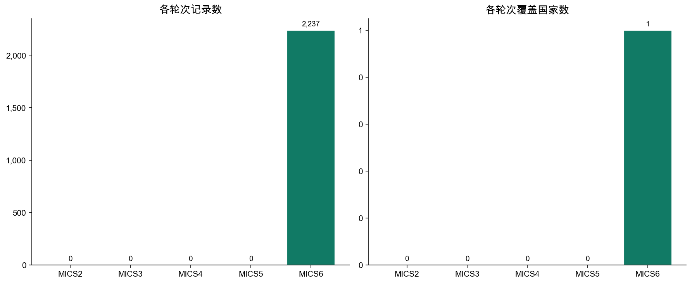
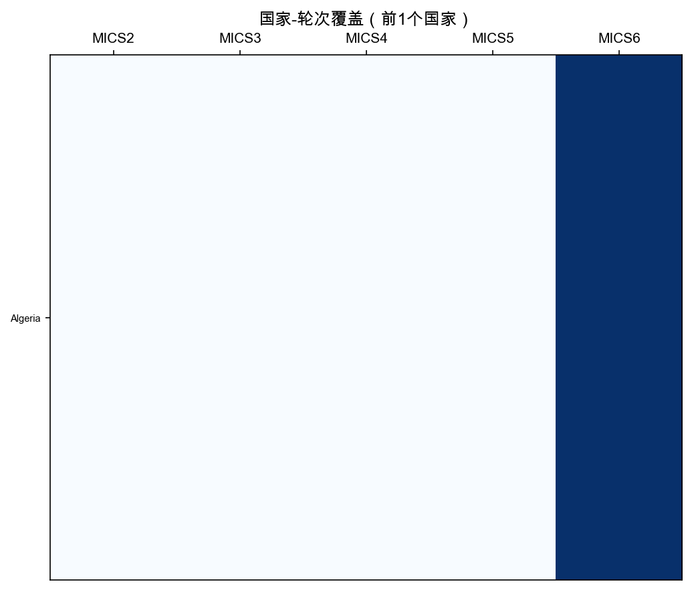
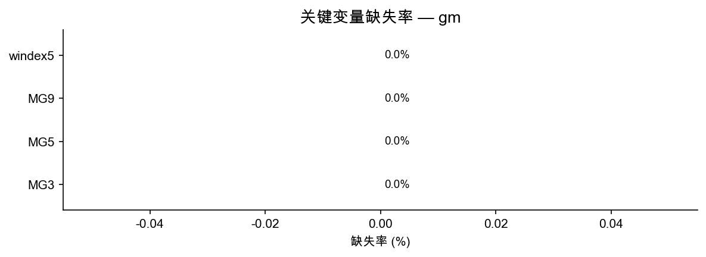

# gm 模块数据报告

> 生成脚本：`MICS/etc/generate_remaining.py`

---

## 1. 概览

| 指标 | 数值 |
|--------|-------|
| 总行数 | 2,237 |
| 总列数 | 29 |
| 覆盖国家/地区数 | 1 |
| 覆盖轮次 | MICS2 ~ MICS6 |

**gm 模块**（全球移民模块）每行代表一名受访者（样本量较小）。主要包含：移民相关信息（MG*）、财富指数（windex*）等。仅存在于MICS6。

---

## 2. 各轮次分布

| 轮次 | 国家/地区数 | 记录数 | 平均每国记录数 |
|------|------------|--------|--------------|
| MICS2 | 0 | 0 | 0 |
| MICS3 | 0 | 0 | 0 |
| MICS4 | 0 | 0 | 0 |
| MICS5 | 0 | 0 | 0 |
| MICS6 | 1 | 2,237 | 2,237 |

---

## 3. 国家-轮次覆盖

蓝色=有数据，白色=无数据。

---

## 4. 关键变量缺失率

缺失主要来自早期轮次问卷未包含该题。

| 变量 | 含义 | 缺失率 |
|------|------|--------|
| MG3 | 移民状态 | 0.0% |
| MG5 | 出发国 | 0.0% |
| MG9 | 离开原因 | 0.0% |
| windex5 | 财富指数五分位 | 0.0% |

---

## 5. 标准核心变量列表

共 **27** 个标准变量（出现在 ≥50% 的轮次中）

| 变量名 | 含义 | MICS3 | MICS4 | MICS5 | MICS6 |
|--------|------|:-----:|:-----:|:-----:|:-----:|
| `HH1` |  | — | — | — | ✓ |
| `HH2` |  | — | — | — | ✓ |
| `HH6` |  | — | — | — | ✓ |
| `HH7` |  | — | — | — | ✓ |
| `MG10` |  | — | — | — | ✓ |
| `MG3` |  | — | — | — | ✓ |
| `MG5` |  | — | — | — | ✓ |
| `MG6` |  | — | — | — | ✓ |
| `MG7D` |  | — | — | — | ✓ |
| `MG7M` |  | — | — | — | ✓ |
| `MG7Y` |  | — | — | — | ✓ |
| `MG8D` |  | — | — | — | ✓ |
| `MG8M` |  | — | — | — | ✓ |
| `MG8Y` |  | — | — | — | ✓ |
| `MG9` |  | — | — | — | ✓ |
| `PSU` |  | — | — | — | ✓ |
| `hhweight` |  | — | — | — | ✓ |
| `stratum` |  | — | — | — | ✓ |
| `windex10` |  | — | — | — | ✓ |
| `windex10r` |  | — | — | — | ✓ |
| `windex10u` |  | — | — | — | ✓ |
| `windex5` |  | — | — | — | ✓ |
| `windex5r` |  | — | — | — | ✓ |
| `windex5u` |  | — | — | — | ✓ |
| `wscore` |  | — | — | — | ✓ |
| `wscorer` |  | — | — | — | ✓ |
| `wscoreu` |  | — | — | — | ✓ |

---

## 6. 使用说明

- **链接键**: `country` + `mics_round` + HH1 + HH2
- **注意**: MICS2 变量已按映射字典标准化，早期轮次缺失字段显示为 NaN
