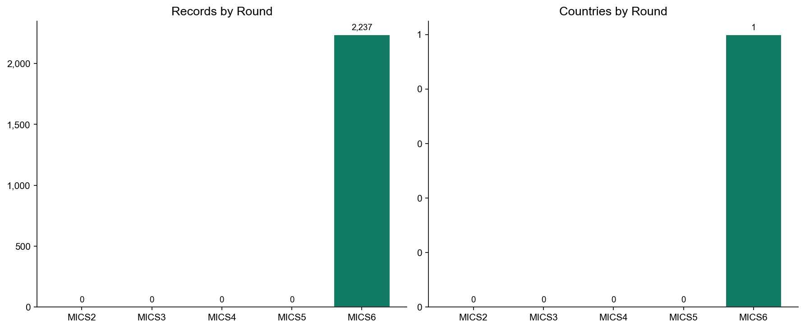
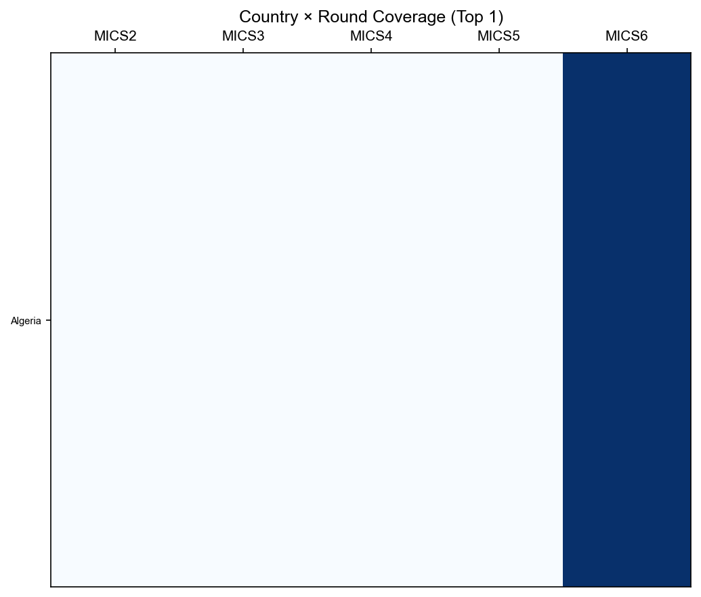
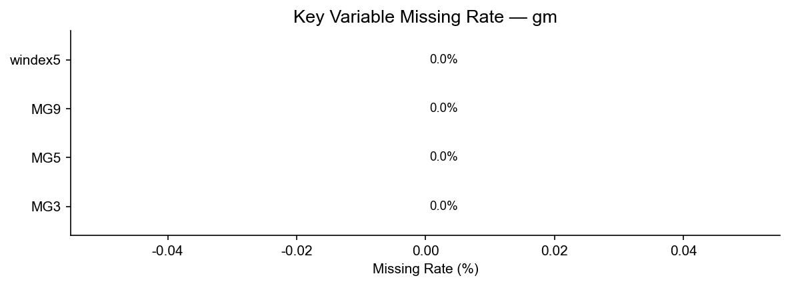

# gm Module Data Report

> Generation script: `MICS/etc/generate_remaining.py`

---

## 1. Overview

| Metric | Value |
|--------|-------|
| Total rows | 2,237 |
| Total columns | 29 |
| Countries/areas covered | 1 |
| Rounds covered | MICS2 – MICS6 |

The **gm module** (Global Migration Module) — One row per respondent (small sample). Key topics: migration-related variables (MG*), wealth index (windex*). Present in MICS6 only.

---

## 2. Distribution by Round

| Round | Countries/Areas | Records | Avg. Records/Country |
|-------|----------------|---------|----------------------|
| MICS2 | 0 | 0 | 0 |
| MICS3 | 0 | 0 | 0 |
| MICS4 | 0 | 0 | 0 |
| MICS5 | 0 | 0 | 0 |
| MICS6 | 1 | 2,237 | 2,237 |

---

## 3. Country × Round Coverage

Blue = data available, White = no data.

---

## 4. Missing Rate of Key Variables

Missingness mainly reflects questions absent in earlier rounds.

| Variable | Description | Missing Rate |
|----------|-------------|-------------|
| MG3 | Migration status | 0.0% |
| MG5 | Country of departure | 0.0% |
| MG9 | Reason for leaving | 0.0% |
| windex5 | Wealth index quintile | 0.0% |

---

## 5. Standard Core Variables

共 **27** 个标准变量（出现在 ≥50% 的轮次中）

| 变量名 | 含义 | MICS3 | MICS4 | MICS5 | MICS6 |
|--------|------|:-----:|:-----:|:-----:|:-----:|
| `HH1` |  | — | — | — | ✓ |
| `HH2` |  | — | — | — | ✓ |
| `HH6` |  | — | — | — | ✓ |
| `HH7` |  | — | — | — | ✓ |
| `MG10` |  | — | — | — | ✓ |
| `MG3` |  | — | — | — | ✓ |
| `MG5` |  | — | — | — | ✓ |
| `MG6` |  | — | — | — | ✓ |
| `MG7D` |  | — | — | — | ✓ |
| `MG7M` |  | — | — | — | ✓ |
| `MG7Y` |  | — | — | — | ✓ |
| `MG8D` |  | — | — | — | ✓ |
| `MG8M` |  | — | — | — | ✓ |
| `MG8Y` |  | — | — | — | ✓ |
| `MG9` |  | — | — | — | ✓ |
| `PSU` |  | — | — | — | ✓ |
| `hhweight` |  | — | — | — | ✓ |
| `stratum` |  | — | — | — | ✓ |
| `windex10` |  | — | — | — | ✓ |
| `windex10r` |  | — | — | — | ✓ |
| `windex10u` |  | — | — | — | ✓ |
| `windex5` |  | — | — | — | ✓ |
| `windex5r` |  | — | — | — | ✓ |
| `windex5u` |  | — | — | — | ✓ |
| `wscore` |  | — | — | — | ✓ |
| `wscorer` |  | — | — | — | ✓ |
| `wscoreu` |  | — | — | — | ✓ |

---

## 6. Usage Notes

- **Link keys**: `country` + `mics_round` + HH1 + HH2
- **Note**: MICS2 variables have been standardised; fields absent in early rounds appear as NaN
