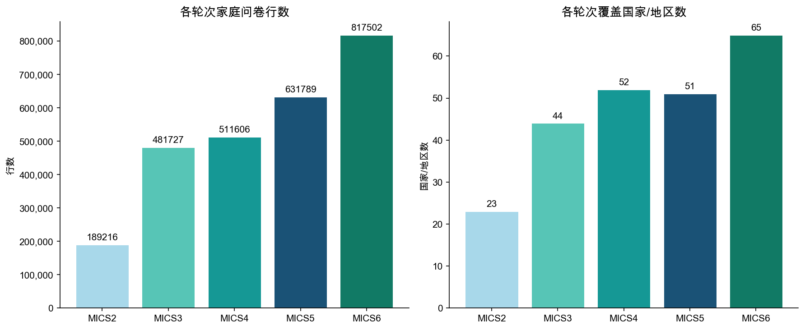
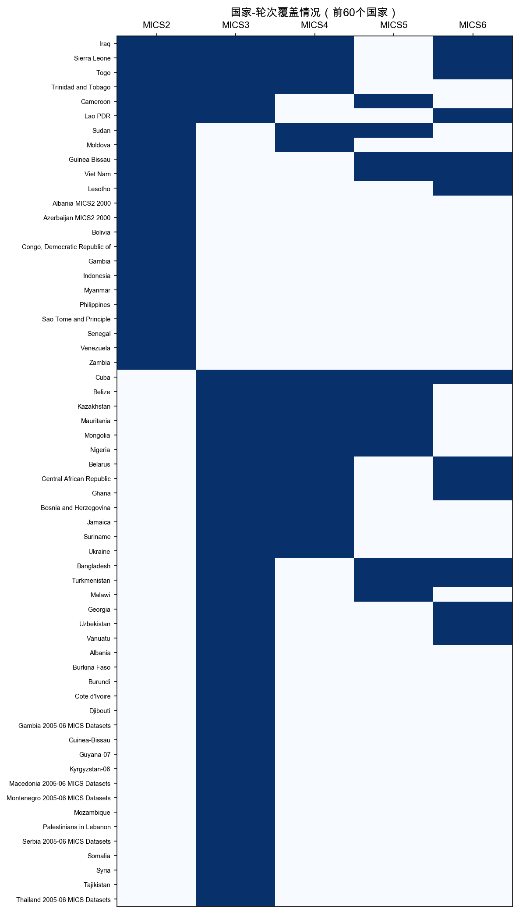
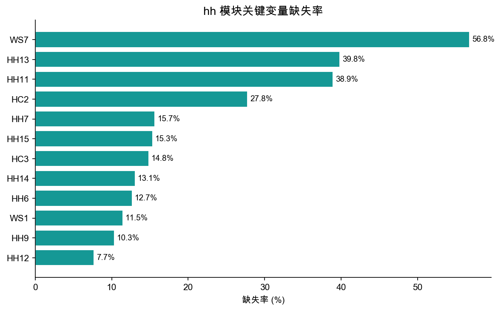
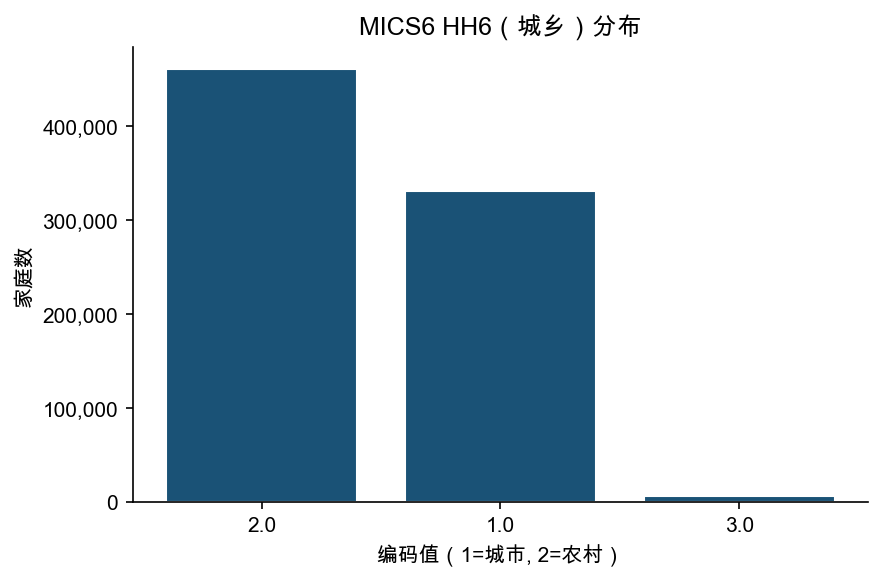

# hh 模块数据报告

> 生成脚本：`MICS/etc/hh/report.py`

---

## 1. 概览

| 指标 | 数值 |
|------|------|
| 总行数 | 2,631,840 |
| 总列数 | 3,541 |
| 覆盖国家/地区数 | 155 |
| 覆盖轮次 | MICS2 ~ MICS6 |

**hh 模块**（家庭问卷）每行代表一个家庭。主要包含：家庭基本信息、调查结果、居住条件（HC*）、饮水与卫生设施（WS*）。

---

## 2. 各轮次分布

| 轮次 | 国家/地区数 | 行数 | 平均每国行数 |
|------|------------|------|------------|
| MICS2 | 23 | 189,216 | 8,227 |
| MICS3 | 44 | 481,727 | 10,948 |
| MICS4 | 52 | 511,606 | 9,839 |
| MICS5 | 51 | 631,789 | 12,388 |
| MICS6 | 65 | 817,502 | 12,577 |

---

## 3. 国家-轮次覆盖

下图展示前60个国家在各轮次的覆盖情况（蓝色=有数据，白色=无数据）。

---

## 4. 关键变量缺失率

以下为常用分析变量的缺失情况。缺失主要来自早期轮次（MICS2/3）问卷未包含该题。

| 变量 | 含义 | 缺失率 |
|------|------|--------|
| HH6  | 城乡类型 | 12.7% |
| HH9  | 家庭问卷结果 | 10.3% |
| HH11 | 家庭成员数 | 38.9% |
| HC2  | 睡眠用房间数 | 27.8% |
| HC3  | 地板材质 | 14.8% |
| WS1  | 饮用水主要来源 | 11.5% |

---

## 5. HH6 城乡分布（MICS6）

MICS6 中 HH6 的编码：1 = 城市，2 = 农村。

---

## 6. 标准核心变量列表

共 **397** 个标准变量（出现在 ≥50% 的轮次中）

| 变量名 | 含义 | MICS3 | MICS4 | MICS5 | MICS6 |
|--------|------|:-----:|:-----:|:-----:|:-----:|
| `AC1A` |  | — | — | ✓ | ✓ |
| `AC1B` |  | — | — | ✓ | ✓ |
| `AC1C` |  | — | — | ✓ | ✓ |
| `AC1D` |  | — | — | ✓ | ✓ |
| `AC1E` |  | — | — | ✓ | ✓ |
| `AC2A` |  | — | — | ✓ | ✓ |
| `AC2B` |  | — | — | ✓ | ✓ |
| `AC2C` |  | — | — | ✓ | ✓ |
| `AC2D` |  | — | — | ✓ | ✓ |
| `AC2E` |  | — | — | ✓ | ✓ |
| `CD11` | Took away privileges | ✓ | ✓ | ✓ | — |
| `CD12` | Explained why behaviour was wrong | — | ✓ | ✓ | — |
| `CD12A` | Took away privileges | ✓ | ✓ | — | — |
| `CD12B` | Explaned why something was wrong | ✓ | ✓ | — | — |
| `CD12C` | Shook him/her | ✓ | ✓ | — | — |
| `CD12D` | Shouted yelled at or screamed at him/her | ✓ | ✓ | — | — |
| `CD12E` | Gave him/hersomething else to do | ✓ | ✓ | — | — |
| `CD12F` | Spanked, hit or slapped him/her with bare hand | ✓ | ✓ | — | — |
| `CD12G` | Hit him/her   on the bottom with or elsewhere with a b | ✓ | ✓ | — | — |
| `CD12H` | Called him/her dumb, lazy | ✓ | ✓ | — | — |
| `CD12I` | Hit or slapped him/her on the face | ✓ | ✓ | — | — |
| `CD12J` | Hit or slapped him/her on the hand | ✓ | ✓ | — | — |
| `CD12K` | Beat him/her up with an implement | ✓ | ✓ | — | — |
| `CD13` | Shook child | ✓ | ✓ | ✓ | — |
| `CD14` | Shouted, yelled or screamed at child | — | ✓ | ✓ | — |
| `CD15` | Gave child something else to do | — | ✓ | ✓ | — |
| `CD16` | Spanked, hit or slapped child on bottom with bare hand | — | ✓ | ✓ | — |
| `CD17` | Hit child on the bottom or elsewhere with belt, brush, stick | — | ✓ | ✓ | — |
| `CD18` | Called child dumb, lazy or another name | — | ✓ | ✓ | — |
| `CD19` | Hit or slapped child on the face, head or ears | — | ✓ | ✓ | — |
| `CD20` | Hit or slapped child on the hand, arm or leg | — | ✓ | ✓ | — |
| `CD21` | Beat child up with an implement | — | ✓ | ✓ | — |
| `CD22` | Child needs to be physically punished to be brought up prope | — | ✓ | ✓ | — |
| `CD6` | Total children aged 2-14 years | — | ✓ | ✓ | — |
| `CD7` | Total children aged 2-14 years | ✓ | ✓ | — | — |
| `CD8` | Rank number of the selected child | — | ✓ | ✓ | — |
| `CD9` | Child line number | ✓ | ✓ | ✓ | — |
| `CD_FLAG` | Flag for correct child line number | — | ✓ | ✓ | — |
| `CONSENT` |  | — | ✓ | ✓ | — |
| `DC0` |  | — | — | ✓ | ✓ |
| `EV1` |  | — | ✓ | — | ✓ |
| `EV2` |  | — | ✓ | — | ✓ |
| `EV4A` |  | — | ✓ | — | ✓ |
| `EV4B` |  | — | ✓ | — | ✓ |
| `EV4C` |  | — | ✓ | — | ✓ |
| `HC10` | Household owns the dwelling | ✓ | ✓ | ✓ | — |
| `HC10A` | Watch | ✓ | ✓ | ✓ | ✓ |
| `HC10B` | Bicycle | ✓ | ✓ | — | ✓ |
| `HC10C` | Motorcycle or scooter | ✓ | ✓ | — | ✓ |
| `HC10D` |  | ✓ | ✓ | — | ✓ |
| `HC10E` | Car or truck | ✓ | ✓ | — | ✓ |
| `HC10F` |  | ✓ | ✓ | — | ✓ |
| `HC10G` |  | ✓ | — | — | ✓ |
| `HC10H` |  | ✓ | — | — | ✓ |
| `HC10I` |  | ✓ | — | — | ✓ |
| `HC11` | Any household member own land that can be used for agriculture | ✓ | ✓ | ✓ | ✓ |
| `HC11A` |  | ✓ | — | — | ✓ |
| `HC12` | Acres of agricultural land members of household owns | ✓ | ✓ | ✓ | ✓ |
| `HC12A` |  | — | ✓ | ✓ | ✓ |
| `HC12B` |  | — | ✓ | ✓ | — |
| `HC12BU` |  | — | ✓ | ✓ | — |
| `HC12C` |  | — | ✓ | ✓ | — |
| `HC12N` |  | ✓ | ✓ | ✓ | — |
| `HC12U` |  | ✓ | ✓ | ✓ | — |
| `HC13` | Household own any animals | ✓ | ✓ | ✓ | ✓ |
| `HC14A` | Cattle, milk cows, or bulls | ✓ | ✓ | ✓ | ✓ |
| `HC14B` | Horses, donkeys, or mules | ✓ | ✓ | ✓ | ✓ |
| `HC14C` | Goats | ✓ | ✓ | ✓ | ✓ |
| `HC14D` | Sheep | ✓ | ✓ | ✓ | ✓ |
| `HC14E` | Chickens/Ducks | ✓ | ✓ | ✓ | ✓ |
| `HC14F` | Pigs | ✓ | ✓ | ✓ | ✓ |
| `HC14G` |  | ✓ | ✓ | ✓ | — |
| `HC14H` |  | ✓ | ✓ | ✓ | — |
| `HC14I` |  | ✓ | ✓ | ✓ | — |
| `HC14J` |  | ✓ | — | ✓ | — |
| `HC14X` |  | — | ✓ | ✓ | — |
| `HC15` | Any household member own bank account | ✓ | ✓ | ✓ | ✓ |
| `HC15A` |  | ✓ | ✓ | ✓ | — |
| `HC16` | Do you take any protection for mosquito bites | — | ✓ | ✓ | ✓ |
| `HC16A` |  | ✓ | — | ✓ | ✓ |
| `HC16B` |  | ✓ | — | ✓ | ✓ |
| `HC16C` |  | ✓ | — | ✓ | ✓ |
| `HC16D` |  | ✓ | — | ✓ | ✓ |
| `HC16E` |  | ✓ | — | ✓ | — |
| `HC16F` |  | ✓ | — | ✓ | — |
| `HC16G` |  | ✓ | — | ✓ | — |
| `HC16H` |  | ✓ | — | ✓ | — |
| `HC16I` |  | ✓ | — | ✓ | ✓ |
| `HC16J` |  | ✓ | — | ✓ | — |
| `HC17` |  | ✓ | ✓ | ✓ | ✓ |
| `HC17A` | Protection: Mosquito net | — | ✓ | ✓ | — |
| `HC17B` | Protection: Coil | — | ✓ | ✓ | — |
| `HC17C` | Protection: Spray | — | ✓ | ✓ | — |
| `HC17D` | Protection: Electric mat | — | ✓ | ✓ | — |
| `HC18` |  | ✓ | — | ✓ | — |
| `HC18A` |  | — | ✓ | — | ✓ |
| `HC18B` |  | — | ✓ | — | ✓ |
| `HC18C` |  | — | ✓ | — | ✓ |
| `HC18D` |  | — | ✓ | — | ✓ |
| `HC18E` |  | — | ✓ | — | ✓ |
| `HC18X` |  | — | ✓ | — | ✓ |
| `HC19` |  | — | ✓ | ✓ | ✓ |
| `HC1A` | Religion of household head | ✓ | ✓ | ✓ | ✓ |
| `HC1B` | Mother tongue of household head | ✓ | ✓ | ✓ | ✓ |
| `HC1BA` |  | — | ✓ | ✓ | — |
| `HC1C` | Ethnic group of household head other than Bengali | ✓ | ✓ | ✓ | ✓ |
| `HC1D` |  | — | ✓ | ✓ | ✓ |
| `HC1E` |  | — | ✓ | ✓ | — |
| `HC1F` |  | — | ✓ | ✓ | — |
| `HC2` | Number of rooms used for sleeping | ✓ | ✓ | ✓ | ✓ |
| `HC20A` |  | — | — | ✓ | ✓ |
| `HC20B` |  | — | — | ✓ | ✓ |
| `HC20C` |  | — | — | ✓ | ✓ |
| `HC20D` |  | — | — | ✓ | ✓ |
| `HC20E` |  | — | — | ✓ | ✓ |
| `HC20NR` |  | — | — | ✓ | ✓ |
| `HC2A` | Surface area of floor | — | ✓ | ✓ | ✓ |
| `HC2B` |  | — | — | ✓ | ✓ |
| `HC3` | Main material of floor | ✓ | ✓ | ✓ | ✓ |
| `HC3A` |  | — | ✓ | ✓ | ✓ |
| `HC4` | Main material of roof | ✓ | ✓ | ✓ | ✓ |
| `HC4A` |  | — | ✓ | ✓ | — |
| `HC5` | Main material of exterior wall | ✓ | ✓ | ✓ | ✓ |
| `HC5A` |  | ✓ | ✓ | ✓ | — |
| `HC5B` |  | ✓ | ✓ | ✓ | — |
| `HC5C` |  | ✓ | — | ✓ | — |
| `HC6` | Type of fuel using for cooking | ✓ | ✓ | ✓ | ✓ |
| `HC6A` |  | ✓ | ✓ | — | — |
| `HC7` | Cooking location | ✓ | ✓ | ✓ | — |
| `HC7A` |  | ✓ | ✓ | — | ✓ |
| `HC8` | Cooking location | ✓ | ✓ | — | ✓ |
| `HC8A` | Electricity | — | ✓ | ✓ | ✓ |
| `HC8AA` |  | — | — | ✓ | ✓ |
| `HC8AB` |  | — | — | ✓ | ✓ |
| `HC8B` | Radio | — | ✓ | ✓ | — |
| `HC8C` | Television | — | ✓ | ✓ | — |
| `HC8D` | Non-mobile phone | — | ✓ | ✓ | — |
| `HC8E` | Refrigerator | — | ✓ | ✓ | — |
| `HC8F` | Electric fan | — | ✓ | ✓ | — |
| `HC8G` | Cot/Bed | — | ✓ | ✓ | — |
| `HC8H` | Table | — | ✓ | ✓ | — |
| `HC8I` | Almirah/Wardrobe | — | ✓ | ✓ | — |
| `HC8J` | Sofa set | — | ✓ | ✓ | — |
| `HC8K` | Water dispenser | — | ✓ | ✓ | — |
| `HC8L` | Water pump | — | ✓ | ✓ | — |
| `HC8M` |  | — | ✓ | ✓ | — |
| `HC8N` |  | — | ✓ | ✓ | — |
| `HC8O` |  | — | ✓ | ✓ | — |
| `HC8P` |  | — | ✓ | ✓ | — |
| `HC8Q` |  | — | ✓ | ✓ | — |
| `HC8R` |  | — | ✓ | ✓ | — |
| `HC8S` |  | — | ✓ | ✓ | — |
| `HC9A` | Watch | ✓ | ✓ | ✓ | ✓ |
| `HC9B` | Mobile telephone | ✓ | ✓ | ✓ | ✓ |
| `HC9C` | Bicycle | ✓ | ✓ | ✓ | ✓ |
| `HC9D` | Motorcycle or scooter | ✓ | ✓ | ✓ | ✓ |
| `HC9E` | Animal-drawn cart | ✓ | ✓ | ✓ | ✓ |
| `HC9F` | Car or truck | ✓ | ✓ | ✓ | ✓ |
| `HC9G` | Boat with motor | ✓ | ✓ | ✓ | ✓ |
| `HC9H` | Rickshaw/Van | ✓ | ✓ | ✓ | ✓ |
| `HC9I` | Nasiman/Kariman/Votbati | ✓ | ✓ | ✓ | ✓ |
| `HC9J` | Easy bike/Auto bike (battery driven) | ✓ | ✓ | ✓ | ✓ |
| `HC9K` | Computer | ✓ | ✓ | ✓ | ✓ |
| `HC9L` |  | ✓ | ✓ | ✓ | ✓ |
| `HC9M` |  | ✓ | ✓ | ✓ | ✓ |
| `HC9N` |  | ✓ | ✓ | ✓ | ✓ |
| `HC9O` |  | ✓ | ✓ | ✓ | ✓ |
| `HC9P` |  | ✓ | — | — | ✓ |
| `HC9Q` |  | ✓ | — | — | ✓ |
| `HC9_C` |  | — | ✓ | — | ✓ |
| `HH1` | Cluster number | ✓ | ✓ | ✓ | ✓ |
| `HH10` | Respondent to HH questionnaire | ✓ | ✓ | ✓ | ✓ |
| `HH11` | Number of HH members | ✓ | ✓ | ✓ | — |
| `HH12` | Number of women 15 - 49 years | ✓ | ✓ | ✓ | ✓ |
| `HH12B` |  | — | ✓ | — | ✓ |
| `HH13` | Number of woman' questionnaires completed | ✓ | ✓ | ✓ | — |
| `HH13A` |  | — | ✓ | ✓ | — |
| `HH13B` |  | — | ✓ | ✓ | — |
| `HH14` | Number of children under age 5 | ✓ | ✓ | ✓ | ✓ |
| `HH15` | Number of under - 5 questionnaires completed | ✓ | ✓ | ✓ | ✓ |
| `HH15A` |  | — | ✓ | ✓ | — |
| `HH15B` |  | — | ✓ | ✓ | — |
| `HH15C` |  | — | ✓ | ✓ | — |
| `HH15D` |  | — | ✓ | ✓ | — |
| `HH16` | Field editor | ✓ | ✓ | ✓ | ✓ |
| `HH17` | Data entry clerk | — | ✓ | ✓ | ✓ |
| `HH18H` | Start of interview - Hour | — | ✓ | ✓ | — |
| `HH18M` | Start of interview - Minutes | — | ✓ | ✓ | — |
| `HH19H` | End of interview - Hour | — | ✓ | ✓ | — |
| `HH19M` | End of interview - Minutes | — | ✓ | ✓ | — |
| `HH1A` |  | ✓ | ✓ | — | — |
| `HH2` | Household number | ✓ | ✓ | ✓ | ✓ |
| `HH2A` |  | ✓ | ✓ | — | — |
| `HH2B` |  | ✓ | — | — | ✓ |
| `HH3` | Interviewer number | ✓ | ✓ | ✓ | ✓ |
| `HH4` | Supervisor number | ✓ | ✓ | ✓ | ✓ |
| `HH4A` |  | — | ✓ | ✓ | — |
| `HH5A` |  | — | ✓ | ✓ | — |
| `HH5D` | Day of interview | ✓ | ✓ | ✓ | ✓ |
| `HH5M` | Month of interview | ✓ | ✓ | ✓ | ✓ |
| `HH5Y` | Year of interview | ✓ | ✓ | ✓ | ✓ |
| `HH6` | Area | ✓ | ✓ | ✓ | ✓ |
| `HH6A` |  | ✓ | ✓ | ✓ | ✓ |
| `HH6B` |  | ✓ | ✓ | ✓ | — |
| `HH6a` |  | — | ✓ | — | ✓ |
| `HH6r` |  | ✓ | — | — | ✓ |
| `HH7` | Division | ✓ | ✓ | ✓ | ✓ |
| `HH7A` | District | ✓ | ✓ | ✓ | ✓ |
| `HH7B` | Houshold selected for water testing | ✓ | ✓ | ✓ | ✓ |
| `HH7C` | Household selected for additional water testing | ✓ | ✓ | ✓ | ✓ |
| `HH7D` |  | ✓ | ✓ | ✓ | — |
| `HH7a` |  | — | ✓ | ✓ | — |
| `HH8` |  | — | — | ✓ | ✓ |
| `HH8A` |  | — | ✓ | ✓ | — |
| `HH8B` |  | — | ✓ | ✓ | ✓ |
| `HH9` | Result of HH interview | ✓ | ✓ | ✓ | ✓ |
| `HH9A` |  | — | ✓ | — | ✓ |
| `HH9B` |  | — | ✓ | — | ✓ |
| `HHAUX` |  | — | ✓ | ✓ | ✓ |
| `HHNINOS` |  | — | — | ✓ | ✓ |
| `HHSEX` | Sex of household head | — | ✓ | ✓ | ✓ |
| `HHWEIGHT` |  | ✓ | ✓ | ✓ | — |
| `HW1` | Place where household members most often wash their hands | — | ✓ | ✓ | ✓ |
| `HW1A` |  | — | ✓ | ✓ | — |
| `HW2` | Water available at the place for handwashing | — | ✓ | ✓ | ✓ |
| `HW3A` | Bar soap | — | ✓ | ✓ | — |
| `HW3B` | Detergent (Powder / Liquid / Paste) | — | ✓ | ✓ | — |
| `HW3C` | Liquid soap | — | ✓ | ✓ | — |
| `HW3D` | Ash / Mud / Sand | — | ✓ | ✓ | — |
| `HW3Y` | None | — | ✓ | ✓ | — |
| `HW4` | Soap/other material available for washing hands | — | ✓ | ✓ | ✓ |
| `HW5` |  | — | ✓ | — | ✓ |
| `HW5A` | Bar soap | — | ✓ | ✓ | — |
| `HW5B` | Detergent (Powder / Liquid / Paste) | — | ✓ | ✓ | — |
| `HW5C` | Liquid soap | — | ✓ | ✓ | — |
| `HW5D` | Ash / Mud / Sand | — | ✓ | ✓ | — |
| `HW5Y` | Not able / Does not want to show | — | ✓ | ✓ | — |
| `HW6A` |  | — | ✓ | ✓ | — |
| `HW6B` |  | — | ✓ | ✓ | — |
| `HW6C` |  | — | ✓ | ✓ | — |
| `HW6D` |  | — | ✓ | ✓ | — |
| `HW6E` |  | — | ✓ | ✓ | — |
| `HW6X` |  | — | ✓ | ✓ | — |
| `HW6Y` |  | — | ✓ | ✓ | — |
| `HW6Z` |  | — | ✓ | ✓ | — |
| `INTROHL` |  | — | — | ✓ | ✓ |
| `IR1` |  | — | ✓ | ✓ | ✓ |
| `IR2` |  | — | ✓ | ✓ | — |
| `IR2A` |  | — | ✓ | ✓ | ✓ |
| `IR2B` |  | — | ✓ | ✓ | ✓ |
| `IR2C` |  | — | ✓ | ✓ | ✓ |
| `IR2NR` |  | — | — | ✓ | ✓ |
| `IR2Q` |  | — | ✓ | ✓ | — |
| `IR2X` |  | — | ✓ | ✓ | ✓ |
| `IR2Z` |  | — | ✓ | ✓ | ✓ |
| `IR3` |  | — | ✓ | ✓ | — |
| `OV2` |  | ✓ | ✓ | ✓ | — |
| `OV3` |  | ✓ | ✓ | ✓ | — |
| `OV4` |  | ✓ | ✓ | ✓ | — |
| `PSU` | Primary sampling unit | — | ✓ | ✓ | ✓ |
| `RM1` |  | — | — | ✓ | ✓ |
| `RM2` |  | — | — | ✓ | ✓ |
| `RM4` |  | — | — | ✓ | ✓ |
| `SI1` | Salt iodization test outcome | ✓ | ✓ | ✓ | — |
| `SI2` |  | — | ✓ | ✓ | — |
| `SI3` |  | — | ✓ | ✓ | — |
| `TEAM` |  | — | ✓ | ✓ | — |
| `TN1` |  | ✓ | ✓ | ✓ | ✓ |
| `TN2` |  | ✓ | ✓ | ✓ | ✓ |
| `TN2A` |  | ✓ | ✓ | — | — |
| `TN6` |  | ✓ | ✓ | — | — |
| `WQ1` | Measurer's identification code | — | — | ✓ | ✓ |
| `WQ10` |  | — | — | ✓ | ✓ |
| `WQ11` | E-coli test on household water sample conducted | — | — | ✓ | ✓ |
| `WQ12` | Permission to visit drinking water source for additional water testing | — | — | ✓ | ✓ |
| `WQ13` | Arsenic level (ppb) in source water sample | — | — | ✓ | ✓ |
| `WQ14` | E-coli test on source water sample conducted | — | — | ✓ | ✓ |
| `WQ15D` |  | — | — | ✓ | ✓ |
| `WQ16` | Household selected for Blank test | — | — | ✓ | ✓ |
| `WQ17` | Arsenic level (ppb) in blank water sample | — | — | ✓ | ✓ |
| `WQ17A` |  | — | — | ✓ | ✓ |
| `WQ18` | Blank test for E-coli conducted | — | — | ✓ | ✓ |
| `WQ19` |  | — | — | ✓ | ✓ |
| `WQ19A` | Red colonies in 1 ml household water sample | — | — | ✓ | ✓ |
| `WQ19B` | Blue colonies in 1 ml household water sample | — | — | ✓ | ✓ |
| `WQ19C` | Red colonies in 100 ml household water sample | — | — | ✓ | ✓ |
| `WQ1A` |  | — | — | ✓ | ✓ |
| `WQ2` |  | — | — | ✓ | ✓ |
| `WQ20` |  | — | — | ✓ | ✓ |
| `WQ20A` | Red colonies in 1 ml source water sample | — | — | ✓ | ✓ |
| `WQ20B` | Blue colonies in 1 ml source water sample | — | — | ✓ | ✓ |
| `WQ20C` | Red colonies in 100 ml source water sample | — | — | ✓ | ✓ |
| `WQ21` |  | — | — | ✓ | ✓ |
| `WQ21A` | Red colonies in 1 ml blank water sample | — | — | ✓ | ✓ |
| `WQ22` |  | — | — | ✓ | ✓ |
| `WQ22M` |  | — | — | ✓ | ✓ |
| `WQ26` |  | — | — | ✓ | ✓ |
| `WQ27` |  | — | — | ✓ | ✓ |
| `WQ28` |  | — | — | ✓ | ✓ |
| `WQ29` |  | — | — | ✓ | ✓ |
| `WQ3` |  | — | — | ✓ | ✓ |
| `WQ31` |  | — | — | ✓ | ✓ |
| `WQ4` | Permission to get drinking water sample for arsenic test | — | — | ✓ | ✓ |
| `WQ5A` |  | — | — | ✓ | ✓ |
| `WQ5B` |  | — | — | ✓ | ✓ |
| `WQ5C` |  | — | — | ✓ | ✓ |
| `WQ5D` |  | — | — | ✓ | ✓ |
| `WQ6` | Observation on source of drinking water sample | — | — | ✓ | ✓ |
| `WQ7` | Source of drinking water sample | — | — | ✓ | ✓ |
| `WQ8` | Amount of water collected in a day | — | — | ✓ | ✓ |
| `WS1` | Main source of drinking water | ✓ | ✓ | ✓ | ✓ |
| `WS10` | Toilet shared with other household or with general public | — | ✓ | ✓ | — |
| `WS11` | Households using this toilet facility | — | ✓ | ✓ | ✓ |
| `WS11A` |  | — | ✓ | ✓ | ✓ |
| `WS12` |  | — | ✓ | ✓ | ✓ |
| `WS12A` |  | — | ✓ | — | ✓ |
| `WS13` |  | — | ✓ | ✓ | ✓ |
| `WS14` |  | — | ✓ | — | ✓ |
| `WS15` |  | — | ✓ | — | ✓ |
| `WS16` |  | — | ✓ | — | ✓ |
| `WS17` |  | — | ✓ | — | ✓ |
| `WS1A` |  | ✓ | ✓ | ✓ | ✓ |
| `WS1B` |  | ✓ | — | — | ✓ |
| `WS2` | Main source of water used for other purposes (if bottled water used for drinking) | ✓ | ✓ | ✓ | ✓ |
| `WS2A` |  | — | ✓ | ✓ | ✓ |
| `WS3` | Location of the water source | ✓ | ✓ | ✓ | ✓ |
| `WS4` | Time (in minutes) to get water and come back | ✓ | ✓ | ✓ | ✓ |
| `WS4A` |  | ✓ | ✓ | ✓ | — |
| `WS4B` |  | — | ✓ | ✓ | — |
| `WS5` | Person collecting water | ✓ | ✓ | ✓ | ✓ |
| `WS5A` |  | ✓ | — | ✓ | — |
| `WS6` | Treat water to make safer for drinking | ✓ | ✓ | ✓ | ✓ |
| `WS6A` | Boil | ✓ | ✓ | — | — |
| `WS6B` | Add bleach/chlorine | ✓ | ✓ | — | — |
| `WS6C` | Strain it through a cloth | ✓ | ✓ | — | — |
| `WS6D` | Use water filter | ✓ | ✓ | — | — |
| `WS6E` | Solar disinfection | ✓ | ✓ | — | — |
| `WS6F` | Let it stand and settle | ✓ | ✓ | — | — |
| `WS6X` | Other | ✓ | ✓ | — | — |
| `WS6Z` | DK | ✓ | ✓ | — | — |
| `WS7` | Kind of toilet facility | ✓ | ✓ | — | ✓ |
| `WS7A` | Water treatment: Boil | ✓ | ✓ | ✓ | ✓ |
| `WS7AA` |  | — | ✓ | ✓ | — |
| `WS7B` | Water treatment: Add bleach/chlorine | — | ✓ | ✓ | — |
| `WS7C` | Water treatment: Strain it through a cloth | — | ✓ | ✓ | — |
| `WS7D` | Water treatment: Use water filter | — | ✓ | ✓ | — |
| `WS7E` | Water treatment: Solar disinfection | — | ✓ | ✓ | — |
| `WS7F` | Water treatment: Let it stand and settle | — | ✓ | ✓ | — |
| `WS7G` |  | — | ✓ | ✓ | — |
| `WS7H` |  | — | ✓ | ✓ | — |
| `WS7Q` |  | — | ✓ | ✓ | — |
| `WS7X` | Water treatment: Other | — | ✓ | ✓ | — |
| `WS7Z` | Water treatment: DK | — | ✓ | ✓ | — |
| `WS8` | Type of toilet facility | ✓ | ✓ | ✓ | ✓ |
| `WS8A` |  | — | ✓ | — | ✓ |
| `WS8B` |  | — | ✓ | ✓ | — |
| `WS8C` |  | — | ✓ | ✓ | — |
| `WS9` | Toilet facility shared | ✓ | ✓ | ✓ | ✓ |
| `area` |  | ✓ | ✓ | ✓ | — |
| `consin` |  | — | ✓ | ✓ | — |
| `division` |  | — | — | ✓ | ✓ |
| `dstratum` |  | — | — | ✓ | ✓ |
| `ethnicity` | Ethnicity of household head | — | ✓ | ✓ | ✓ |
| `helevel` | Education of household head | ✓ | ✓ | ✓ | ✓ |
| `helevel1` |  | ✓ | ✓ | — | ✓ |
| `helevel2` |  | ✓ | — | — | ✓ |
| `hh7` |  | ✓ | — | ✓ | — |
| `hh7r` |  | — | — | ✓ | ✓ |
| `hhsex` | Sex of household head | ✓ | ✓ | — | — |
| `hhweight` | Household sample weight | ✓ | ✓ | ✓ | ✓ |
| `language` |  | — | ✓ | ✓ | ✓ |
| `langue` |  | — | ✓ | ✓ | — |
| `prov` |  | — | ✓ | ✓ | — |
| `province` | Province | — | ✓ | ✓ | ✓ |
| `psu` |  | — | ✓ | — | ✓ |
| `region` |  | ✓ | ✓ | ✓ | ✓ |
| `religion` | Religion of household head | ✓ | ✓ | ✓ | ✓ |
| `strata` | Stratum | — | ✓ | ✓ | ✓ |
| `stratum` | Strata | ✓ | ✓ | ✓ | ✓ |
| `suburban` |  | — | — | ✓ | ✓ |
| `windex10` |  | — | — | ✓ | ✓ |
| `windex10r` |  | — | — | ✓ | ✓ |
| `windex10u` |  | — | — | ✓ | ✓ |
| `windex2` |  | — | ✓ | ✓ | ✓ |
| `windex5` | Wealth index quintile | — | ✓ | ✓ | ✓ |
| `windex5c` |  | — | — | ✓ | ✓ |
| `windex5r` | Rural wealth index quintile | — | — | ✓ | ✓ |
| `windex5u` | Urban wealth index quintile | — | — | ✓ | ✓ |
| `wlthind5` | Wealth index quintiles | ✓ | ✓ | — | — |
| `wlthscor` | Wealth index score | ✓ | ✓ | — | — |
| `wqhweight` |  | — | — | ✓ | ✓ |
| `wqsweight` |  | — | — | ✓ | ✓ |
| `wscore` | Combined wealth score | — | ✓ | ✓ | ✓ |
| `wscorec` |  | — | — | ✓ | ✓ |
| `wscorer` | Rural wealth score | — | — | ✓ | ✓ |
| `wscoreu` | Urban wealth score | — | — | ✓ | ✓ |
| `zhhweight` |  | — | — | ✓ | ✓ |

---

## 7. 使用说明

- **链接键**：`country` + `mics_round` + `HH1`（cluster）+ `HH2`（household）
- **与 hl 模块关联**：通过 `HH1` + `HH2` 连接
- **与 wm/ch 模块关联**：通过 `HH1` + `HH2` 连接
- **注意**：MICS2 的变量已按映射字典标准化，部分早期轮次变量不存在时为 NaN
