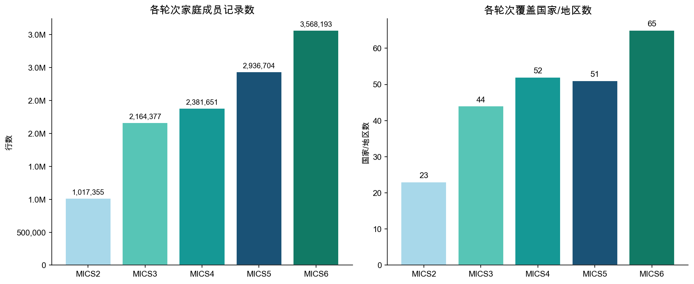
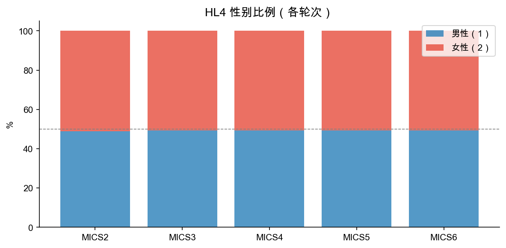
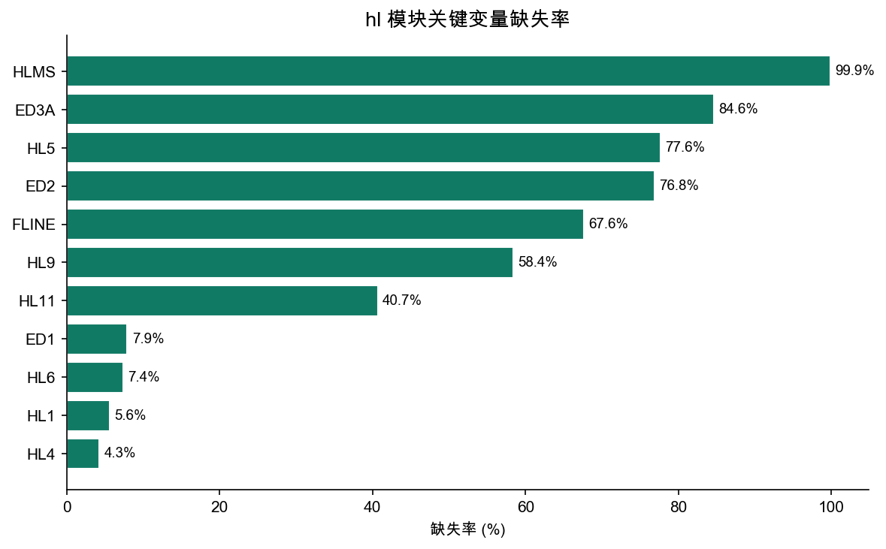

# hl 模块数据报告

> 生成脚本：`MICS/etc/hl/report.py`

---

## 1. 概览

| 指标 | 数值 |
|------|------|
| 总行数 | 12,068,280 |
| 总列数 | 1,821 |
| 覆盖国家/地区数 | 155 |
| 覆盖轮次 | MICS2 ~ MICS6 |

**hl 模块**（家庭成员清单）每行代表一个家庭成员。主要包含：个人基本信息（年龄、性别、与户主关系）、教育信息（ED*）、家庭成员间的关联（母亲/父亲行号）。

---

## 2. 各轮次分布

| 轮次 | 国家/地区数 | 成员记录数 | 平均每国记录数 |
|------|------------|-----------|--------------|
| MICS2 | 23 | 1,017,355 | 44,233 |
| MICS3 | 44 | 2,164,377 | 49,190 |
| MICS4 | 52 | 2,381,651 | 45,801 |
| MICS5 | 51 | 2,936,704 | 57,582 |
| MICS6 | 65 | 3,568,193 | 54,895 |

---

## 3. 性别分布（HL4）

HL4 编码：1 = 男性，2 = 女性。各轮次性别比例基本稳定。

---

## 4. 年龄分布（HL5，MICS6）

MICS6 家庭成员年龄呈典型的人口金字塔分布，0-5 岁儿童占比较高。

---

## 5. 关键变量缺失率

| 变量 | 含义 | 缺失率 |
|------|------|--------|
| HL1  | 成员行号 | 5.6% |
| HL4  | 性别 | 4.3% |
| HL5  | 年龄 | 77.6% |
| ED2  | 是否上过学 | 76.8% |
| ED3A | 最高教育程度 | 84.6% |

---

## 6. 标准核心变量列表

共 **279** 个标准变量（出现在 ≥50% 的轮次中）

| 变量名 | 含义 | MICS3 | MICS4 | MICS5 | MICS6 |
|--------|------|:-----:|:-----:|:-----:|:-----:|
| `AE1` |  | — | ✓ | — | ✓ |
| `AE3` |  | — | ✓ | — | ✓ |
| `AE4` |  | — | ✓ | — | ✓ |
| `AE5` |  | — | ✓ | — | ✓ |
| `BN1` |  | — | ✓ | ✓ | — |
| `BN2` |  | — | ✓ | ✓ | — |
| `BN3` |  | — | ✓ | ✓ | — |
| `CL1` | Line number | ✓ | ✓ | — | — |
| `CL3` | Worked in past week for someone who is not a HH member | ✓ | ✓ | — | — |
| `CL4` | Hours worked in past week for someone who is not a HH member | ✓ | ✓ | — | — |
| `CL5` | Worked in past week to fetch water or collect firewood for h | ✓ | ✓ | — | — |
| `CL6` | Hours to fetch water or collect firewood | ✓ | ✓ | — | — |
| `CL7` | Other paid or unpaid family work in past week | ✓ | ✓ | — | — |
| `CL8` | Hours worked on other family work | ✓ | ✓ | — | — |
| `CL9` | Helped with household chores in past week | ✓ | ✓ | — | — |
| `DA1` | Line number from household listing | ✓ | ✓ | — | ✓ |
| `DA10` | Can says recognizable words | ✓ | ✓ | — | ✓ |
| `DA11` | Speech in any way different from normal | ✓ | ✓ | — | ✓ |
| `DA12` | Can he name at least one object | ✓ | ✓ | — | ✓ |
| `DA13` | Compared to other children does he appear mentally back | ✓ | ✓ | — | ✓ |
| `DA2B` |  | — | ✓ | — | ✓ |
| `DA3` | Any serious delay sitting, standang or walking | ✓ | ✓ | — | ✓ |
| `DA4` | Does he have difficulty seeing in daytime or nightime | ✓ | ✓ | — | ✓ |
| `DA5` | Does he apprea to have difficulty hearing | ✓ | ✓ | — | ✓ |
| `DA6` | When you ask him to  do something, does he understand wh | ✓ | ✓ | — | ✓ |
| `DA7` | Does he have difficulty walking or moving | ✓ | ✓ | — | ✓ |
| `DA8` | Does he have fits, become rigid or los consciousnes | ✓ | ✓ | — | ✓ |
| `DA9` | Does he learn to do thing like other | ✓ | ✓ | — | ✓ |
| `ED1` | Line number | ✓ | ✓ | ✓ | ✓ |
| `ED10` |  | ✓ | ✓ | — | — |
| `ED10A` |  | — | ✓ | ✓ | ✓ |
| `ED10B` |  | — | ✓ | ✓ | ✓ |
| `ED10C` |  | — | ✓ | — | ✓ |
| `ED10D` |  | — | ✓ | — | ✓ |
| `ED11` |  | ✓ | ✓ | ✓ | ✓ |
| `ED12` |  | ✓ | ✓ | ✓ | ✓ |
| `ED13` |  | ✓ | ✓ | ✓ | — |
| `ED14` |  | — | ✓ | — | ✓ |
| `ED14A` |  | — | ✓ | ✓ | ✓ |
| `ED14B` |  | — | ✓ | ✓ | ✓ |
| `ED15` |  | — | ✓ | — | ✓ |
| `ED15A` |  | — | ✓ | ✓ | — |
| `ED15B` |  | — | ✓ | ✓ | — |
| `ED15C` |  | — | ✓ | ✓ | — |
| `ED15D` |  | — | ✓ | ✓ | — |
| `ED15E` |  | — | ✓ | ✓ | — |
| `ED15F` |  | — | ✓ | ✓ | — |
| `ED15G` |  | — | ✓ | ✓ | — |
| `ED15H` |  | — | ✓ | ✓ | — |
| `ED15I` |  | — | ✓ | ✓ | — |
| `ED15J` |  | — | ✓ | ✓ | — |
| `ED15K` |  | — | ✓ | ✓ | — |
| `ED15L` |  | — | ✓ | ✓ | — |
| `ED15M` |  | — | ✓ | ✓ | — |
| `ED15N` |  | — | ✓ | ✓ | — |
| `ED15X` |  | — | ✓ | ✓ | — |
| `ED18` |  | — | ✓ | — | ✓ |
| `ED2` | Ever attended school | ✓ | ✓ | ✓ | — |
| `ED20` |  | — | ✓ | — | ✓ |
| `ED2A` |  | — | ✓ | ✓ | ✓ |
| `ED2B` |  | — | ✓ | ✓ | — |
| `ED3` | Ever attended school or pre-school | ✓ | ✓ | ✓ | ✓ |
| `ED3A` | Highest level of school attended | ✓ | ✓ | ✓ | ✓ |
| `ED3B` | Highest grade at level | ✓ | ✓ | — | — |
| `ED4` | Currently attending school during the school year (2004- | ✓ | ✓ | — | ✓ |
| `ED4A` | Highest level of education attended | — | ✓ | ✓ | ✓ |
| `ED4B` | Highest grade completed at that level | — | ✓ | ✓ | — |
| `ED4C` |  | — | ✓ | ✓ | — |
| `ED5` | Attended school during current school year (2012) | ✓ | ✓ | ✓ | — |
| `ED5A` |  | — | ✓ | ✓ | ✓ |
| `ED6` |  | ✓ | — | — | ✓ |
| `ED6A` | Level of education attended current school year | ✓ | ✓ | ✓ | ✓ |
| `ED6B` | Grade of education attended current school year | ✓ | ✓ | ✓ | ✓ |
| `ED6C` |  | ✓ | ✓ | ✓ | ✓ |
| `ED7` | Attended school previous school year (2011) | ✓ | ✓ | ✓ | ✓ |
| `ED8` |  | ✓ | — | — | ✓ |
| `ED8A` | Level of education attended previous school year | ✓ | ✓ | ✓ | — |
| `ED8B` | Grade of education attended previous school year | ✓ | ✓ | ✓ | — |
| `ED9` |  | ✓ | ✓ | ✓ | ✓ |
| `FLINE` | Father's line number | — | ✓ | ✓ | ✓ |
| `HC10A` | Watch | ✓ | ✓ | — | — |
| `HC10B` | Bicycle | ✓ | ✓ | — | — |
| `HC10C` | Motorcycle or scooter | ✓ | ✓ | — | — |
| `HC10D` |  | ✓ | ✓ | — | — |
| `HC10E` | Car or truck | ✓ | ✓ | — | — |
| `HC10F` |  | ✓ | ✓ | — | — |
| `HC11` |  | ✓ | ✓ | — | — |
| `HC12` |  | ✓ | ✓ | — | — |
| `HC13` |  | ✓ | ✓ | — | — |
| `HC14A` |  | ✓ | ✓ | — | — |
| `HC14B` |  | ✓ | ✓ | — | — |
| `HC14C` |  | ✓ | ✓ | — | — |
| `HC14D` |  | ✓ | ✓ | — | — |
| `HC14E` |  | ✓ | ✓ | — | — |
| `HC14F` |  | ✓ | ✓ | — | — |
| `HC15A` |  | ✓ | ✓ | — | — |
| `HC1A` | Religion | ✓ | ✓ | ✓ | — |
| `HC1B` | Religion | ✓ | — | ✓ | — |
| `HC1C` |  | ✓ | ✓ | — | — |
| `HC2` | Number of rooms for sleeping | ✓ | ✓ | — | — |
| `HC3` | Main material of floor | ✓ | ✓ | — | — |
| `HC4` | Main material of roof | ✓ | ✓ | — | — |
| `HC5` | Main material of wall | ✓ | ✓ | — | — |
| `HC6` | Type of fuel using for cooking | ✓ | ✓ | — | — |
| `HC8` | Cooking location | ✓ | ✓ | — | — |
| `HC9A` |  | ✓ | ✓ | — | — |
| `HC9B` |  | ✓ | ✓ | — | — |
| `HC9C` | Television | ✓ | ✓ | — | — |
| `HC9D` | Mobile phone | ✓ | ✓ | — | — |
| `HC9E` | Non-mobile phone | ✓ | ✓ | — | — |
| `HC9F` | Refrigerator | ✓ | ✓ | — | — |
| `HC9G` | Washing machine | ✓ | ✓ | — | — |
| `HC9H` |  | ✓ | ✓ | — | — |
| `HC9I` |  | ✓ | ✓ | — | — |
| `HC9J` |  | ✓ | ✓ | — | — |
| `HC9K` |  | ✓ | ✓ | — | — |
| `HC9L` |  | ✓ | ✓ | — | — |
| `HC9M` |  | ✓ | ✓ | — | — |
| `HC9N` |  | ✓ | ✓ | — | — |
| `HC9O` |  | ✓ | ✓ | — | — |
| `HH1` | Cluster number | ✓ | ✓ | ✓ | ✓ |
| `HH10` | Respondent HH questionnaire | ✓ | ✓ | — | — |
| `HH11` | Number of household members | ✓ | ✓ | — | — |
| `HH12` | Total eligible women | ✓ | ✓ | — | — |
| `HH13` | Women interviews completed | ✓ | ✓ | — | — |
| `HH14` | Total children under 5 | ✓ | ✓ | — | — |
| `HH15` | Child interviews completed | ✓ | ✓ | — | — |
| `HH16` | Data entry clerk | ✓ | ✓ | — | — |
| `HH1A` |  | ✓ | ✓ | — | — |
| `HH2` | Household number | ✓ | ✓ | ✓ | ✓ |
| `HH3` | Interviewer number | ✓ | ✓ | ✓ | ✓ |
| `HH4` | Supervisor Number | ✓ | ✓ | ✓ | ✓ |
| `HH5D` | Day of interview | ✓ | ✓ | ✓ | ✓ |
| `HH5M` | Month of interview | ✓ | ✓ | ✓ | ✓ |
| `HH5Y` | Year of interview | ✓ | ✓ | ✓ | ✓ |
| `HH6` | Area | ✓ | ✓ | ✓ | ✓ |
| `HH6A` |  | ✓ | ✓ | ✓ | ✓ |
| `HH6B` |  | ✓ | ✓ | ✓ | — |
| `HH7` | Division | ✓ | ✓ | ✓ | ✓ |
| `HH7A` | District | ✓ | ✓ | ✓ | ✓ |
| `HH7B` |  | ✓ | ✓ | ✓ | ✓ |
| `HH7C` |  | ✓ | ✓ | ✓ | ✓ |
| `HH7D` |  | ✓ | ✓ | ✓ | — |
| `HH8` |  | — | — | ✓ | ✓ |
| `HH9` | Result of HH interview | ✓ | ✓ | — | — |
| `HHNINOS` |  | — | — | ✓ | ✓ |
| `HHSEX` |  | — | ✓ | — | ✓ |
| `HHWEIGHT` |  | ✓ | ✓ | ✓ | — |
| `HL1` | Line number | ✓ | ✓ | ✓ | ✓ |
| `HL10` | Member stayed in the house last night | ✓ | ✓ | — | ✓ |
| `HL10A` |  | ✓ | ✓ | ✓ | ✓ |
| `HL11` | Is natural mother alive | ✓ | ✓ | ✓ | ✓ |
| `HL12` | Natural mother's line number in HH | ✓ | ✓ | ✓ | ✓ |
| `HL12A` | Where does natural mother live | ✓ | ✓ | ✓ | — |
| `HL13` | Is natural father alive | ✓ | ✓ | ✓ | ✓ |
| `HL14` | Natural father's line number in HH | — | ✓ | ✓ | ✓ |
| `HL14A` | Where does natural father live | — | ✓ | ✓ | — |
| `HL15` |  | — | ✓ | ✓ | ✓ |
| `HL15A` |  | — | ✓ | ✓ | ✓ |
| `HL16` |  | — | ✓ | — | ✓ |
| `HL2A` |  | ✓ | — | — | ✓ |
| `HL3` | Relationship to the head | ✓ | ✓ | ✓ | ✓ |
| `HL4` | Sex | ✓ | ✓ | ✓ | ✓ |
| `HL5` | Age | ✓ | ✓ | — | — |
| `HL5D` |  | — | ✓ | ✓ | ✓ |
| `HL5M` | Month of birth | — | ✓ | ✓ | ✓ |
| `HL5Y` | Year of birth | — | ✓ | ✓ | ✓ |
| `HL6` | Age | ✓ | ✓ | ✓ | ✓ |
| `HL6A` |  | — | ✓ | ✓ | ✓ |
| `HL6B` |  | — | — | ✓ | ✓ |
| `HL7` | Line number of woman age 15 - 49 | ✓ | ✓ | ✓ | ✓ |
| `HL7A` |  | — | ✓ | ✓ | ✓ |
| `HL7B` |  | — | — | ✓ | ✓ |
| `HL8` | Line number of mother/caretaker for children age 5 - 14 | ✓ | ✓ | ✓ | ✓ |
| `HL8A` |  | ✓ | ✓ | — | — |
| `HL9` | Line number of mother/caretaker for children under age 5 | ✓ | ✓ | ✓ | ✓ |
| `HL9A` |  | — | ✓ | ✓ | — |
| `LN` |  | ✓ | — | ✓ | ✓ |
| `MC1` |  | — | ✓ | — | ✓ |
| `MC2A` |  | — | ✓ | — | ✓ |
| `MC3` |  | — | ✓ | — | ✓ |
| `MC4` |  | — | ✓ | — | ✓ |
| `MC5` |  | — | ✓ | — | ✓ |
| `MC6` |  | — | ✓ | — | ✓ |
| `MC7` |  | — | ✓ | — | ✓ |
| `MLINE` | Mother's line number | — | ✓ | ✓ | ✓ |
| `OV10` |  | ✓ | ✓ | — | — |
| `OV11` |  | ✓ | ✓ | — | — |
| `OV12` |  | ✓ | ✓ | — | — |
| `OV13` |  | ✓ | ✓ | — | — |
| `OV14` |  | ✓ | ✓ | — | — |
| `OV15` |  | ✓ | ✓ | — | — |
| `OV16` |  | ✓ | ✓ | — | — |
| `OV18` |  | ✓ | ✓ | — | — |
| `OV2` |  | ✓ | ✓ | — | — |
| `OV3` |  | ✓ | ✓ | — | — |
| `OV4` |  | ✓ | ✓ | — | — |
| `OV8A` |  | ✓ | ✓ | — | — |
| `OV8B` |  | ✓ | ✓ | — | — |
| `PSU` |  | — | ✓ | ✓ | ✓ |
| `Stratum` |  | ✓ | — | — | ✓ |
| `TN10` |  | — | ✓ | ✓ | ✓ |
| `TN11` |  | — | ✓ | ✓ | — |
| `TN12` |  | — | ✓ | — | ✓ |
| `TN12_1` |  | — | ✓ | ✓ | — |
| `TN12_2` |  | — | ✓ | ✓ | — |
| `TN12_3` |  | — | ✓ | ✓ | — |
| `TN12_4` |  | — | ✓ | ✓ | — |
| `TN12_5` |  | — | ✓ | ✓ | — |
| `TN12_6` |  | — | ✓ | ✓ | — |
| `TN3` |  | — | ✓ | — | ✓ |
| `TN4` |  | — | ✓ | ✓ | ✓ |
| `TN5` |  | — | ✓ | ✓ | ✓ |
| `TN5A` |  | — | ✓ | ✓ | — |
| `TN5B` |  | — | ✓ | ✓ | — |
| `TN6` |  | — | ✓ | ✓ | — |
| `TN6A` |  | — | ✓ | ✓ | — |
| `TN7` |  | — | ✓ | — | ✓ |
| `TN8` |  | — | ✓ | ✓ | — |
| `TN9` |  | — | ✓ | ✓ | ✓ |
| `TNLN` |  | — | ✓ | ✓ | ✓ |
| `WS1` | Main source of drinking water | ✓ | ✓ | — | — |
| `WS2` | Main source of water used for other purposes (if bottled | ✓ | ✓ | — | — |
| `WS3` | Time to get water and come back | ✓ | ✓ | — | — |
| `WS4` | Person fetching water | ✓ | ✓ | — | — |
| `WS5` | Treat water to make safer for drinking | ✓ | ✓ | — | — |
| `WS6A` | Boil | ✓ | ✓ | — | — |
| `WS6B` | Add bleach/chlorine | ✓ | ✓ | — | — |
| `WS6C` | Strain it through a cloth | ✓ | ✓ | — | — |
| `WS6D` | Use water filter | ✓ | ✓ | — | — |
| `WS6E` | Solar disinfection | ✓ | ✓ | — | — |
| `WS6F` | Let it stand and settle | ✓ | ✓ | — | — |
| `WS6X` | Other | ✓ | ✓ | — | — |
| `WS6Z` | DK | ✓ | ✓ | — | — |
| `WS7` | Kind of toilet facility | ✓ | ✓ | — | — |
| `WS8` | Toilet facility shared | ✓ | ✓ | — | — |
| `WS9` | Households using this toilet facility | ✓ | ✓ | — | — |
| `area` |  | ✓ | ✓ | — | — |
| `division` |  | — | — | ✓ | ✓ |
| `ethnicity` | Ethnicity of household head | — | ✓ | ✓ | ✓ |
| `felevel` | Father's education | ✓ | ✓ | ✓ | ✓ |
| `felevel2` |  | ✓ | — | — | ✓ |
| `fline` | Father's line number | ✓ | ✓ | ✓ | — |
| `helevel` | Education of household head | ✓ | ✓ | ✓ | ✓ |
| `helevel2` |  | ✓ | — | — | ✓ |
| `hh6a` |  | — | ✓ | — | ✓ |
| `hh6r` |  | — | — | ✓ | ✓ |
| `hh7` |  | ✓ | — | ✓ | ✓ |
| `hh7a` |  | ✓ | ✓ | — | — |
| `hh7r` |  | — | — | ✓ | ✓ |
| `hhweight` | Household sample weight | ✓ | ✓ | ✓ | ✓ |
| `hlweight` |  | — | ✓ | — | ✓ |
| `language` |  | — | ✓ | ✓ | ✓ |
| `langue` |  | — | ✓ | ✓ | — |
| `melevel` | Mother's education | ✓ | ✓ | ✓ | ✓ |
| `melevel2` |  | ✓ | — | — | ✓ |
| `mline` | Mother's line number | ✓ | ✓ | ✓ | — |
| `province` | Province code | — | ✓ | ✓ | ✓ |
| `region` |  | ✓ | ✓ | ✓ | ✓ |
| `religion` | Religion of household head | ✓ | ✓ | ✓ | ✓ |
| `schage` | Age at beginning of school year | — | ✓ | ✓ | ✓ |
| `strata` |  | — | ✓ | — | ✓ |
| `stratum` |  | ✓ | ✓ | ✓ | ✓ |
| `suburban` |  | — | — | ✓ | ✓ |
| `windex10` |  | — | — | ✓ | ✓ |
| `windex10r` |  | — | — | ✓ | ✓ |
| `windex10u` |  | — | — | ✓ | ✓ |
| `windex2` |  | — | ✓ | ✓ | ✓ |
| `windex5` | Wealth index quintile | — | ✓ | ✓ | ✓ |
| `windex5c` |  | — | — | ✓ | ✓ |
| `windex5r` | Rural wealth index quintile | — | — | ✓ | ✓ |
| `windex5u` | Urban wealth index quintile | — | — | ✓ | ✓ |
| `wlthind5` | Wealth index quintiles | ✓ | ✓ | — | — |
| `wlthscor` | Wealth index score | ✓ | ✓ | — | — |
| `wscore` | Combined wealth score | — | ✓ | ✓ | ✓ |
| `wscorec` |  | — | — | ✓ | ✓ |
| `wscorer` | Rural wealth score | — | — | ✓ | ✓ |
| `wscoreu` | Urban wealth score | — | — | ✓ | ✓ |
| `zhhweight` |  | — | — | ✓ | ✓ |

---

## 7. 使用说明

- **链接键**：`country` + `mics_round` + `HH1`（cluster）+ `HH2`（household）+ `HL1`（成员行号）
- **与 hh 模块关联**：通过 `HH1` + `HH2`
- **与 wm 模块关联**：通过 `HH1` + `HH2` + `HL1`（女性行号 = `LN` in wm）
- **与 ch 模块关联**：通过 `HH1` + `HH2` + `HL1`（儿童行号 = `LN` in ch）
- **注意**：MICS2 的 HL3（原性别）已重命名为 HL4，HL4（原年龄）已重命名为 HL5，与 MICS3-6 一致
