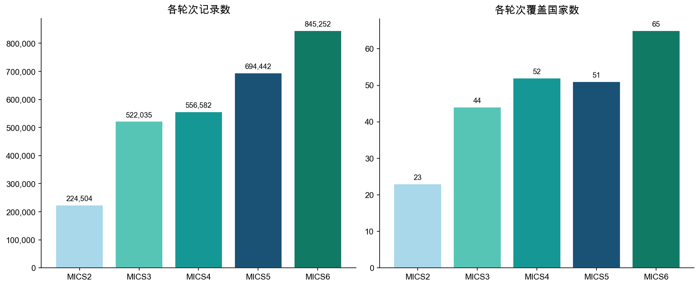
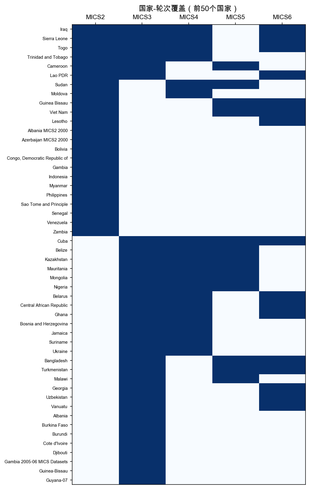
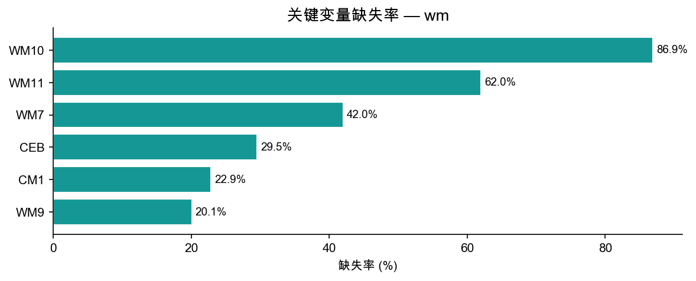
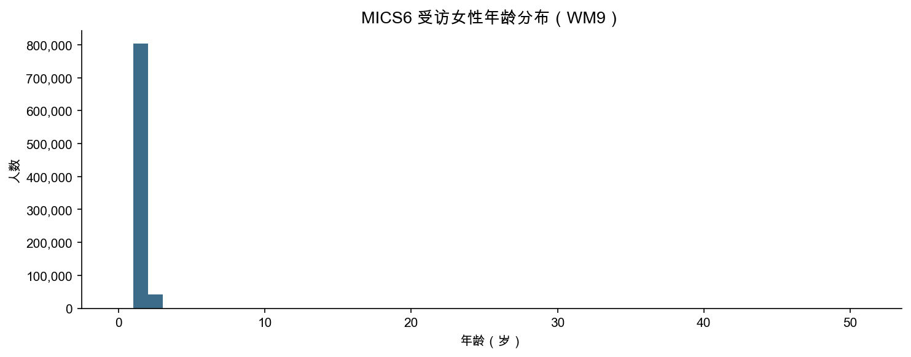

# wm 模块数据报告

> 生成脚本：`MICS/etc/generate_remaining.py`

---

## 1. 概览

| 指标 | 数值 |
|--------|-------|
| 总行数 | 2,842,815 |
| 总列数 | 7,678 |
| 覆盖国家/地区数 | 155 |
| 覆盖轮次 | MICS2 ~ MICS6 |

**wm 模块**（女性问卷）每行代表一名15–49岁女性。主要包含：访谈信息、出生日期与年龄、教育、生育史摘要（CM*）、避孕（CP*）、孕产保健（MN*）等。

---

## 2. 各轮次分布

| 轮次 | 国家/地区数 | 记录数 | 平均每国记录数 |
|------|------------|--------|--------------|
| MICS2 | 23 | 224,504 | 9,761 |
| MICS3 | 44 | 522,035 | 11,864 |
| MICS4 | 52 | 556,582 | 10,704 |
| MICS5 | 51 | 694,442 | 13,617 |
| MICS6 | 65 | 845,252 | 13,004 |

---

## 3. 国家-轮次覆盖

蓝色=有数据，白色=无数据。

---

## 4. 关键变量缺失率

缺失主要来自早期轮次问卷未包含该题。

| 变量 | 含义 | 缺失率 |
|------|------|--------|
| WM7 | 访谈结果 | 42.0% |
| WM9 | 年龄 | 20.1% |
| WM10 | 是否上过学 | 86.9% |
| WM11 | 最高教育程度 | 62.0% |
| CM1 | 是否生育过 | 22.9% |
| CEB | 累计生育数 | 29.5% |

---

## 5. 年龄分布（MICS6）

---

## 6. 标准核心变量列表

共 **1070** 个标准变量（出现在 ≥50% 的轮次中）

| 变量名 | 含义 | MICS3 | MICS4 | MICS5 | MICS6 |
|--------|------|:-----:|:-----:|:-----:|:-----:|
| `AB11` |  | — | — | ✓ | ✓ |
| `AB12` |  | — | — | ✓ | ✓ |
| `AB13` |  | — | — | ✓ | ✓ |
| `AB14` |  | — | — | ✓ | ✓ |
| `AB17A` |  | — | — | ✓ | ✓ |
| `AB17B` |  | — | — | ✓ | ✓ |
| `AB17C` |  | — | — | ✓ | ✓ |
| `AB17X` |  | — | — | ✓ | ✓ |
| `AB2` |  | — | — | ✓ | ✓ |
| `AB3` |  | — | — | ✓ | ✓ |
| `AB4M` |  | — | — | ✓ | ✓ |
| `AB4Y` |  | — | — | ✓ | ✓ |
| `BH11` |  | — | ✓ | ✓ | ✓ |
| `BH12` |  | — | ✓ | — | ✓ |
| `BHAUX` |  | — | — | ✓ | ✓ |
| `CC1` |  | — | — | ✓ | ✓ |
| `CDEAD` | Children dead | — | ✓ | ✓ | ✓ |
| `CEB` | Children ever born | — | ✓ | ✓ | ✓ |
| `CM0` |  | — | ✓ | ✓ | ✓ |
| `CM0A` |  | — | ✓ | ✓ | — |
| `CM1` | Ever given birth | ✓ | ✓ | ✓ | ✓ |
| `CM10` | Children ever born | — | ✓ | ✓ | ✓ |
| `CM11` |  | — | — | ✓ | ✓ |
| `CM11A` |  | ✓ | ✓ | — | ✓ |
| `CM11B` |  | ✓ | ✓ | — | — |
| `CM11C` |  | ✓ | ✓ | — | — |
| `CM11D` |  | ✓ | ✓ | — | — |
| `CM12` |  | ✓ | ✓ | ✓ | ✓ |
| `CM12A` |  | — | ✓ | ✓ | — |
| `CM12B` |  | — | ✓ | ✓ | — |
| `CM12C` |  | — | ✓ | ✓ | — |
| `CM12D` | Day of last birth | — | ✓ | ✓ | — |
| `CM12G` |  | — | ✓ | ✓ | — |
| `CM12J` |  | — | ✓ | ✓ | — |
| `CM12K` |  | — | ✓ | ✓ | — |
| `CM12M` | Month of last birth | — | ✓ | ✓ | — |
| `CM12Y` | Year of last birth | — | ✓ | ✓ | — |
| `CM13` | Last birth in last two years | ✓ | ✓ | ✓ | — |
| `CM15` |  | — | ✓ | — | ✓ |
| `CM19` |  | — | ✓ | — | ✓ |
| `CM1A` |  | — | ✓ | — | ✓ |
| `CM2` |  | — | ✓ | — | ✓ |
| `CM21` |  | — | ✓ | — | ✓ |
| `CM22` |  | — | ✓ | — | ✓ |
| `CM23` |  | — | ✓ | — | ✓ |
| `CM24` |  | — | ✓ | — | ✓ |
| `CM25` |  | — | ✓ | — | ✓ |
| `CM2D` | Day of first birth | — | ✓ | ✓ | — |
| `CM2M` | Month of first birth | — | ✓ | ✓ | — |
| `CM2Y` | Year of first birth | — | ✓ | ✓ | — |
| `CM3` | Years since first birth | ✓ | ✓ | ✓ | ✓ |
| `CM4` | Any sons or daughters living with you | — | ✓ | ✓ | ✓ |
| `CM4A` |  | ✓ | ✓ | — | — |
| `CM4B` |  | ✓ | ✓ | — | — |
| `CM5` |  | ✓ | ✓ | — | ✓ |
| `CM5A` | Sons living with you | — | ✓ | ✓ | — |
| `CM5B` | Daughters living with you | — | ✓ | ✓ | — |
| `CM6` | Any sons or daughters not living with you | — | ✓ | ✓ | ✓ |
| `CM6A` |  | ✓ | ✓ | — | — |
| `CM6B` |  | ✓ | ✓ | — | — |
| `CM7` |  | ✓ | ✓ | — | ✓ |
| `CM7A` | Sons living elsewhere | — | ✓ | ✓ | — |
| `CM7B` | Daughters living elsewhere | — | ✓ | ✓ | — |
| `CM8` | Ever had child who later died | — | ✓ | ✓ | ✓ |
| `CM8A` |  | ✓ | ✓ | — | — |
| `CM8B` |  | ✓ | ✓ | — | — |
| `CM9` |  | ✓ | ✓ | — | ✓ |
| `CM9A` | Boys dead | — | ✓ | ✓ | — |
| `CM9B` | Girls dead | — | ✓ | ✓ | — |
| `CONSENT_WM` |  | — | ✓ | ✓ | — |
| `CP0` |  | ✓ | — | — | ✓ |
| `CP0A` |  | ✓ | ✓ | ✓ | ✓ |
| `CP0AA` |  | — | — | ✓ | ✓ |
| `CP0AB` |  | — | — | ✓ | ✓ |
| `CP0AC` |  | — | — | ✓ | ✓ |
| `CP0AD` |  | — | — | ✓ | ✓ |
| `CP0AE` |  | — | — | ✓ | ✓ |
| `CP0AF` |  | — | — | ✓ | ✓ |
| `CP0AG` |  | — | — | ✓ | ✓ |
| `CP0AH` |  | — | — | ✓ | ✓ |
| `CP0AI` |  | — | — | ✓ | ✓ |
| `CP0AJ` |  | — | — | ✓ | ✓ |
| `CP0AL` |  | — | — | ✓ | ✓ |
| `CP0B` |  | ✓ | ✓ | ✓ | ✓ |
| `CP0BA` |  | — | — | ✓ | ✓ |
| `CP0BB` |  | — | — | ✓ | ✓ |
| `CP0BC` |  | — | — | ✓ | ✓ |
| `CP0BD` |  | — | — | ✓ | ✓ |
| `CP0BE` |  | — | — | ✓ | ✓ |
| `CP0BF` |  | — | — | ✓ | ✓ |
| `CP0BG` |  | — | — | ✓ | ✓ |
| `CP0BH` |  | — | — | ✓ | ✓ |
| `CP0BI` |  | — | — | ✓ | ✓ |
| `CP0BJ` |  | — | — | ✓ | ✓ |
| `CP0BL` |  | — | — | ✓ | ✓ |
| `CP0BM` |  | — | — | ✓ | ✓ |
| `CP0BN` |  | — | — | ✓ | ✓ |
| `CP0BX` |  | — | — | ✓ | ✓ |
| `CP0C` |  | ✓ | ✓ | ✓ | ✓ |
| `CP0D` |  | ✓ | ✓ | ✓ | ✓ |
| `CP0E` |  | ✓ | ✓ | ✓ | ✓ |
| `CP0F` |  | ✓ | ✓ | ✓ | ✓ |
| `CP0G` |  | ✓ | ✓ | ✓ | ✓ |
| `CP0H` |  | ✓ | ✓ | ✓ | ✓ |
| `CP0I` |  | ✓ | ✓ | ✓ | ✓ |
| `CP0J` |  | ✓ | ✓ | ✓ | ✓ |
| `CP0K` |  | ✓ | ✓ | ✓ | ✓ |
| `CP0L` |  | ✓ | ✓ | ✓ | ✓ |
| `CP0M` |  | ✓ | ✓ | ✓ | ✓ |
| `CP0N` |  | — | ✓ | ✓ | ✓ |
| `CP0O` |  | — | ✓ | ✓ | — |
| `CP0P` |  | — | ✓ | ✓ | — |
| `CP0X` |  | ✓ | ✓ | ✓ | ✓ |
| `CP1` | Currently pregnant | ✓ | ✓ | ✓ | ✓ |
| `CP10` |  | — | ✓ | ✓ | — |
| `CP10A` |  | — | ✓ | ✓ | ✓ |
| `CP11` |  | — | ✓ | ✓ | ✓ |
| `CP12` |  | — | ✓ | — | ✓ |
| `CP13` |  | — | ✓ | ✓ | — |
| `CP14` |  | — | ✓ | ✓ | ✓ |
| `CP14A` |  | — | ✓ | — | ✓ |
| `CP15` |  | — | ✓ | ✓ | ✓ |
| `CP16` |  | — | ✓ | — | ✓ |
| `CP17` |  | — | — | ✓ | ✓ |
| `CP18` |  | — | ✓ | ✓ | ✓ |
| `CP19` |  | — | ✓ | ✓ | ✓ |
| `CP1A` |  | ✓ | ✓ | — | — |
| `CP2` | Currently using a method to avoid pregnancy | ✓ | ✓ | ✓ | ✓ |
| `CP20` |  | — | ✓ | — | ✓ |
| `CP21` |  | — | ✓ | ✓ | — |
| `CP24` |  | — | ✓ | ✓ | — |
| `CP25` |  | — | ✓ | ✓ | — |
| `CP28A` |  | — | ✓ | ✓ | — |
| `CP28B` |  | — | ✓ | ✓ | — |
| `CP28C` |  | — | ✓ | ✓ | — |
| `CP28D` |  | — | ✓ | ✓ | — |
| `CP2A` | Ever used method to avoid pregnancy | — | ✓ | ✓ | ✓ |
| `CP2AA` |  | — | ✓ | ✓ | — |
| `CP3` |  | — | ✓ | — | ✓ |
| `CP30` |  | — | ✓ | ✓ | — |
| `CP3A` | Current method: Female sterilization | ✓ | ✓ | ✓ | ✓ |
| `CP3AA` |  | ✓ | ✓ | ✓ | — |
| `CP3B` | Current method: Male sterilization | ✓ | ✓ | ✓ | — |
| `CP3C` | Current method: IUD | ✓ | ✓ | ✓ | — |
| `CP3D` | Current method: Injectables | ✓ | ✓ | ✓ | — |
| `CP3E` | Current method: Implants | ✓ | ✓ | ✓ | — |
| `CP3F` | Current method: Pill | ✓ | ✓ | ✓ | — |
| `CP3G` | Current method: Male condom | ✓ | ✓ | ✓ | — |
| `CP3H` | Current method: Female condom | ✓ | ✓ | ✓ | — |
| `CP3I` | Current method: Diaphragm | ✓ | ✓ | ✓ | — |
| `CP3J` | Current method: Foam / Jelly | ✓ | ✓ | ✓ | — |
| `CP3K` | Current method: Lactational amenorrhoea method | ✓ | ✓ | ✓ | — |
| `CP3L` | Current method: Periodic abstinence / Rhythm | ✓ | ✓ | ✓ | — |
| `CP3M` | Current method: Withdrawal | ✓ | ✓ | ✓ | — |
| `CP3N` |  | — | ✓ | ✓ | — |
| `CP3O` |  | — | ✓ | ✓ | — |
| `CP3Q` |  | — | ✓ | ✓ | — |
| `CP3X` | Current method: Other | ✓ | ✓ | ✓ | — |
| `CP4` |  | — | ✓ | ✓ | — |
| `CP4A` |  | ✓ | ✓ | ✓ | ✓ |
| `CP4B` |  | ✓ | ✓ | ✓ | ✓ |
| `CP4C` |  | — | ✓ | ✓ | ✓ |
| `CP4CN` |  | ✓ | ✓ | — | — |
| `CP4CU` |  | ✓ | ✓ | — | — |
| `CP4D` |  | — | ✓ | — | ✓ |
| `CP4E` |  | ✓ | ✓ | ✓ | ✓ |
| `CP4F` |  | — | ✓ | ✓ | ✓ |
| `CP4G` |  | — | ✓ | ✓ | ✓ |
| `CP4H` |  | — | ✓ | ✓ | ✓ |
| `CP4I` |  | — | — | ✓ | ✓ |
| `CP4J` |  | — | — | ✓ | ✓ |
| `CP4K` |  | — | — | ✓ | ✓ |
| `CP4L` |  | — | — | ✓ | ✓ |
| `CP4M` |  | — | — | ✓ | ✓ |
| `CP4N` |  | — | — | ✓ | ✓ |
| `CP4O` |  | — | — | ✓ | ✓ |
| `CP4P` |  | — | — | ✓ | ✓ |
| `CP4Q` |  | — | — | ✓ | ✓ |
| `CP4X` |  | — | ✓ | ✓ | ✓ |
| `CP5` |  | — | ✓ | ✓ | ✓ |
| `CP5A` |  | — | ✓ | — | ✓ |
| `CP5B` |  | — | ✓ | — | ✓ |
| `CP5C` |  | — | ✓ | — | ✓ |
| `CP5D` |  | — | ✓ | — | ✓ |
| `CP5E` |  | — | ✓ | — | ✓ |
| `CP5F` |  | — | ✓ | — | ✓ |
| `CP5G` |  | — | ✓ | — | ✓ |
| `CP5H` |  | — | ✓ | — | ✓ |
| `CP5I` |  | — | ✓ | — | ✓ |
| `CP5J` |  | — | ✓ | — | ✓ |
| `CP5K` |  | — | ✓ | — | ✓ |
| `CP5L` |  | — | ✓ | — | ✓ |
| `CP5M` |  | — | ✓ | ✓ | — |
| `CP5X` |  | — | ✓ | — | ✓ |
| `CP5Y` |  | — | — | ✓ | ✓ |
| `CP5Z` |  | — | ✓ | — | ✓ |
| `CP6` |  | — | ✓ | ✓ | ✓ |
| `CP6A` |  | — | — | ✓ | ✓ |
| `CP6B` |  | — | — | ✓ | ✓ |
| `CP6C` |  | — | — | ✓ | ✓ |
| `CP6D` |  | — | — | ✓ | ✓ |
| `CP6E` |  | — | — | ✓ | ✓ |
| `CP6F` |  | — | — | ✓ | ✓ |
| `CP6X` |  | — | — | ✓ | ✓ |
| `CP7` |  | — | ✓ | ✓ | ✓ |
| `CP8M` |  | — | ✓ | ✓ | ✓ |
| `CP8Y` |  | — | ✓ | — | ✓ |
| `CP9` |  | — | ✓ | ✓ | ✓ |
| `CSURV` | Children surviving | — | ✓ | ✓ | ✓ |
| `DA11` |  | — | ✓ | — | ✓ |
| `DA12` |  | — | ✓ | — | ✓ |
| `DA13` |  | — | ✓ | — | ✓ |
| `DA15A` |  | — | ✓ | — | ✓ |
| `DA15B` |  | — | ✓ | — | ✓ |
| `DA15C` |  | — | ✓ | — | ✓ |
| `DA16` |  | — | ✓ | — | ✓ |
| `DA18` |  | — | ✓ | — | ✓ |
| `DA19B` |  | — | ✓ | — | ✓ |
| `DA20` |  | — | ✓ | — | ✓ |
| `DA29` |  | — | ✓ | — | ✓ |
| `DA3A` |  | — | ✓ | — | ✓ |
| `DA3B` |  | — | ✓ | — | ✓ |
| `DA3C` |  | — | ✓ | — | ✓ |
| `DA3D` |  | — | ✓ | — | ✓ |
| `DA3E` |  | — | ✓ | — | ✓ |
| `DA3F` |  | — | ✓ | — | ✓ |
| `DA4A1` |  | — | ✓ | — | ✓ |
| `DA4B1` |  | — | ✓ | — | ✓ |
| `DA4C1` |  | — | ✓ | — | ✓ |
| `DA5A1` |  | — | ✓ | — | ✓ |
| `DA5B1` |  | — | ✓ | — | ✓ |
| `DA5C1` |  | — | ✓ | — | ✓ |
| `DA5D1` |  | — | ✓ | — | ✓ |
| `DA5E1` |  | — | ✓ | — | ✓ |
| `DA5F1` |  | — | ✓ | — | ✓ |
| `DA5G1` |  | — | ✓ | — | ✓ |
| `DA5H1` |  | — | ✓ | — | ✓ |
| `DA5I1` |  | — | ✓ | — | ✓ |
| `DA7` |  | — | ✓ | — | ✓ |
| `DA8A` |  | — | ✓ | — | ✓ |
| `DA8B` |  | — | ✓ | — | ✓ |
| `DA8C` |  | — | ✓ | — | ✓ |
| `DA9` |  | — | ✓ | — | ✓ |
| `DB1` | Wanted last child then | — | ✓ | ✓ | — |
| `DB2` | Wanted child later or did not want more children | — | ✓ | ✓ | ✓ |
| `DB3N` | Desired waiting time (number) | — | ✓ | ✓ | — |
| `DB3U` | Desired waiting time (units) | — | ✓ | ✓ | — |
| `DB4` |  | — | ✓ | — | ✓ |
| `DB5` |  | — | ✓ | — | ✓ |
| `DV10` |  | — | ✓ | — | ✓ |
| `DV11` |  | — | ✓ | — | ✓ |
| `DV12` |  | — | ✓ | — | ✓ |
| `DV13` |  | — | ✓ | — | ✓ |
| `DV18` |  | — | ✓ | — | ✓ |
| `DV1A` | If she goes out with out telling husband: wife beating justi | ✓ | ✓ | ✓ | ✓ |
| `DV1B` | If she neglects the children: wife beating justified | ✓ | ✓ | ✓ | ✓ |
| `DV1C` | If she argues with husband: wife beating justified | ✓ | ✓ | ✓ | ✓ |
| `DV1D` | If she refuses sex with husband: wife beating justified | ✓ | ✓ | ✓ | ✓ |
| `DV1E` | If she burns the food: wife beating justified | ✓ | ✓ | ✓ | ✓ |
| `DV1F` | if she isn't wearing | ✓ | ✓ | ✓ | ✓ |
| `DV1G` |  | ✓ | ✓ | ✓ | ✓ |
| `DV1H` |  | ✓ | ✓ | ✓ | ✓ |
| `DV1I` |  | — | ✓ | ✓ | ✓ |
| `DV1J` |  | — | ✓ | ✓ | ✓ |
| `DV1K` |  | — | ✓ | — | ✓ |
| `DV2` |  | — | ✓ | — | ✓ |
| `DV20` |  | — | ✓ | — | ✓ |
| `DV23` |  | — | ✓ | — | ✓ |
| `DV27` |  | — | ✓ | — | ✓ |
| `DV2A` |  | ✓ | ✓ | ✓ | ✓ |
| `DV2B` |  | ✓ | ✓ | ✓ | ✓ |
| `DV2C` |  | ✓ | ✓ | ✓ | ✓ |
| `DV2D` |  | ✓ | ✓ | ✓ | ✓ |
| `DV2E` |  | — | ✓ | ✓ | ✓ |
| `DV2F` |  | — | ✓ | ✓ | ✓ |
| `DV2X` |  | — | ✓ | — | ✓ |
| `DV3` |  | — | ✓ | — | ✓ |
| `DV3A` |  | — | ✓ | — | ✓ |
| `DV3B` |  | — | ✓ | — | ✓ |
| `DV3C` |  | — | ✓ | — | ✓ |
| `DV3D` |  | — | ✓ | — | ✓ |
| `DV3E` |  | — | ✓ | — | ✓ |
| `DV3F` |  | — | ✓ | — | ✓ |
| `DV3G` |  | — | ✓ | — | ✓ |
| `DV4` |  | — | ✓ | — | ✓ |
| `DV4A` |  | — | ✓ | — | ✓ |
| `DV4A1` |  | — | ✓ | — | ✓ |
| `DV4B` |  | — | ✓ | — | ✓ |
| `DV4B1` |  | — | ✓ | — | ✓ |
| `DV4C` |  | — | ✓ | — | ✓ |
| `DV5A` |  | — | ✓ | — | ✓ |
| `DV5A1` |  | — | ✓ | — | ✓ |
| `DV5B` |  | — | ✓ | — | ✓ |
| `DV5B1` |  | — | ✓ | — | ✓ |
| `DV6` |  | — | ✓ | — | ✓ |
| `DV7` |  | — | ✓ | — | ✓ |
| `DV8A` |  | — | ✓ | — | ✓ |
| `DV8B` |  | — | ✓ | — | ✓ |
| `DV8C` |  | — | ✓ | — | ✓ |
| `DV9` |  | — | ✓ | — | ✓ |
| `FG1` |  | ✓ | ✓ | ✓ | ✓ |
| `FG10` |  | — | ✓ | ✓ | ✓ |
| `FG11` |  | ✓ | ✓ | — | — |
| `FG12` |  | ✓ | ✓ | — | — |
| `FG13` |  | ✓ | ✓ | — | — |
| `FG14` |  | ✓ | ✓ | — | — |
| `FG15` |  | ✓ | ✓ | — | — |
| `FG16` |  | ✓ | ✓ | — | — |
| `FG16A` |  | ✓ | ✓ | — | — |
| `FG2` |  | ✓ | ✓ | ✓ | ✓ |
| `FG22` |  | — | ✓ | ✓ | — |
| `FG23` |  | — | ✓ | ✓ | — |
| `FG24` |  | — | — | ✓ | ✓ |
| `FG24A` |  | — | ✓ | — | ✓ |
| `FG3` |  | ✓ | ✓ | ✓ | ✓ |
| `FG4` |  | ✓ | ✓ | ✓ | ✓ |
| `FG5` |  | ✓ | ✓ | ✓ | ✓ |
| `FG6` |  | ✓ | ✓ | ✓ | ✓ |
| `FG7` |  | ✓ | ✓ | ✓ | ✓ |
| `FG8` |  | — | ✓ | ✓ | ✓ |
| `FG9` |  | ✓ | ✓ | ✓ | ✓ |
| `FI1` |  | — | ✓ | ✓ | — |
| `FI2` |  | — | ✓ | ✓ | — |
| `FI3` |  | — | ✓ | ✓ | — |
| `FI4` |  | — | ✓ | ✓ | — |
| `FI5` |  | — | ✓ | ✓ | — |
| `FI7` |  | — | ✓ | ✓ | — |
| `HA1` | Ever heard of AIDS | ✓ | ✓ | ✓ | ✓ |
| `HA10` | Would buy fresh vegetables from shopkeeper with AIDS virus | ✓ | ✓ | ✓ | ✓ |
| `HA11` | If HH member became infected with AIDS virus, would want it to remain a secret | ✓ | ✓ | ✓ | — |
| `HA12` | Willing to care for person with AIDS in household | ✓ | ✓ | ✓ | — |
| `HA12A` |  | — | ✓ | ✓ | — |
| `HA12B` |  | — | ✓ | ✓ | — |
| `HA12C` |  | — | ✓ | ✓ | — |
| `HA12D` |  | — | ✓ | ✓ | — |
| `HA13` |  | ✓ | ✓ | — | — |
| `HA15` |  | ✓ | ✓ | — | ✓ |
| `HA15A` | Given information about AIDS virus during antenatal care visit: AIDS from mother | — | ✓ | ✓ | — |
| `HA15B` | Given information about AIDS virus during antenatal care visit: Things to do | — | ✓ | ✓ | — |
| `HA15C` | Given information about AIDS virus during antenatal care visit: Tested for AIDS | — | ✓ | ✓ | — |
| `HA15D` |  | — | ✓ | ✓ | — |
| `HA16` |  | ✓ | ✓ | ✓ | ✓ |
| `HA16A` |  | — | ✓ | — | ✓ |
| `HA17` |  | ✓ | ✓ | ✓ | — |
| `HA18` |  | ✓ | ✓ | ✓ | ✓ |
| `HA1A` |  | — | ✓ | — | ✓ |
| `HA2` | Can avoid AIDS virus by having one uninfected partner | ✓ | ✓ | ✓ | ✓ |
| `HA20` |  | — | ✓ | ✓ | ✓ |
| `HA21` |  | — | ✓ | ✓ | ✓ |
| `HA22` |  | — | ✓ | ✓ | ✓ |
| `HA23` |  | — | ✓ | ✓ | ✓ |
| `HA24` |  | — | ✓ | ✓ | ✓ |
| `HA25` |  | — | ✓ | ✓ | ✓ |
| `HA25A` |  | — | ✓ | — | ✓ |
| `HA26` |  | — | ✓ | ✓ | ✓ |
| `HA26A` |  | — | ✓ | ✓ | — |
| `HA27` | Know a place to get AIDS virus test | — | ✓ | ✓ | ✓ |
| `HA28` |  | — | ✓ | ✓ | ✓ |
| `HA29` |  | — | ✓ | ✓ | ✓ |
| `HA3` | Can get AIDS virus through supernatural means | ✓ | ✓ | ✓ | ✓ |
| `HA30` |  | — | — | ✓ | ✓ |
| `HA31` |  | — | — | ✓ | ✓ |
| `HA32` |  | — | ✓ | ✓ | ✓ |
| `HA33` |  | — | ✓ | — | ✓ |
| `HA34` |  | — | ✓ | ✓ | ✓ |
| `HA35` |  | — | — | ✓ | ✓ |
| `HA36` |  | — | ✓ | ✓ | ✓ |
| `HA37` |  | — | ✓ | — | ✓ |
| `HA38` |  | — | ✓ | ✓ | ✓ |
| `HA39` |  | — | — | ✓ | ✓ |
| `HA3A` |  | — | ✓ | ✓ | ✓ |
| `HA4` | Can avoid AIDS virus by using a condom correctly every time | ✓ | ✓ | ✓ | ✓ |
| `HA40` |  | — | — | ✓ | ✓ |
| `HA5` | Can get AIDS virus from mosquito bites | ✓ | ✓ | ✓ | ✓ |
| `HA5A` |  | — | — | ✓ | ✓ |
| `HA6` | Can get AIDS virus by sharing food with a person who has AIDS | ✓ | ✓ | ✓ | ✓ |
| `HA6A` |  | — | ✓ | ✓ | ✓ |
| `HA6B` |  | — | — | ✓ | ✓ |
| `HA7` | Healthy-looking person may have AIDS virus | ✓ | ✓ | ✓ | ✓ |
| `HA7A` |  | ✓ | ✓ | ✓ | ✓ |
| `HA8` |  | ✓ | ✓ | — | — |
| `HA8A` | AIDS virus from mother to child during pregnancy | — | ✓ | ✓ | ✓ |
| `HA8B` | AIDS virus from mother to child during delivery | — | ✓ | ✓ | ✓ |
| `HA8C` | AIDS virus from mother to child through breastfeeding | — | ✓ | ✓ | ✓ |
| `HA9` | Should female teacher with AIDS virus be allowed to teach in school | — | ✓ | ✓ | — |
| `HA9A` |  | ✓ | ✓ | ✓ | — |
| `HA9B` |  | ✓ | ✓ | ✓ | — |
| `HA9C` |  | ✓ | ✓ | — | — |
| `HB3` |  | — | ✓ | ✓ | — |
| `HB5` |  | — | ✓ | ✓ | — |
| `HB7` |  | — | ✓ | ✓ | — |
| `HC10A` |  | ✓ | ✓ | — | — |
| `HC10B` |  | ✓ | ✓ | — | — |
| `HC10C` |  | ✓ | ✓ | — | — |
| `HC10D` |  | ✓ | ✓ | — | — |
| `HC10E` |  | ✓ | ✓ | — | — |
| `HC10F` |  | ✓ | ✓ | — | — |
| `HC11` |  | ✓ | ✓ | — | — |
| `HC12` |  | ✓ | ✓ | — | — |
| `HC13` |  | ✓ | ✓ | — | — |
| `HC14A` |  | ✓ | ✓ | — | — |
| `HC14B` |  | ✓ | ✓ | — | — |
| `HC14C` |  | ✓ | ✓ | — | — |
| `HC14D` |  | ✓ | ✓ | — | — |
| `HC14E` |  | ✓ | ✓ | — | — |
| `HC14F` |  | ✓ | ✓ | — | — |
| `HC15A` |  | ✓ | ✓ | — | — |
| `HC1A` |  | ✓ | ✓ | — | — |
| `HC1C` |  | ✓ | ✓ | — | — |
| `HC2` |  | ✓ | ✓ | — | — |
| `HC3` |  | ✓ | ✓ | — | — |
| `HC4` |  | ✓ | ✓ | — | — |
| `HC5` |  | ✓ | ✓ | — | — |
| `HC6` |  | ✓ | ✓ | — | — |
| `HC8` |  | ✓ | ✓ | — | — |
| `HC9A` |  | ✓ | ✓ | — | — |
| `HC9B` |  | ✓ | ✓ | — | — |
| `HC9C` |  | ✓ | ✓ | — | — |
| `HC9D` |  | ✓ | ✓ | — | — |
| `HC9E` |  | ✓ | ✓ | — | — |
| `HC9F` |  | ✓ | ✓ | — | — |
| `HC9G` |  | ✓ | ✓ | — | — |
| `HC9H` |  | ✓ | ✓ | — | — |
| `HC9I` |  | ✓ | ✓ | — | — |
| `HC9J` |  | ✓ | ✓ | — | — |
| `HC9K` |  | ✓ | ✓ | — | — |
| `HC9L` |  | ✓ | ✓ | — | — |
| `HC9M` |  | ✓ | ✓ | — | — |
| `HC9N` |  | ✓ | ✓ | — | — |
| `HC9O` |  | ✓ | ✓ | — | — |
| `HE1` |  | — | ✓ | ✓ | — |
| `HE2` |  | — | ✓ | ✓ | — |
| `HE3` |  | — | ✓ | ✓ | — |
| `HE4` |  | — | ✓ | ✓ | — |
| `HH1` | Cluster number | ✓ | ✓ | ✓ | ✓ |
| `HH10` |  | ✓ | ✓ | — | — |
| `HH11` |  | ✓ | ✓ | — | — |
| `HH12` |  | ✓ | ✓ | — | — |
| `HH13` |  | ✓ | ✓ | — | — |
| `HH14` |  | ✓ | ✓ | — | — |
| `HH15` |  | ✓ | ✓ | — | — |
| `HH16` |  | ✓ | ✓ | — | — |
| `HH2` | Household number | ✓ | ✓ | ✓ | ✓ |
| `HH3` |  | ✓ | ✓ | ✓ | ✓ |
| `HH4` |  | ✓ | ✓ | ✓ | ✓ |
| `HH5D` |  | ✓ | ✓ | — | — |
| `HH5M` |  | ✓ | ✓ | — | — |
| `HH5Y` |  | ✓ | ✓ | — | — |
| `HH6` | Area | ✓ | ✓ | ✓ | ✓ |
| `HH6A` |  | ✓ | ✓ | ✓ | ✓ |
| `HH6B` |  | ✓ | ✓ | ✓ | — |
| `HH7` | Division | ✓ | ✓ | ✓ | ✓ |
| `HH7A` | District | ✓ | ✓ | ✓ | ✓ |
| `HH7B` |  | ✓ | ✓ | ✓ | ✓ |
| `HH7C` |  | ✓ | ✓ | ✓ | ✓ |
| `HH7D` |  | ✓ | ✓ | ✓ | — |
| `HH9` |  | ✓ | ✓ | — | — |
| `HHNINOS` |  | — | — | ✓ | ✓ |
| `HHSEX` |  | — | ✓ | — | ✓ |
| `HL7` |  | — | ✓ | — | ✓ |
| `INTROBH` |  | — | — | ✓ | ✓ |
| `INTROBX` |  | — | — | ✓ | ✓ |
| `IS2A` | Symptoms: Child not able to drink or breastfeed | — | ✓ | ✓ | — |
| `IS2B` | Symptoms: Child becomes sicker | — | ✓ | ✓ | — |
| `IS2C` | Symptoms: Child develops a fever | — | ✓ | ✓ | — |
| `IS2D` | Symptoms: Child has fast breathing | — | ✓ | ✓ | — |
| `IS2E` | Symptoms: Child has difficult breathing | — | ✓ | ✓ | — |
| `IS2F` | Symptoms: Child has blood in stools | — | ✓ | ✓ | — |
| `IS2G` | Symptoms: Child is drinking poorly | — | ✓ | ✓ | — |
| `IS2H` | Symptoms: Child has diarrhoea | — | ✓ | ✓ | — |
| `IS2I` |  | — | ✓ | ✓ | — |
| `IS2J` |  | — | ✓ | ✓ | — |
| `IS2K` |  | — | ✓ | ✓ | — |
| `IS2L` |  | — | ✓ | ✓ | — |
| `IS2M` |  | — | ✓ | ✓ | — |
| `IS2N` |  | — | ✓ | ✓ | — |
| `IS2O` |  | — | ✓ | ✓ | — |
| `IS2Q` |  | — | ✓ | ✓ | — |
| `IS2X` | Symptoms: Other | — | ✓ | ✓ | — |
| `IS2Y` | Symptoms: Other | — | ✓ | ✓ | — |
| `IS2Z` | Symptoms: Other | — | ✓ | ✓ | — |
| `IS3A` |  | — | ✓ | ✓ | — |
| `IS3B` |  | — | ✓ | ✓ | — |
| `IS3C` |  | — | ✓ | ✓ | — |
| `IS3D` |  | — | ✓ | ✓ | — |
| `IS3E` |  | — | ✓ | ✓ | — |
| `IS3F` |  | — | ✓ | ✓ | — |
| `IS3G` |  | — | ✓ | ✓ | — |
| `IS3H` |  | — | ✓ | ✓ | — |
| `IS3X` |  | — | ✓ | ✓ | — |
| `IS3Y` |  | — | ✓ | ✓ | — |
| `IS4A` |  | — | ✓ | ✓ | — |
| `IS4B` |  | — | ✓ | ✓ | — |
| `IS4C` |  | — | ✓ | ✓ | — |
| `IS4D` |  | — | ✓ | ✓ | — |
| `IS4E` |  | — | ✓ | ✓ | — |
| `IS4F` |  | — | ✓ | ✓ | — |
| `IS4G` |  | — | ✓ | ✓ | — |
| `IS4H` |  | — | ✓ | ✓ | — |
| `IS4I` |  | — | ✓ | ✓ | — |
| `IS4J` |  | — | ✓ | ✓ | — |
| `IS4X` |  | — | ✓ | ✓ | — |
| `IS4Y` |  | — | ✓ | ✓ | — |
| `IS5A` |  | — | ✓ | ✓ | — |
| `IS5B` |  | — | ✓ | ✓ | — |
| `IS5C` |  | — | ✓ | ✓ | — |
| `IS5D` |  | — | ✓ | ✓ | — |
| `IS5E` |  | — | ✓ | ✓ | — |
| `IS5F` |  | — | ✓ | ✓ | — |
| `IS5G` |  | — | ✓ | ✓ | — |
| `IS5X` |  | — | ✓ | ✓ | — |
| `IS5Y` |  | — | ✓ | ✓ | — |
| `LN` | Line number | ✓ | ✓ | ✓ | ✓ |
| `LS10` |  | — | ✓ | ✓ | — |
| `LS11` |  | — | ✓ | ✓ | — |
| `LS12` |  | — | ✓ | ✓ | — |
| `LS13` |  | — | ✓ | ✓ | — |
| `LS14` |  | — | ✓ | ✓ | — |
| `LS15` |  | — | ✓ | ✓ | — |
| `LS2` |  | — | ✓ | ✓ | ✓ |
| `LS3` |  | — | ✓ | ✓ | ✓ |
| `LS4` |  | — | ✓ | ✓ | ✓ |
| `LS5` |  | — | ✓ | ✓ | — |
| `LS6` |  | — | ✓ | ✓ | — |
| `LS7` |  | — | ✓ | ✓ | — |
| `LS8` |  | — | ✓ | ✓ | — |
| `LS9` |  | — | ✓ | ✓ | — |
| `MA1` | Currently married | ✓ | ✓ | ✓ | ✓ |
| `MA10` |  | — | ✓ | ✓ | — |
| `MA11` |  | — | ✓ | — | ✓ |
| `MA12` |  | — | ✓ | — | ✓ |
| `MA1A` |  | — | — | ✓ | ✓ |
| `MA2` | Age of husband | ✓ | ✓ | ✓ | ✓ |
| `MA2A` |  | ✓ | ✓ | ✓ | — |
| `MA2B` |  | ✓ | ✓ | — | — |
| `MA3` | Husband has other wives | ✓ | ✓ | ✓ | ✓ |
| `MA4` | Number of other wives | ✓ | ✓ | ✓ | ✓ |
| `MA5` | Ever married | ✓ | ✓ | ✓ | ✓ |
| `MA6` | Marital status | — | ✓ | ✓ | ✓ |
| `MA6M` |  | ✓ | ✓ | — | — |
| `MA6Y` |  | ✓ | ✓ | — | — |
| `MA7` | Married once or more than once | — | ✓ | ✓ | ✓ |
| `MA8` |  | ✓ | ✓ | — | — |
| `MA8C` |  | — | — | ✓ | ✓ |
| `MA8F` |  | — | — | ✓ | ✓ |
| `MA8M` | Month of first marriage | — | ✓ | ✓ | ✓ |
| `MA8Y` | Year of first marriage | — | ✓ | ✓ | ✓ |
| `MA9` | Age at first marriage | — | ✓ | ✓ | — |
| `MA9C` |  | — | ✓ | ✓ | — |
| `MM1` |  | — | ✓ | ✓ | ✓ |
| `MM3` |  | — | ✓ | ✓ | ✓ |
| `MMAUX` |  | — | — | ✓ | ✓ |
| `MN1` | Received antenatal care | ✓ | ✓ | ✓ | — |
| `MN10` | Doses of tetanus toxoid before last pregnancy | ✓ | ✓ | ✓ | — |
| `MN11` | Years ago last tetanus toxoid received | ✓ | ✓ | ✓ | ✓ |
| `MN11A` |  | ✓ | ✓ | — | — |
| `MN11C` |  | ✓ | ✓ | — | — |
| `MN12` |  | ✓ | ✓ | — | ✓ |
| `MN12A` |  | ✓ | — | ✓ | — |
| `MN13` |  | — | ✓ | ✓ | ✓ |
| `MN13N` |  | ✓ | ✓ | — | — |
| `MN13U` |  | ✓ | ✓ | — | — |
| `MN14A` |  | ✓ | ✓ | ✓ | ✓ |
| `MN14B` |  | ✓ | ✓ | ✓ | — |
| `MN14C` |  | ✓ | ✓ | ✓ | ✓ |
| `MN14D` |  | ✓ | ✓ | ✓ | ✓ |
| `MN14E` |  | ✓ | ✓ | ✓ | ✓ |
| `MN14F` |  | ✓ | — | — | ✓ |
| `MN14G` |  | ✓ | — | — | ✓ |
| `MN14H` |  | ✓ | ✓ | — | — |
| `MN14X` |  | — | ✓ | ✓ | — |
| `MN14Z` |  | — | ✓ | ✓ | — |
| `MN15A` |  | — | ✓ | — | ✓ |
| `MN16` |  | — | ✓ | ✓ | ✓ |
| `MN16A` |  | — | ✓ | ✓ | ✓ |
| `MN16B` |  | — | ✓ | ✓ | — |
| `MN17A` | Assistance at delivery: Doctor | — | ✓ | ✓ | — |
| `MN17AA` |  | — | ✓ | ✓ | — |
| `MN17B` | Assistance at delivery: Nurse / Midwife | — | ✓ | ✓ | — |
| `MN17C` | Assistance at delivery: Auxiliary midwife | — | ✓ | ✓ | — |
| `MN17D` |  | — | ✓ | ✓ | — |
| `MN17E` |  | — | ✓ | ✓ | — |
| `MN17F` | Assistance at delivery: Traditional birth attendant | — | ✓ | ✓ | — |
| `MN17G` | Assistance at delivery: Community health worker | — | ✓ | ✓ | — |
| `MN17H` | Assistance at delivery: Relative / Friend | — | ✓ | ✓ | — |
| `MN17I` |  | — | ✓ | ✓ | — |
| `MN17J` |  | — | ✓ | ✓ | — |
| `MN17Q` |  | — | ✓ | ✓ | — |
| `MN17X` | Assistance at delivery: Other | — | ✓ | ✓ | — |
| `MN17Y` | Assistance at delivery: No one | — | ✓ | ✓ | — |
| `MN18` | Place of delivery | — | ✓ | ✓ | — |
| `MN18A` |  | — | ✓ | ✓ | ✓ |
| `MN18B` |  | — | — | ✓ | ✓ |
| `MN18C` |  | — | — | ✓ | ✓ |
| `MN19` | Delivery by caesarean section | — | ✓ | ✓ | — |
| `MN19A` |  | — | ✓ | ✓ | ✓ |
| `MN19B` |  | — | ✓ | ✓ | ✓ |
| `MN19C` |  | — | ✓ | ✓ | ✓ |
| `MN19D` |  | — | ✓ | ✓ | ✓ |
| `MN19E` |  | — | ✓ | — | ✓ |
| `MN19G` |  | — | — | ✓ | ✓ |
| `MN19H` |  | — | — | ✓ | ✓ |
| `MN19I` |  | — | — | ✓ | ✓ |
| `MN19J` |  | — | — | ✓ | ✓ |
| `MN20` | Size of child at birth | — | ✓ | ✓ | ✓ |
| `MN20A` |  | — | — | ✓ | ✓ |
| `MN21` | Child weighed at birth | — | ✓ | ✓ | ✓ |
| `MN21A` |  | — | — | ✓ | ✓ |
| `MN22` | Weight at birth (Kilograms) | — | ✓ | ✓ | ✓ |
| `MN22A` | Weight from card or recall | — | ✓ | ✓ | ✓ |
| `MN22AA` |  | — | — | ✓ | ✓ |
| `MN22B` |  | — | ✓ | ✓ | ✓ |
| `MN22BB` |  | — | — | ✓ | ✓ |
| `MN22C` |  | — | ✓ | ✓ | — |
| `MN22D` |  | — | ✓ | ✓ | — |
| `MN22N` |  | — | ✓ | ✓ | — |
| `MN22U` |  | — | ✓ | ✓ | — |
| `MN23` | Menstrual period returned since the birth of child | — | ✓ | ✓ | ✓ |
| `MN23A` |  | — | — | ✓ | ✓ |
| `MN24` | Ever breastfeed | — | ✓ | ✓ | ✓ |
| `MN25` |  | — | ✓ | — | ✓ |
| `MN25N` | Time baby put to breast (number) | — | ✓ | ✓ | — |
| `MN25U` | Time baby put to breast (unit) | — | ✓ | ✓ | — |
| `MN26` | Within first 3 days after delivery, child given anything to drink other than breast milk | — | ✓ | ✓ | — |
| `MN27A` | Child given to drink - Milk (other than breast milk) | — | ✓ | ✓ | — |
| `MN27AA` |  | — | ✓ | ✓ | — |
| `MN27B` | Child given to drink - Plain water | — | ✓ | ✓ | — |
| `MN27C` | Child given to drink - Sugar or glucose water | — | ✓ | ✓ | — |
| `MN27D` | Child given to drink - Gripe water | — | ✓ | ✓ | — |
| `MN27E` | Child given to drink - Sugar - salt - water solution | — | ✓ | ✓ | — |
| `MN27F` | Child given to drink - Fruit juice | — | ✓ | ✓ | — |
| `MN27G` | Child given to drink - Infant formula | — | ✓ | ✓ | — |
| `MN27H` | Child given to drink - Tea / Infusions | — | ✓ | ✓ | — |
| `MN27I` | Child given to drink - Honey | — | ✓ | ✓ | — |
| `MN27J` |  | — | ✓ | ✓ | — |
| `MN27Q` |  | — | ✓ | ✓ | — |
| `MN27X` | Child given to drink - Other | — | ✓ | ✓ | — |
| `MN28` | Receiving vitamine A | — | ✓ | ✓ | ✓ |
| `MN29` |  | — | ✓ | ✓ | ✓ |
| `MN29A` |  | — | ✓ | ✓ | — |
| `MN29B` |  | — | ✓ | ✓ | — |
| `MN2A` | Antenatal care: Doctor | ✓ | ✓ | ✓ | — |
| `MN2AA` |  | ✓ | ✓ | ✓ | — |
| `MN2AB` |  | ✓ | ✓ | — | — |
| `MN2B` | Antenatal care: Nurse / Midwife | ✓ | ✓ | ✓ | — |
| `MN2BB` |  | — | ✓ | ✓ | — |
| `MN2C` | Antenatal care: Auxiliary midwife | ✓ | ✓ | ✓ | — |
| `MN2CC` |  | — | ✓ | ✓ | — |
| `MN2D` |  | ✓ | ✓ | ✓ | — |
| `MN2E` |  | — | ✓ | ✓ | — |
| `MN2F` | Antenatal care: Traditional birth attendant | ✓ | ✓ | ✓ | — |
| `MN2G` | Antenatal care: Community health worker | ✓ | ✓ | ✓ | — |
| `MN2H` |  | ✓ | ✓ | ✓ | — |
| `MN2I` |  | — | ✓ | ✓ | — |
| `MN2J` |  | — | ✓ | ✓ | — |
| `MN2Q` |  | — | ✓ | ✓ | — |
| `MN2X` | Antenatal care: Other | ✓ | ✓ | ✓ | — |
| `MN2Y` |  | ✓ | ✓ | ✓ | — |
| `MN3` | Times received antenatal care | — | ✓ | ✓ | — |
| `MN30` |  | — | — | ✓ | ✓ |
| `MN31A` |  | — | ✓ | — | ✓ |
| `MN31B` |  | — | ✓ | — | ✓ |
| `MN31C` |  | — | ✓ | — | ✓ |
| `MN31D` |  | — | ✓ | — | ✓ |
| `MN31Y` |  | — | ✓ | — | ✓ |
| `MN3A` |  | ✓ | ✓ | ✓ | ✓ |
| `MN3AA` |  | — | — | ✓ | ✓ |
| `MN3AB` |  | — | — | ✓ | ✓ |
| `MN3B` |  | ✓ | ✓ | ✓ | ✓ |
| `MN3C` |  | ✓ | ✓ | ✓ | ✓ |
| `MN3D` |  | ✓ | ✓ | ✓ | ✓ |
| `MN3E` |  | ✓ | — | — | ✓ |
| `MN3F` |  | ✓ | — | ✓ | ✓ |
| `MN3G` |  | ✓ | — | — | ✓ |
| `MN3H` |  | ✓ | — | — | ✓ |
| `MN4` |  | ✓ | ✓ | — | — |
| `MN4A` | Blood pressure | ✓ | ✓ | ✓ | ✓ |
| `MN4AA` |  | — | ✓ | ✓ | — |
| `MN4AB` |  | — | ✓ | ✓ | — |
| `MN4AC` |  | — | ✓ | ✓ | — |
| `MN4AD` |  | — | ✓ | ✓ | — |
| `MN4AE` |  | — | ✓ | ✓ | — |
| `MN4AF` |  | — | ✓ | ✓ | — |
| `MN4AG` |  | — | ✓ | ✓ | — |
| `MN4AH` |  | — | ✓ | ✓ | — |
| `MN4B` | Urine sample | ✓ | ✓ | ✓ | — |
| `MN4BA` |  | ✓ | — | ✓ | — |
| `MN4BB` |  | ✓ | ✓ | ✓ | — |
| `MN4C` | Blood sample | — | ✓ | ✓ | — |
| `MN4CA` |  | — | ✓ | ✓ | — |
| `MN4CCA` |  | — | ✓ | ✓ | — |
| `MN4CCB` |  | — | ✓ | ✓ | — |
| `MN4CCC` |  | — | ✓ | ✓ | — |
| `MN4CCD` |  | — | ✓ | ✓ | — |
| `MN4D` |  | — | ✓ | ✓ | — |
| `MN4DA` |  | — | ✓ | ✓ | — |
| `MN4DB` |  | — | ✓ | ✓ | — |
| `MN4DD` |  | — | ✓ | ✓ | — |
| `MN4E` |  | — | ✓ | ✓ | — |
| `MN4F` |  | — | ✓ | ✓ | — |
| `MN4G` |  | — | ✓ | ✓ | — |
| `MN4H` |  | — | ✓ | ✓ | — |
| `MN5` | Has own immunization card | ✓ | ✓ | ✓ | ✓ |
| `MN5A` |  | ✓ | — | ✓ | ✓ |
| `MN5B` |  | — | — | ✓ | ✓ |
| `MN5C` |  | — | — | ✓ | ✓ |
| `MN6` | Any tetanus toxoid injection during last pregnancy | ✓ | ✓ | ✓ | — |
| `MN6A` |  | ✓ | ✓ | — | ✓ |
| `MN6BA` |  | ✓ | ✓ | — | ✓ |
| `MN6BB` |  | ✓ | ✓ | — | ✓ |
| `MN6BX` |  | ✓ | ✓ | — | — |
| `MN6BZ` |  | ✓ | ✓ | — | — |
| `MN6D` |  | ✓ | ✓ | — | ✓ |
| `MN6E` |  | ✓ | — | — | ✓ |
| `MN7` | Doses of tetanus toxoid during last pregnancy | — | ✓ | ✓ | ✓ |
| `MN7A` |  | ✓ | ✓ | — | ✓ |
| `MN7B` |  | ✓ | ✓ | — | ✓ |
| `MN7C` |  | ✓ | ✓ | — | — |
| `MN7D` |  | ✓ | ✓ | — | ✓ |
| `MN7F` |  | ✓ | ✓ | — | — |
| `MN7G` |  | ✓ | ✓ | — | — |
| `MN7X` |  | ✓ | ✓ | — | — |
| `MN7Y` |  | ✓ | ✓ | — | — |
| `MN8` |  | ✓ | ✓ | — | ✓ |
| `MN8B` |  | ✓ | ✓ | — | — |
| `MN9` | Any tetanus toxoid injection before last pregnancy | ✓ | ✓ | ✓ | ✓ |
| `MSTATUS` | Marital status | — | ✓ | ✓ | ✓ |
| `MT10` | Internet usage in the last 12 months | — | ✓ | ✓ | ✓ |
| `MT10A` |  | — | — | ✓ | ✓ |
| `MT11` | Frequency of Internet usage in the past month | — | ✓ | ✓ | ✓ |
| `MT12` |  | — | ✓ | ✓ | ✓ |
| `MT13` |  | — | ✓ | ✓ | ✓ |
| `MT13A` |  | — | ✓ | ✓ | — |
| `MT13B` |  | — | ✓ | ✓ | — |
| `MT13C` |  | — | ✓ | ✓ | — |
| `MT13D` |  | — | ✓ | ✓ | — |
| `MT13E` |  | — | ✓ | ✓ | — |
| `MT13F` |  | — | ✓ | ✓ | — |
| `MT13G` |  | — | ✓ | ✓ | — |
| `MT13X` |  | — | ✓ | ✓ | — |
| `MT14` |  | — | ✓ | ✓ | ✓ |
| `MT14A` |  | — | ✓ | ✓ | — |
| `MT14B` |  | — | ✓ | ✓ | — |
| `MT15` |  | — | ✓ | — | ✓ |
| `MT2` | Frequency of reading newspaper or magazine | — | ✓ | ✓ | ✓ |
| `MT3` | Frequency of listening to the radio | — | ✓ | ✓ | ✓ |
| `MT4` | Frequency of watching TV | — | ✓ | ✓ | ✓ |
| `MT4A` |  | — | — | ✓ | ✓ |
| `MT6` | Ever used a computer | — | ✓ | ✓ | — |
| `MT7` | Computer usage in the last 12 months | — | ✓ | ✓ | — |
| `MT8` | Frequency of computer usage in the last month | — | ✓ | ✓ | — |
| `MT9` | Ever used internet | — | ✓ | ✓ | ✓ |
| `PN10` | Baby checked after the delivery | — | ✓ | ✓ | ✓ |
| `PN11` | Number of times baby was checked | — | ✓ | ✓ | ✓ |
| `PN12AN` |  | — | ✓ | ✓ | — |
| `PN12AU` |  | — | ✓ | ✓ | — |
| `PN12BN` |  | — | ✓ | ✓ | — |
| `PN12BU` |  | — | ✓ | ✓ | — |
| `PN12N` | How long after delivery did the first check of baby happen (number) | — | ✓ | ✓ | — |
| `PN12U` | How long after delivery did the first check of baby happen (unit) | — | ✓ | ✓ | — |
| `PN13A` | Person checking on baby's health: Doctor | — | ✓ | ✓ | — |
| `PN13B` | Person checking on baby's health: Nurse / Midwife | — | ✓ | ✓ | — |
| `PN13C` | Person checking on baby's health: Auxiliary midwife | — | ✓ | ✓ | — |
| `PN13D` |  | — | ✓ | ✓ | — |
| `PN13F` | Person checking on baby's health: Traditional birth attendant | — | ✓ | ✓ | — |
| `PN13G` | Person checking on baby's health: Community health worker | — | ✓ | ✓ | — |
| `PN13H` | Person checking on baby's health: Relative / Friend | — | ✓ | ✓ | — |
| `PN13X` | Person checking on baby's health: Other | — | ✓ | ✓ | — |
| `PN14` | Place where baby's health was checked | — | ✓ | ✓ | — |
| `PN14A` |  | — | ✓ | ✓ | ✓ |
| `PN16` | Mother's health checked after leaving health facility | — | ✓ | ✓ | — |
| `PN18` | Mother's health checked after the delivery was over | — | ✓ | ✓ | — |
| `PN19` | Mother's health checked after the birth of the baby | — | ✓ | ✓ | ✓ |
| `PN20` | Number of times mother's health was checked after the birth | — | ✓ | ✓ | ✓ |
| `PN21AN` |  | — | ✓ | ✓ | — |
| `PN21AU` |  | — | ✓ | ✓ | — |
| `PN21BN` |  | — | ✓ | ✓ | — |
| `PN21BU` |  | — | ✓ | ✓ | — |
| `PN21N` | How long after delivery did the first check of mother happen (number) | — | ✓ | ✓ | — |
| `PN21U` | How long after delivery did the first check of mother happen (unit) | — | ✓ | ✓ | — |
| `PN22A` | Person checking on mother's health: Doctor | — | ✓ | ✓ | — |
| `PN22AA` |  | — | ✓ | ✓ | — |
| `PN22B` | Person checking on mother's health: Nurse / Midwife | — | ✓ | ✓ | — |
| `PN22C` | Person checking on mother's health: Auxiliary midwife | — | ✓ | ✓ | — |
| `PN22D` |  | — | ✓ | ✓ | — |
| `PN22F` | Person checking on mother's health: Traditional birth attendant | — | ✓ | ✓ | — |
| `PN22G` | Person checking on mother's health: Community health worker | — | ✓ | ✓ | — |
| `PN22H` | Person checking on mother's health: Relative / Friend | — | ✓ | ✓ | — |
| `PN22X` | Person checking on mother's health: Other | — | ✓ | ✓ | — |
| `PN23` | Place where mother's health was checked | — | ✓ | ✓ | — |
| `PN23A` |  | — | — | ✓ | ✓ |
| `PN23B` |  | — | — | ✓ | ✓ |
| `PN23C` |  | — | — | ✓ | ✓ |
| `PN23E` |  | — | — | ✓ | ✓ |
| `PN24` |  | — | ✓ | ✓ | ✓ |
| `PN24AA` |  | — | — | ✓ | ✓ |
| `PN24AB` |  | — | — | ✓ | ✓ |
| `PN24AC` |  | — | — | ✓ | ✓ |
| `PN24AD` |  | — | — | ✓ | ✓ |
| `PN24AE` |  | — | — | ✓ | ✓ |
| `PN24AF` |  | — | — | ✓ | ✓ |
| `PN2N` | Duration of staying in the health facility (number) | — | ✓ | ✓ | — |
| `PN2U` | Duration of staying in the health facility (unit) | — | ✓ | ✓ | — |
| `PN3` | Baby's health checked before leaving health facility | — | ✓ | ✓ | — |
| `PN4` | Mother's health checked before leaving health facility | — | ✓ | ✓ | ✓ |
| `PN5` | Baby's health checked after leaving health facility | — | ✓ | ✓ | ✓ |
| `PN7` | Baby checked after the delivery was over | — | ✓ | ✓ | — |
| `PN8` | Mother checked after the delivery was over | — | ✓ | ✓ | ✓ |
| `PN9` | Additional baby check after the delivery | — | ✓ | ✓ | ✓ |
| `PSU` |  | — | ✓ | ✓ | ✓ |
| `SB1` |  | ✓ | ✓ | ✓ | ✓ |
| `SB10` |  | ✓ | ✓ | ✓ | — |
| `SB11` |  | ✓ | ✓ | — | — |
| `SB12` |  | — | ✓ | ✓ | ✓ |
| `SB13` |  | — | ✓ | ✓ | ✓ |
| `SB14` |  | — | ✓ | ✓ | — |
| `SB14A` |  | — | ✓ | ✓ | — |
| `SB15` |  | — | ✓ | ✓ | — |
| `SB16` |  | — | ✓ | ✓ | — |
| `SB2` |  | — | ✓ | ✓ | — |
| `SB2N` |  | ✓ | ✓ | — | ✓ |
| `SB2U` |  | ✓ | ✓ | — | ✓ |
| `SB3` |  | ✓ | ✓ | — | ✓ |
| `SB3N` |  | — | ✓ | ✓ | — |
| `SB3U` |  | — | ✓ | ✓ | — |
| `SB4` |  | ✓ | ✓ | ✓ | ✓ |
| `SB5` |  | ✓ | ✓ | ✓ | — |
| `SB6` |  | ✓ | ✓ | — | ✓ |
| `SB7` |  | ✓ | ✓ | ✓ | ✓ |
| `SB8` |  | ✓ | ✓ | ✓ | ✓ |
| `SB9` |  | ✓ | ✓ | ✓ | ✓ |
| `STI5` |  | — | ✓ | — | ✓ |
| `TA1` |  | — | ✓ | ✓ | ✓ |
| `TA10` |  | — | ✓ | ✓ | ✓ |
| `TA11` |  | — | ✓ | ✓ | ✓ |
| `TA12A` |  | — | ✓ | ✓ | ✓ |
| `TA12B` |  | — | ✓ | ✓ | ✓ |
| `TA12C` |  | — | ✓ | ✓ | ✓ |
| `TA12D` |  | — | — | ✓ | ✓ |
| `TA12E` |  | — | — | ✓ | ✓ |
| `TA12F` |  | — | — | ✓ | ✓ |
| `TA12G` |  | — | — | ✓ | ✓ |
| `TA12H` |  | — | — | ✓ | ✓ |
| `TA12NR` |  | — | — | ✓ | ✓ |
| `TA12X` |  | — | ✓ | ✓ | ✓ |
| `TA13` |  | — | ✓ | ✓ | ✓ |
| `TA13A` |  | — | ✓ | ✓ | — |
| `TA13B` |  | — | ✓ | ✓ | — |
| `TA14` |  | — | ✓ | ✓ | ✓ |
| `TA15` |  | — | ✓ | ✓ | ✓ |
| `TA16` |  | — | ✓ | ✓ | ✓ |
| `TA17` |  | — | ✓ | ✓ | ✓ |
| `TA18` |  | — | — | ✓ | ✓ |
| `TA19` |  | — | — | ✓ | ✓ |
| `TA2` |  | — | ✓ | ✓ | ✓ |
| `TA3` |  | — | ✓ | ✓ | ✓ |
| `TA4` |  | — | ✓ | ✓ | ✓ |
| `TA5` |  | — | ✓ | ✓ | ✓ |
| `TA6` |  | — | ✓ | ✓ | ✓ |
| `TA7` |  | — | ✓ | ✓ | ✓ |
| `TA8A` |  | — | ✓ | ✓ | ✓ |
| `TA8AA` |  | — | — | ✓ | ✓ |
| `TA8B` |  | — | ✓ | ✓ | ✓ |
| `TA8C` |  | — | ✓ | ✓ | ✓ |
| `TA8D` |  | — | ✓ | ✓ | ✓ |
| `TA8E` |  | — | — | ✓ | ✓ |
| `TA8F` |  | — | — | ✓ | ✓ |
| `TA8NR` |  | — | — | ✓ | ✓ |
| `TA8X` |  | — | ✓ | ✓ | ✓ |
| `TA9` |  | — | ✓ | ✓ | ✓ |
| `TA9A` |  | — | ✓ | ✓ | ✓ |
| `TB1` |  | ✓ | ✓ | — | ✓ |
| `TB2A` |  | — | ✓ | — | ✓ |
| `TB2B` |  | — | ✓ | — | ✓ |
| `TB2C` |  | — | ✓ | — | ✓ |
| `TB2D` |  | — | ✓ | — | ✓ |
| `TB2E` |  | — | ✓ | — | ✓ |
| `TB2F` |  | — | ✓ | — | ✓ |
| `TB2X` |  | — | ✓ | — | ✓ |
| `TB2Z` |  | — | ✓ | — | ✓ |
| `TB3` |  | ✓ | — | — | ✓ |
| `TB3A` |  | — | ✓ | — | ✓ |
| `TB3B` |  | — | ✓ | — | ✓ |
| `TB3C` |  | — | ✓ | — | ✓ |
| `TB3D` |  | — | ✓ | — | ✓ |
| `TB3E` |  | — | ✓ | — | ✓ |
| `TB3F` |  | — | ✓ | — | ✓ |
| `TB3G` |  | — | ✓ | — | ✓ |
| `TB3H` |  | — | ✓ | — | ✓ |
| `TB3I` |  | — | ✓ | — | ✓ |
| `TB3J` |  | — | ✓ | — | ✓ |
| `TB3K` |  | — | ✓ | — | ✓ |
| `TB3X` |  | — | ✓ | — | ✓ |
| `TB3Z` |  | — | ✓ | — | ✓ |
| `TB4` |  | ✓ | ✓ | — | ✓ |
| `TB5` |  | — | ✓ | — | ✓ |
| `TN10` |  | — | ✓ | ✓ | ✓ |
| `TN11` |  | — | ✓ | ✓ | — |
| `TN12_1` |  | — | ✓ | ✓ | — |
| `TN12_2` |  | — | ✓ | ✓ | — |
| `TN12_3` |  | — | ✓ | ✓ | — |
| `TN12_4` |  | — | ✓ | ✓ | — |
| `TN12_5` |  | — | ✓ | ✓ | — |
| `TN12_6` |  | — | ✓ | ✓ | — |
| `TN3` |  | — | ✓ | — | ✓ |
| `TN4` |  | — | ✓ | ✓ | ✓ |
| `TN5` |  | — | ✓ | ✓ | ✓ |
| `TN5A` |  | — | ✓ | ✓ | — |
| `TN5B` |  | — | ✓ | ✓ | — |
| `TN6` |  | — | ✓ | ✓ | — |
| `TN6A` |  | — | ✓ | ✓ | — |
| `TN7` |  | — | ✓ | — | ✓ |
| `TN8` |  | — | ✓ | ✓ | — |
| `TN9` |  | — | ✓ | ✓ | ✓ |
| `TNLN` |  | — | ✓ | ✓ | ✓ |
| `TT1` |  | ✓ | ✓ | — | — |
| `TT2` |  | ✓ | ✓ | — | — |
| `TT3` |  | ✓ | ✓ | — | — |
| `TT5` |  | ✓ | ✓ | — | — |
| `TT6` |  | ✓ | ✓ | — | — |
| `TT7M` |  | ✓ | ✓ | — | — |
| `TT7Y` |  | ✓ | ✓ | — | — |
| `TT8` |  | ✓ | ✓ | — | — |
| `UN10` | Able to get pregnant | — | ✓ | ✓ | — |
| `UN11A` | Reason: Infrequent sex / No sex | — | ✓ | ✓ | — |
| `UN11B` | Reason: Menopausal | — | ✓ | ✓ | — |
| `UN11C` | Reason: Never menstruated | — | ✓ | ✓ | — |
| `UN11D` | Reason: Hysterectomy | — | ✓ | ✓ | — |
| `UN11E` | Reason: Trying to get pregnant for 2 years without result | — | ✓ | ✓ | — |
| `UN11F` | Reason: Postpartum amenorrheic | — | ✓ | ✓ | — |
| `UN11G` | Reason: Breastfeeding | — | ✓ | ✓ | — |
| `UN11H` | Reason: Too old | — | ✓ | ✓ | — |
| `UN11I` | Reason: Fatalistic | — | ✓ | ✓ | — |
| `UN11Q` |  | — | ✓ | ✓ | — |
| `UN11X` | Reason: Other | — | ✓ | ✓ | — |
| `UN11Z` | Reason: Don't know | — | ✓ | ✓ | — |
| `UN12A` |  | — | — | ✓ | ✓ |
| `UN13N` | Start of last menstrual period (number) | — | ✓ | ✓ | — |
| `UN13U` | Start of last menstrual period (unit) | — | ✓ | ✓ | — |
| `UN16` |  | — | ✓ | — | ✓ |
| `UN2` | Wanted to get pregnant at the time | — | ✓ | ✓ | ✓ |
| `UN3` | Wanted baby later or did not want more children | — | ✓ | ✓ | — |
| `UN4` | Would like to have another child (currently pregnant) | — | ✓ | ✓ | ✓ |
| `UN5` |  | — | ✓ | — | ✓ |
| `UN6` | Would like to have another child (not currently pregnant) | — | ✓ | ✓ | — |
| `UN7` |  | — | ✓ | — | ✓ |
| `UN7A` |  | — | ✓ | — | ✓ |
| `UN7N` | Desired waiting time (number) | — | ✓ | ✓ | — |
| `UN7U` | Desired waiting time (unit) | — | ✓ | ✓ | — |
| `WAGE` | Age | — | ✓ | ✓ | ✓ |
| `WAGEM` | Age at first marriage | — | ✓ | ✓ | ✓ |
| `WAN1` |  | — | — | ✓ | ✓ |
| `WAN2` |  | — | — | ✓ | ✓ |
| `WAN3` |  | — | — | ✓ | ✓ |
| `WAN4` |  | — | — | ✓ | ✓ |
| `WB10` |  | — | ✓ | ✓ | — |
| `WB11` |  | — | — | ✓ | ✓ |
| `WB14` |  | — | — | ✓ | ✓ |
| `WB1C` |  | — | — | ✓ | ✓ |
| `WB1D` |  | — | ✓ | ✓ | — |
| `WB1F` |  | — | — | ✓ | ✓ |
| `WB1M` | Month of birth of woman | — | ✓ | ✓ | — |
| `WB1Y` | Year of birth of woman | — | ✓ | ✓ | — |
| `WB2` | Age of woman | — | ✓ | ✓ | — |
| `WB2A` |  | — | ✓ | ✓ | — |
| `WB2C` |  | — | ✓ | ✓ | ✓ |
| `WB3` | Ever attended school | — | ✓ | ✓ | — |
| `WB4` | Highest level of school you attended | — | ✓ | ✓ | ✓ |
| `WB5` | Highest grade completed at that level | — | ✓ | ✓ | ✓ |
| `WB7` | Can read part of the sentence | — | ✓ | ✓ | ✓ |
| `WB7A` |  | — | ✓ | ✓ | — |
| `WB8` |  | — | ✓ | ✓ | — |
| `WB9` |  | — | ✓ | ✓ | ✓ |
| `WDOB` | Date of birth of woman (CMC) | — | ✓ | ✓ | ✓ |
| `WDOBFC` | Date of birth of first child (CMC) | — | ✓ | ✓ | ✓ |
| `WDOBLC` | Date of birth of last child (CMC) | — | ✓ | ✓ | ✓ |
| `WDOI` | Date of interview women (CMC) | — | ✓ | ✓ | ✓ |
| `WDOM` | Date of marriage (CMC) | — | ✓ | ✓ | ✓ |
| `WM1` | Cluster number | ✓ | ✓ | ✓ | ✓ |
| `WM10` |  | ✓ | ✓ | — | — |
| `WM10H` | Start of interview - Hour | — | ✓ | ✓ | ✓ |
| `WM10M` | Start of interview - Minutes | — | ✓ | ✓ | ✓ |
| `WM11` |  | ✓ | ✓ | — | ✓ |
| `WM11H` | End of interview - Hour | — | ✓ | ✓ | — |
| `WM11M` | End of interview - Minutes | — | ✓ | ✓ | — |
| `WM12` |  | ✓ | ✓ | — | ✓ |
| `WM14` |  | ✓ | ✓ | — | ✓ |
| `WM1A` |  | — | ✓ | — | ✓ |
| `WM2` | Household number | ✓ | ✓ | ✓ | ✓ |
| `WM3` |  | — | ✓ | — | ✓ |
| `WM4` | Woman's line number | ✓ | ✓ | ✓ | ✓ |
| `WM5` | Interviewer number | ✓ | ✓ | ✓ | ✓ |
| `WM5A` |  | — | ✓ | ✓ | — |
| `WM6A` | Selected for nutrition survey | — | ✓ | ✓ | ✓ |
| `WM6D` | Day of interview | ✓ | ✓ | ✓ | ✓ |
| `WM6M` | Month of interview | ✓ | ✓ | ✓ | ✓ |
| `WM6Y` | Year of interview | ✓ | ✓ | ✓ | ✓ |
| `WM7` | Result of woman's interview | ✓ | ✓ | ✓ | — |
| `WM7A` |  | ✓ | ✓ | — | — |
| `WM8` | Field editor | — | ✓ | ✓ | ✓ |
| `WM8M` |  | ✓ | ✓ | — | — |
| `WM8Y` |  | ✓ | ✓ | — | — |
| `WM9` | Data entry clerk | ✓ | ✓ | ✓ | ✓ |
| `WM9A` |  | ✓ | ✓ | — | — |
| `WMCONSENT` |  | — | ✓ | ✓ | — |
| `WMWEIGHT` |  | ✓ | ✓ | ✓ | — |
| `WS1` |  | ✓ | ✓ | — | — |
| `WS2` |  | ✓ | ✓ | — | — |
| `WS3` |  | ✓ | ✓ | — | — |
| `WS4` |  | ✓ | ✓ | — | — |
| `WS5` |  | ✓ | ✓ | — | — |
| `WS6A` |  | ✓ | ✓ | — | — |
| `WS6B` |  | ✓ | ✓ | — | — |
| `WS6C` |  | ✓ | ✓ | — | — |
| `WS6D` |  | ✓ | ✓ | — | — |
| `WS6E` |  | ✓ | ✓ | — | — |
| `WS6F` |  | ✓ | ✓ | — | — |
| `WS6X` |  | ✓ | ✓ | — | — |
| `WS6Z` |  | ✓ | ✓ | — | — |
| `WS7` |  | ✓ | ✓ | — | — |
| `WS8` |  | ✓ | ✓ | — | — |
| `WS9` |  | ✓ | ✓ | — | — |
| `agem` |  | ✓ | ✓ | — | — |
| `area` |  | ✓ | ✓ | — | — |
| `ceb` |  | ✓ | ✓ | — | — |
| `cm3` |  | ✓ | — | ✓ | — |
| `cmcdoiw` |  | ✓ | ✓ | — | — |
| `deadkids` |  | ✓ | ✓ | — | — |
| `division` |  | — | — | ✓ | ✓ |
| `ethnicity` | Ethnicity of household head | — | ✓ | ✓ | ✓ |
| `helevel` |  | — | ✓ | — | ✓ |
| `hh6a` |  | — | ✓ | — | ✓ |
| `hh6r` |  | — | — | ✓ | ✓ |
| `hh7` |  | ✓ | — | ✓ | ✓ |
| `hh7a` |  | ✓ | ✓ | — | — |
| `hh7r` |  | — | — | ✓ | ✓ |
| `language` |  | — | ✓ | ✓ | ✓ |
| `langue` |  | — | ✓ | ✓ | — |
| `melevel` |  | ✓ | ✓ | — | — |
| `mstatus` |  | ✓ | ✓ | — | — |
| `province` | Province | — | ✓ | ✓ | — |
| `region` |  | ✓ | ✓ | ✓ | ✓ |
| `religion` | Religion of household head | ✓ | ✓ | ✓ | ✓ |
| `strata` |  | — | ✓ | — | ✓ |
| `stratum` |  | ✓ | ✓ | ✓ | ✓ |
| `suburban` |  | — | — | ✓ | ✓ |
| `wage` |  | ✓ | ✓ | — | — |
| `wdob` |  | ✓ | ✓ | — | — |
| `wdobfc` |  | — | ✓ | ✓ | — |
| `wdoblc` |  | — | ✓ | ✓ | — |
| `wdom` |  | ✓ | ✓ | — | — |
| `welevel` | Education | — | ✓ | ✓ | ✓ |
| `welevel1` |  | — | ✓ | ✓ | ✓ |
| `welevel2` |  | — | ✓ | — | ✓ |
| `windex10` |  | — | — | ✓ | ✓ |
| `windex10r` |  | — | — | ✓ | ✓ |
| `windex10u` |  | — | — | ✓ | ✓ |
| `windex2` |  | — | ✓ | ✓ | ✓ |
| `windex5` | Wealth index quintile | — | ✓ | ✓ | ✓ |
| `windex5c` |  | — | — | ✓ | ✓ |
| `windex5r` | Rural wealth index quintile | — | — | ✓ | ✓ |
| `windex5u` | Urban wealth index quintile | — | — | ✓ | ✓ |
| `wlthind5` |  | ✓ | ✓ | — | — |
| `wlthscor` |  | ✓ | ✓ | — | — |
| `wmweight` | Women's sample weight | ✓ | ✓ | ✓ | ✓ |
| `wscore` | Combined wealth score | — | ✓ | ✓ | ✓ |
| `wscorec` |  | — | — | ✓ | ✓ |
| `wscorer` | Rural wealth score | — | — | ✓ | ✓ |
| `wscoreu` | Urban wealth score | — | — | ✓ | ✓ |
| `zwmweight` |  | — | — | ✓ | ✓ |

---

## 7. 使用说明

- **链接键**: `country` + `mics_round` + HH1 + HH2 + LN（女性行号）
- **注意**: MICS2 变量已按映射字典标准化，早期轮次缺失字段显示为 NaN
